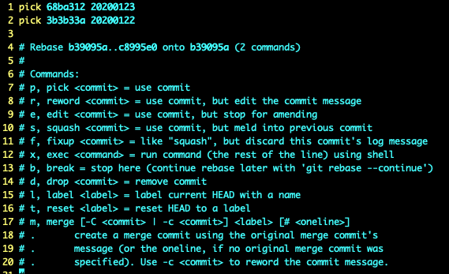

# 0201常用场景

## 01. 怎么删除不需要的分支？

如何去清除自己不想要的分支呢？

	git branch -d [分支名]

有时会提示 -d 清除不了，如果你确定是要清除掉这个分支的话，改成 -D 即可清除。图形化显示的命令需要经常用的：

	gitk --all

## 02. 怎么修改最新 commit 的 message？

    git commit --amend

进入一个文件的 vim 界面。第一行的字符就是最新 commit 的 message 内容，直接修改即可。

1『一个小细节，vim 文件里有多行叠在一起成了一个「+」，点删除键「delete」键展开。』

## 03. 怎么修改老旧 commit 的 message？

message 是 commit 数据结构的一个属性。首先，要变更的话，该 commit 的 ID 号肯定是要变的。其次，rebase 变更的时候一定要选择该 commit 的父基（上一个）。

    git rebase -i 8a5da0636

进入一个文件的 vim 界面。

比如修改第一行：

    r 68ba312 20200123

注意，只需把 pick 修改为 reword 或者 r 即可。保存退出，退出后又自动进入一个交互界面。在这个界面里修改 commit 的 message 信息。变基操作是离不开分离头指针（detached HEAD）的。

一个完整的变基过程：git 先分离头指针，然后在上面做调整，调整完后还把最新的 commit 产生后用一个指针指向它。即当前工作的 master 分支已经肯定变了。

1『第一次修改时用的 r，失败了，第二次用的 reword 成功了，以后最好还是用 reword。』

注意：上面所说的变基的行为，只针对在自己的分支上做变更，还没有贡献到团队的集成分支上，如果已经贡献上去，就不能这样轻易的变基了，否者会影响到团队其他成员。

## 04. 怎样把连续的多个 commit 整理成 1 个？

会遇到需要我们整理自己过去所创建的 commit 的场景。

18 | 怎样把间隔的几个 commit 整理成 1 个？

19 | 怎么比较暂存区和 HEAD 所含文件的差异？

20 | 怎么比较工作区和暂存区所含文件的差异？

21 | 如何让暂存区恢复成和 HEAD 的一样？

22 | 如何让工作区的文件恢复为和暂存区一样？

23 | 怎样取消暂存区部分文件的更改？

24 | 消除最近的几次提交

25 | 看看不同提交的指定文件的差异

26 | 正确删除文件的方法

27 | 开发中临时加塞了紧急任务怎么处理？

28 | 如何指定不需要 Git 管理的文件？

29 | 如何将 Git 仓库备份到本地？

