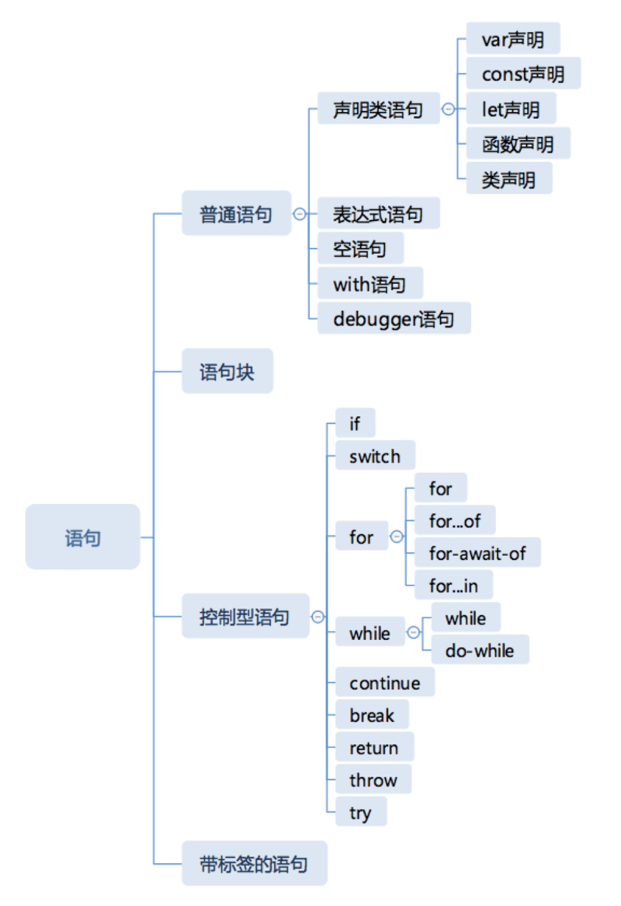

# 0108. JavaScript 执行4：try 里面放 return，finally 还会执行吗？
> winter 2019-03-02

在前面几篇文章中，我们已经了解了关于执行上下文、作用域、闭包之间的关系。

今天，我们则要说一说更为细节的部分：语句。

语句是任何编程语言的基础结构，与 JavaScript 对象一样，JavaScript 语句同样具有「看起来很像其它语言，但是其实一点都不一样」的特点。

我们比较常见的语句包括变量声明、表达式、条件、循环等，这些都是大家非常熟悉的东西，对于它们的行为，我在这里就不赘述了。

为了了解 JavaScript 语句有哪些特别之处，首先我们要看一个不太常见的例子，我会通过这个例子，来向你介绍 JavaScript 语句执行机制涉及的一种基础类型：Completion 类型。

## 01. Completion 类型

我们来看一个例子。在函数 foo 中，使用了一组 try 语句。我们可以先来做一个小实验，在 try 中有 return 语句，finally 中的内容还会执行吗？我们来看一段代码。

```
function foo(){
  try{
    return 0;
  } catch(err) {

  } finally {
    console.log("a")
  }
}

console.log(foo());
```

通过实际试验，我们可以看到，finally 确实执行了，而且 return 语句也生效了，foo () 返回了结果 0。虽然 return 执行了，但是函数并没有立即返回，又执行了 finally 里面的内容，这样的行为违背了很多人的直觉。

如果在这个例子中，我们在 finally 中加入 return 语句，会发生什么呢？

```
function foo(){
  try{
    return 0;
  } catch(err) {

  } finally {
    return 1;
  }
}

console.log(foo());
```

通过实际执行，我们看到，finally 中的 return「覆盖」了 try 中的 return。在一个函数中执行了两次 return，这已经超出了很多人的常识，也是其它语言中不会出现的一种行为。面对如此怪异的行为，我们当然可以把它作为一个孤立的知识去记忆，但是实际上，这背后有一套机制在运作。

这一机制的基础正是 JavaScript 语句执行的完成状态，我们用一个标准类型来表示：Completion Record（我在类型一节提到过，Completion Record 用于描述异常、跳出等语句执行过程）。

Completion Record 表示一个语句执行完之后的结果，它有三个字段：1）[[type]] 表示完成的类型，有 break continue return throw 和 normal 几种类型；2）[[value]] 表示语句的返回值，如果语句没有，则是 empty；3）[[target]] 表示语句的目标，通常是一个 JavaScript 标签（标签在后文会有介绍）。

JavaScript 正是依靠语句的 Completion Record 类型，方才可以在语句的复杂嵌套结构中，实现各种控制。接下来我们要来了解一下 JavaScript 使用 Completion Record 类型，控制语句执行的过程。首先我们来看看语句有几种分类。



## 02. 普通的语句

在 JavaScript 中，我们把不带控制能力的语句称为普通语句。普通语句有下面几种。

声明类语句：1）var 声明。2）const 声明。3）let 声明。4）函数声明。5）类声明。

表达式语句：1）空语句。2）debugger 语句。

这些语句在执行时，从前到后顺次执行（我们这里先忽略 var 和函数声明的预处理机制），没有任何分支或者重复执行逻辑。普通语句执行后，会得到 [[type]] 为 normal 的 Completion Record，JavaScript 引擎遇到这样的 Completion Record，会继续执行下一条语句。这些语句中，只有表达式语句会产生 [[value]]，当然，从引擎控制的角度，这个 value 并没有什么用处。

如果你经常使用 Chrome 自带的调试工具，可以知道，输入一个表达式，在控制台可以得到结果，但是在前面加上 var，就变成了 undefined。Chrome 控制台显示的正是语句的 Completion Record 的 [[value]]。

## 03. 语句块

介绍完了普通语句，我们再来介绍一个比较特殊的语句：语句块。语句块就是拿大括号括起来的一组语句，它是一种语句的复合结构，可以嵌套。

语句块本身并不复杂，我们需要注意的是语句块内部的语句的 Completion Record 的 [[type]] 如果不为 normal，会打断语句块后续的语句执行。比如我们考虑，一个 [[type]] 为 return 的语句，出现在一个语句块中的情况。

从语句的这个 type 中，我们大概可以猜到它由哪些特定语句产生，我们就来说说最开始的例子中的 return。return 语句可能产生 return 或者 throw 类型的 Completion Record。我们来看一个例子。

先给出一个内部为普通语句的语句块：

```
{
  var i = 1; // normal, empty, empty
  i ++; // normal, 1, empty
  console.log(i) //normal, undefined, empty
} // normal, undefined, empty
```

在每一行的注释中，我给出了语句的 Completion Record。

我们看到，在一个 block 中，如果每一个语句都是 normal 类型，那么它会顺次执行。接下来我们加入 return 试试看。

```
{
  var i = 1; // normal, empty, empty
  return i; // return, 1, empty
  i ++; 
  console.log(i)
} // return, 1, empty
```

但是假如我们在 block 中插入了一条 return 语句，产生了一个非 normal 记录，那么整个 block 会成为非 normal。这个结构就保证了非 normal 的完成类型可以穿透复杂的语句嵌套结构，产生控制效果。接下来我们就具体讲讲控制类语句。

## 04. 控制型语句

控制型语句带有 if、switch 关键字，它们会对不同类型的 Completion Record 产生反应。控制类语句分成两部分，一类是对其内部造成影响，如 if、switch、while/for、try。另一类是对外部造成影响如 break、continue、return、throw，这两类语句的配合，会产生控制代码执行顺序和执行逻辑的效果，这也是我们编程的主要工作。

一般来说，for/while - break/continue 和 try - throw 这样比较符合逻辑的组合，是大家比较熟悉的，但是，实际上，我们需要控制语句跟 break 、continue 、return 、throw 四种类型与控制语句两两组合产生的效果。


通过这个表，我们不难发现知识的盲点，也就是我们最初的的 case 中的 try 和 return 的组合了。

因为 finally 中的内容必须保证执行，所以 try/catch 执行完毕，即使得到的结果是非 normal 型的完成记录，也必须要执行 finally。

而当 finally 执行也得到了非 normal 记录，则会使 finally 中的记录作为整个 try 结构的结果。

## 05. 带标签的语句

前文我重点讲了 type 在语句控制中的作用，接下来我们重点来讲一下最后一个字段：target，这涉及了 JavaScript 中的一个语法，带标签的语句。实际上，任何 JavaScript 语句是可以加标签的，在语句前加冒号即可：

    firstStatement: var i = 1;

大部分时候，这个东西类似于注释，没有任何用处。唯一有作用的时候是：与完成记录类型中的 target 相配合，用于跳出多层循环。

```
    outer: while(true) {
      inner: while(true) {
          break outer;
      }
    }
    console.log("finished")
```
break/continue 语句如果后跟了关键字，会产生带 target 的完成记录。一旦完成记录带了 target，那么只有拥有对应 label 的循环语句会消费它。

## 结语

我们以 Completion Record 类型为线索，为你讲解了 JavaScript 语句执行的原理。

因为 JavaScript 语句存在着嵌套关系，所以执行过程实际上主要在一个树形结构上进行，树形结构的每一个节点执行后产生 Completion Record，根据语句的结构和 Completion Record，JavaScript 实现了各种分支和跳出逻辑。

你遇到哪些语句中的执行的实际效果，是跟你想象的有所出入呢，你可以给我留言，我们一起讨论。

## 精选留言

### 01

请问老师，表格中的「穿透」和「消费」是什么意思？

我的理解是，消费指对应的代码被有效的执行了，穿透指对应代码被跳过了，也就是对应控制的语句体被有效执行比如 try catch，当 try 中出现了 throw，能被有效捕获进而执行 catch，这在我理解就是 try 被消费执行了，而当 catch 中还有 throw 时，由于 catch 不具备处理 throw 的能力，于是 catch 被中断跳出，也就是作者所说的穿透。

穿透和消费，报错应该是连贯的，「穿透」就是指不在当前这一层处理，向外逐层寻找可以「消费」的那一层，直到最后都没找到就报错，比如：function 里面有 while，while 里面有 switch，switch 里面又有 continue，按图表来看，switch-continue 应该是穿透，向上层寻找消费，碰到 while-contine，那就是消费，再如 switch 里面是 return，switch-return 穿透，向上层 whlie-return 穿透，最后 function-return 是消费。

2019-03-12

### 02

我们可以这么分析：

1. if 和 break 相遇，break 穿透至 switch。

2. swicth 和 break 相遇，消费掉 break。

3. 接着执行之后的代码。

2019-04-17

### 03

结合表格中的控制语句组合使用得到的结果来看，我的理解是：

『消费』是控制语句里的内容执行完毕。

『穿透』是控制语句里的内容没能执行完，被中止了。

2019-03-03

### 04

这个把 completion 称作一个类型，感觉有点怪，首先这个不是我们自己去定义的，这个是因为我们执行语句都会有这个东西。小白看到这个「类型」会往前找，发现没这个类型，之前掌握的的语言系统也没有相关的类型，结果就是「我擦，这是啥，ES6 的新特性吗？」。关于这个，这是我在 MDN 上找的相关资料，希望大家指点一下（看 run-to-completion 这部分）：[Concurrency model and the event loop - JavaScript | MDN](https://developer.mozilla.org/en-US/docs/Web/JavaScript/EventLoop)。

2019-03-20