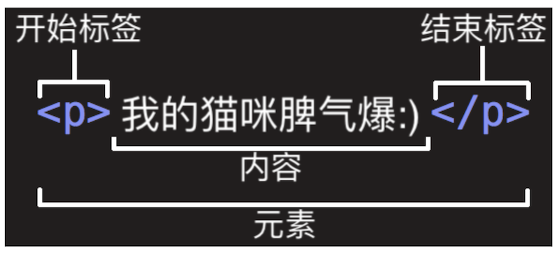

# 0401. HTML 基础

[HTML 基础 - 学习 Web 开发 | MDN](https://developer.mozilla.org/zh-CN/docs/Learn/Getting_started_with_the_web/HTML_basics)

超文本标记语言 (英语：Hypertext Markup Language，简称：HTML) 是一种用来结构化 Web 网页及其内容的标记语言。网页内容可以是：一组段落、一个重点信息列表、也可以含有图片和数据表。正如标题所示，本文将对 HTML 及其功能做一个基本介绍。

## 01. HTML 是何方神圣？

HTML 不是一门编程语言，而是一种用于定义内容结构的标记语言。HTML 由一系列的元素（elements）组成，这些元素可以用来包围不同部分的内容，使其以某种方式呈现或者工作。一对标签（ tags）可以为一段文字或者一张图片添加超链接，将文字设置为斜体，改变字号，等等。例如，键入下面一行内容：

    我的猫咪脾气爆：)

可以将这行文字封装成一个段落（paragraph）元素来使其在单独一行呈现：

    <p> 我的猫咪脾气爆：)</p>

### 1. HTML 元素详解

让我们深入探索一下这个段落元素。



这个元素的主要部分有：

1. 开始标签（Opening tag）：包含元素的名称（本例为 p），被大于号、小于号所包围。表示元素从这里开始或者开始起作用 —— 在本例中即段落由此开始。

2. 结束标签（Closing tag）：与开始标签相似，只是其在元素名之前包含了一个斜杠。这表示着元素的结尾 —— 在本例中即段落在此结束。初学者常常会犯忘记包含结束标签的错误，这可能会产生一些奇怪的结果。

3. 内容（Content）：元素的内容，本例中就是所输入的文本本身。

4. 元素（Element）：开始标签、结束标签与内容相结合，便是一个完整的元素。

元素也可以有属性（Attribute）：


属性包含了关于元素的一些额外信息，这些信息本身不应显现在内容中。本例中，class 是属性名称，editor-note 是属性的值 。class 属性可为元素提供一个标识名称，以便进一步为元素指定样式或进行其他操作时使用。

属性应该包含：

1. 在属性与元素名称（或上一个属性，如果有超过一个属性的话）之间的空格符。

2. 属性的名称，并接上一个等号。

3. 由引号所包围的属性值。

注：不包含 ASCII 空格（以及 "'` = < > ）的简单属性值可以不使用引号，但是建议将所有属性值用引号括起来，这样的代码一致性更佳，更易于阅读。

### 2. 嵌套元素

也可以将一个元素置于其他元素之中 —— 称作嵌套。要表明猫咪非常暴躁，可以将「爆」用 \<strong> 元素包围，爆字将突出显示：

    <p> 我的猫咪脾气 <strong> 爆 </strong>:)</p>

必须保证元素嵌套次序正确：本例首先使用 \<p> 标签，然后是 \<strong> 标签，因此要先结束 \<strong> 标签，最后再结束 \<p> 标签。这样是不对的：

    <p> 我的猫咪脾气 <strong> 爆：)</p></strong>

元素必须正确地开始和结束，才能清楚地显示出正确的嵌套层次。否则浏览器就得自己猜测，虽然它会竭尽全力，但很大程度不会给你期望的结果。

### 3. 空元素

不包含任何内容的元素称为空元素。比如 \ 元素：

    

本元素包含两个属性，但是并没有 \</img> 结束标签，元素里也没有内容。这是因为图像元素不需要通过内容来产生效果，它的作用是向其所在的位置嵌入一个图像。

### 4. HTML 文档详解

以上介绍了一些基本的 HTML 元素，但孤木不成林。现在来看看单个元素如何彼此协同构成一个完整的 HTML 页面。回顾「文件处理」小节中创建的 index.html 示例：

```
<!DOCTYPE html>
<html>
  <head>
    <meta charset="utf-8">
    <title>测试页面</title>
  </head>
  <body>
    
  </body>
</html>
```

这里有：

1、\<!DOCTYPE html> — 文档类型。混沌初分，HTML 尚在襁褓（大约是 1991/92 年），DOCTYPE 用来链接一些 HTML 编写守则，有点像自动校正等。然而现在已经没有人关心这些，只是因为历史原因必须将它们保留，但没有实际作用。现在你只需要知道这些就可以。

2、\<html>\</html> — \<html> 元素。这个元素包含了整个页面的内容，有时也被称作根元素。

3、\<head>\</head> — \<head> 元素。这个元素放置的内容不是展现给用户的，而是包含例如面向搜索引擎的搜索关键字（keywords）、页面描述、CSS 样式表和字符编码声明等。

4、\<meta charset="utf-8"> — 这个元素指定了当前文档使用 UTF-8 字符编码 ，UTF-8 包括绝大多数人类已知语言的字符。基本上 UTF-8 可以处理任何文本内容，还可以避免以后出现某些问题，我们没有任何理由再选用其他编码。

5、\<title></title> — \<title> 元素。这个元素设置页面的标题，显示在浏览器标签页上，同时作为收藏网页的描述文字。

6、\<body></body> — \<body> 元素。这个元素包含期望让用户在访问页面时看到的内容，可以是文本、图像、视频、游戏、可播放的音轨或其他内容。

## 02. 图像

重温一下 \ 元素：

    

像之前所讲，该元素通过包含图像文件路径的地址属性 src，可在所在位置嵌入图像。

该元素还包括一个替换文字属性 alt，是图像的描述内容，用于当图像不能被用户看见时显示，不可见的原因可能是：

1. 用户有视觉障碍。视障用户可以使用屏幕阅读器来朗读 alt 属性的内容。

2. 有些错误使图像无法显示。可以试着故意将 src 属性里的路径改错。保存并刷新页面就可以在图像位置看到：「测试图片」。

alt 属性的关键字即「描述文本」。alt 文本应向用户完整地传递图像要表达的意思。用 "测试图片" 来描述 Firefox 标志并不合适，修改成 "Firefox 标志：一只盘旋在地球上的火狐" 就好多了。

可以试着为图像编写一些更好的 alt 文本。

注：更多信息请参阅[可访问性 - 学习 Web 开发 | MDN](https://developer.mozilla.org/zh-CN/docs/learn/Accessibility)。

## 03. 标记文本

本段包含了一些最常用的文本标记 HTML 元素。

### 1. 标题（Heading）

标题元素可用于指定内容的标题和子标题。就像一本书的书名、每章的大标题、小标题，等。HTML 文档也是一样。HTML 包括六个级别的标题，\<h1>–\<h6> ，一般最多用到 3-4 级标题。

```
<h1>主标题</h1>
<h2>顶层标题</h2>
<h3>子标题</h3>
<h4>次子标题</h4>
```

可以尝试在 \ 元素上面添加一个合适的标题。

注：可以发现 MDN 网站上第一级标题的主题是隐藏的。不要使用标题元素来加大、加粗字体，因为标题对于[可访问性 - 学习 Web 开发 | MDN](https://developer.mozilla.org/zh-CN/docs/learn/Accessibility) 和 [HTML 文字处理基础 - 学习 Web 开发 | MDN](https://developer.mozilla.org/zh-CN/docs/learn/HTML/Introduction_to_HTML/HTML_text_fundamentals#%E4%B8%BA%E4%BB%80%E4%B9%88%E6%88%91%E4%BB%AC%E9%9C%80%E8%A6%81%E7%BB%93%E6%9E%84%E5%8C%96) 等问题非常有意义。要保持页面结构清晰，标题整洁，不要发生标题级别跳跃。

### 2. 段落（Paragraph）

如上文所讲，\<p> 元素是用来指定段落的。通常用于指定常规的文本内容：

    <p> 这是一个段落 </p>

试着添加一些文本（在「[你的网站看起来是什么样的？ - 学习 Web 开发 | MDN](https://developer.mozilla.org/zh-CN/docs/Learn/Getting_started_with_the_web/What_will_your_website_look_like)」小节）到一个或几个段落中，并把它们放在你的 \ （[\：图像嵌入元素 - HTML（超文本标记语言） | MDN](https://developer.mozilla.org/zh-CN/docs/Web/HTML/Element/img)）元素下方。

### 3. 列表（List）

Web 上的许多内容都是列表，HTML 有一些特别的列表元素。标记列表通常包括至少两个元素。最常用的列表类型为：

1. 无序列表（Unordered List）中项目的顺序并不重要，就像购物列表。用一个 \<ul> 元素包围。

2. 有序列表（Ordered List）中项目的顺序很重要，就像烹调指南。用一个 \<ol> 元素包围。

列表的每个项目用一个列表项目（List Item）元素 \<li> 包围。

比如，要将下面的段落片段改成一个列表：

    <p>Mozilla 是一个全球社区，这里聚集着来自五湖四海的技术人员、思考者和建造者，我们致力于……</p>

可以这样更改标记：

```
<p>Mozilla 是一个全球社区，这里聚集着来自五湖四海的</p>
    
<ul> 
  <li>技术人员</li>
  <li>思考者</li>
  <li>建造者</li>
</ul>

<p>我们致力于……</p>
```

试着在示例页面中添加一个有序列表和无序列表。

3『[\<ul> - HTML（超文本标记语言） | MDN](https://developer.mozilla.org/zh-CN/docs/Web/HTML/Element/ul) | [\<ol> - HTML（超文本标记语言） | MDN](https://developer.mozilla.org/zh-CN/docs/Web/HTML/Element/ol) |  [\<li> - HTML（超文本标记语言） | MDN](https://developer.mozilla.org/zh-CN/docs/Web/HTML/Element/li)。』

## 04. 链接

链接非常重要 —— 它们赋予 Web 网络属性。要植入一个链接，我们需要使用一个简单的元素 —— \<a>，a 是 "anchor" （锚）的缩写。要将一些文本添加到链接中，只需如下几步：

1、选择一些文本。比如「Mozilla 宣言」。

2、将文本包含在 \<a> 元素内，就像这样：

    <a>Mozilla 宣言</a>

3、为此 \<a> 元素添加一个 href 属性，就像这样：

    <a href="">Mozilla 宣言 </a>

4、把属性的值设置为所需网址：

    <a href="https://www.mozilla.org/zh-CN/about/manifesto/">Mozilla 宣言</a>

如果网址开始部分省略了 https:// 或者 http://，可能会得到错误的结果。在完成一个链接后，可以试着点击它来确保指向正确。

href 这个名字可能开始看起来有点令人费解。如果你觉得不好记，那么记住它代表的是超文本引用（ hypertext reference）。

现在就为你的页面添加一个链接吧。

3『[\<a> - HTML（超文本标记语言） | MDN](https://developer.mozilla.org/zh-CN/docs/Web/HTML/Element/a)』

## 小结

如果你一直跟着这篇文章里的指导做的话，你应该完成了一个像下面这样的页面。（你也可以从[测试页面](https://roy-tian.github.io/mdn-examples/html/mozilla-is-cool/)查看）：

如果你遇到困难，你可以将 Github 上的 [mdn-examples/html/mozilla-is-cool at master · roy-tian/mdn-examples](https://github.com/roy-tian/mdn-examples/tree/master/html/mozilla-is-cool) 上与你的文件进行比较。

在这里，我们只是介绍了一点点 HTML。要学习更多，访问我们的 HTML 学习主题页面 。