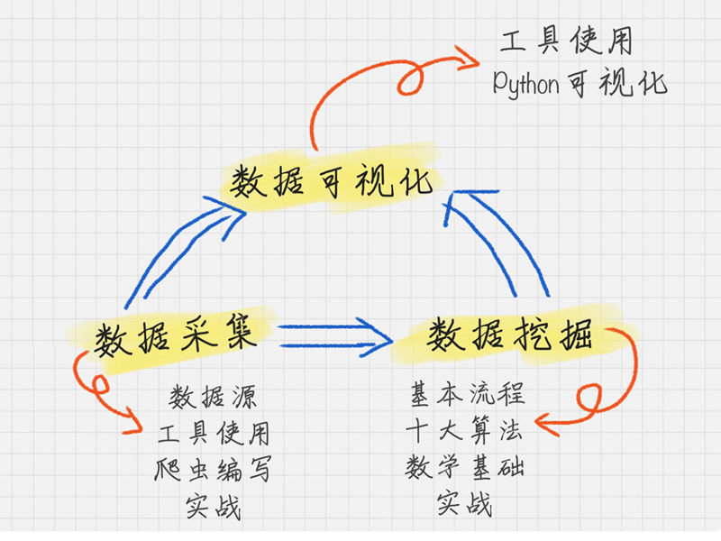
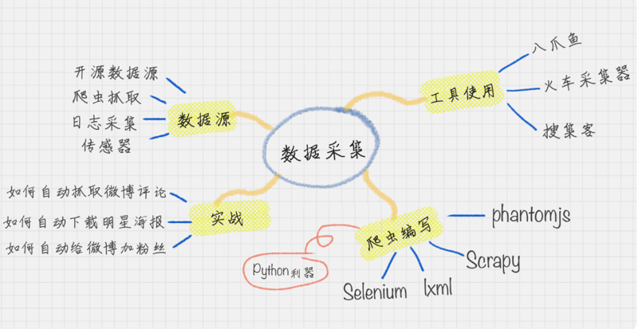
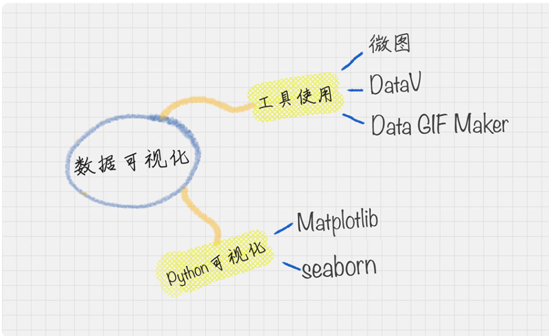
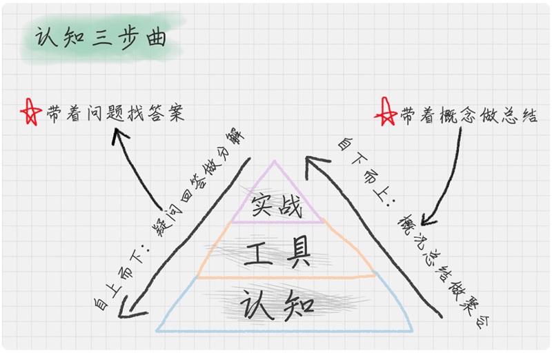

# 0101. 数据分析全景图及修炼指南
> 陈旸 2018-12-18

先给你一张数据分析的全景图，让你对后面的学习做到心中有数。现在，你已经知道了数据分析在现代社会中的重要地位。掌握数据，就是掌握规律。当你了解了市场数据，对它进行分析，就可以得到市场规律。当你掌握了产品自身的数据，对它进行分析，就可以了解产品的用户来源、用户画像等等。所以说数据是个全新的视角。数据分析如此重要，它不仅是新时代的「数据结构 + 算法」，也更是企业争夺人才的高地。

## 01. 当我们谈论数据分析的时候，都在讲些什么呢？

这里我可以把数据分析分成三个重要的组成部分。

1. 数据采集。它是我们的原材料，也是最「接地气」的部分，因为任何分析都要有数据源。

2. 数据挖掘。它可以说是最「高大上」的部分，也是整个商业价值所在。之所以要进行数据分析，就是要找到其中的规律，来指导我们的业务。因此数据挖掘的核心是挖掘数据的商业价值，也就是我们所谈的商业智能 BI。

3. 数据可视化。它可以说是数据领域中万金油的技能，可以让我们直观地了解到数据分析的结果。

下面我来一一为你讲解一下这三个重要的部分。

## 02. 数据采集

在数据采集部分中，你通常会和数据源打交道，然后使用工具进行采集。

在专栏里，我会告诉你都有哪些常用的数据源，以及如何获取它们。另外在工具使用中，你也将掌握「八爪鱼」这个自动抓取的神器，它可以帮你抓取 99% 的页面源。当然我也会教你如何编写 Python 爬虫。掌握 Python 爬虫的乐趣是无穷的。它不仅能让你获取微博上的热点评论，自动下载例如「王祖贤」的海报，还能自动给微博加粉丝，让你掌握自动化的快感。

## 03. 数据挖掘

第二个部分是数据挖掘，它可以说是知识型的工程，相当于整个专栏中的「算法」部分。首先你要知道它的基本流程、十大算法、以及背后的数学基础。

这一部分我们会接触到一些概念，比如关联分析，Adaboost 算法等等，你可能对这些概念还是一知半解，没有关系，我会详细为你介绍这些「朋友」。

每讲完一个算法原理，我都会带你做一个项目的实战，我精选了一些典型的、有趣的项目，比如对泰坦尼克号乘客进行生存预测、对文档进行自动分类、以及导演是如何选择演员的等等。

掌握了数据挖掘，就好比手握水晶球一样，它会通过历史数据，告诉你未来会发生什么。当然它也会告诉你这件事发生的置信度是怎样的，置信度这个词你先记住就可以了，后面我们来学习它具体代表什么。

## 04. 数据可视化

第三个就是数据可视化，这是一个非常重要的步骤，也是我们特别感兴趣的一个步骤。数据往往是隐性的，尤其是当数据量大的时候很难感知，可视化可以帮我们很好地理解这些数据的结构，以及分析结果的呈现。

如何进行数据可视化呢？有两种方法。

第一种就是使用 Python。在 Python 对数据进行清洗、挖掘的过程中，我们可以使用 Matplotlib、Seaborn 等第三方库进行呈现。

第二种就是使用第三方工具。如果你已经生成了 csv 格式文件，想要采用所见即所得的方式进行呈现，可以采用微图、DataV、Data GIF Maker 等第三方工具，它们可以很方便地对数据进行处理，还可以帮你制作呈现的效果。

数据采集和数据可视化的原理简单，容易理解。这两个部分注重的是工具的掌握，所以我会把重点放在讲解工具以及应用实战上。

虽然这些理论我会给你一一讲解，但纸上得来终觉浅，绝知此事要躬行。手拿地图，我们知道要去哪里，但是怎么去呢？我认为学习数据分析最好的方法是：在工具中灵活运用，在项目中加深理解。

## 05. 修炼指南

刚才我们讲了数据分析全景图，包括数据采集、数据挖掘、数据可视化这三个部分。你可能觉得东西很多，无从下手，或者感觉数据挖掘涉及好多算法，有点「高深莫测」，掌握起来是不是会吃力。其实这些都是不必要的烦恼。

开篇词里我给你介绍了 MAS 学习法，有了这个方法，学习数据分析就是从「思维」到「工具」再到「实践」的一个过程。今天我会从更多的角度来和你分享我的学习经验，我们可以把今天的内容叫作「修炼指南」。

借用傅盛的话来说，人与人最大的差别在于「认知」，所谓成长就是认知的升级。

很多人存在对「认知」的误解，认为认知不就是概念么？那么你有没有想过，针对同一个概念，为什么不同的人掌握的程度是不一样的呢？

我们只有把知识转化为自己的语言，它才真正变成了我们自己的东西。这个转换的过程，就是认知的过程。

那么如何提升自己的学习吸收能力呢？简单地说，就是要「知行合一」。

如果说认知是大脑，那么工具就好比我们的双手，数据工程师和算法科学家每天打交道最多的就是工具。

如果你开始做数据分析的项目，你脑海中已经思考好了数据挖掘的算法模型，请牢记下面这两点原则。

### 1. 不重复造轮子

举个数据采集的例子，我见过很多公司，都有数据采集的需求，他们认为某些工具不能满足他们个性化的需求，因此决定招人专门做这项工作。而结果怎样呢？做了 1 年多的实践，工资投入几十万，结果发现 Bug 一大堆，最后还是选择了第三方工具。耗时耗力，还没什么成效。

一个模型是否有相关的类库可以使用 —— 这几乎是每个程序员入行被告知的第一条准则。我也会对新人反复灌输这个概念。大部分情况下你都能找到类库来完成你的想法。

### 2. 工具决定效率

「不要重复造轮子」意味着首先需要找到一个可以用的轮子，也就是工具。我们该如何选择呢？

这取决于你要做的工作，工具没有好坏之分，只有适合与否。除去研究型的工作，大部分情况下，工程师会选择使用者最多的工具。因为：Bug 少、文档全、案例多。

比如 Python 在处理数据挖掘上就有很多第三方库，这些库都有大量的用户和帮助文档可以帮助你来上手。

在后面的课程里，我会给你介绍最常用的工具，这些工具会让你的数据挖掘事半功倍。

选择好工具之后，你要做的就是积累「资产」了。我们很难记住大段的知识点，也背不下来工具的指令，但是我们通常能记住故事、做过的项目、做过的题目。这些题目和项目是你最先行的「资产」。

如何快速积累这些「资产」呢？这里我送你三个字：熟练度。

把题目完成只是第一步，关键在于训练我们工具使用的「熟练度」。

高中的时候，有一次我做「八皇后」的问题，第一次解答花了一个小时的时间。当时老师明确告诉我必须在 20 分钟内完成，我不敢相信，从解题、思考、动手，最后完成，1 个小时不算慢。但是后来我调整了思考的结构。最后我 6 分钟就可以完成那道题。

当熟练度增加的时候，你的思考认知模型也在逐渐提升。所以专栏中，我给你做了一个「专属题库」，在专属题库中你可以进行自我评测，当然我也会对这些练习题进行讲解。在工作篇中，我也会和你一起分享面试技巧、探讨职场上的晋升之路。

## 总结

认知三步曲，从认知到工具，再到实战，是我最想给你分享的学习建议。我看到过很多同学上课的模式，以及很多人工作中的思考模式，我特别认同「人与人最大的区别是在认知」这个观点。他们很听老师的理论，但是这些理论最后又都还给了老师。所以我希望你在后面的 15 周学习里可以做到以下几点。

记录下你每天的认知。尤其是每次课程后，对知识点的自我理解。

这些认知对应工具的哪些操作。用工具来表达你对知识点的掌握，并用自己的语言记录下这些操作笔记。

做更多练习来巩固你的认知。我们学习的内容对于大部分外人来说，就像「开车」一样，很酷。我们学习的内容，对于要掌握的人来说，也像「开车」一样，其实并不难，而且很多人已经上路了。你需要的就是更多的练习。

不知道这一讲中你有没有不清楚的地方，如果有，一定要提问，而且问题越具体越好，我会在留言区和你讨论。如果你理解了我们讲的内容，也一定要分享给我，让我和你一起体验这种认知升级的喜悦。

最后我想问你个问题，就当做个小调查吧，你平时是怎么学习的呢？会做学习笔记吗？期待在留言区看到你的答案。也欢迎你把今天的内容分享给身边的朋友，和他一起学习。

## 精选留言

### 01

好奇问下，文章种的图，作图老师是用的什么工具。

编辑回复：画图软件 SketchBook。

2018-12-31

### 02

我学习的途径主要有两点：一是看书籍自学（也包括专栏等类型）；二是看付费教学视频（例如培训班之类）。我做笔记的 3 大方式：一是准备 1 本笔记本，遇到重要知识点就记录下来（弊端是代码很难记录），因此我记录的内容大多是能够帮助我迅速回忆起知识点的关键点；二是通过云笔记，它刚好弥补了手写笔记的弊端，我能够把所写的代码整块复制下来，并做注释，所以，我一般用它来作为详细记录；三是写思维导图，它的作用就是帮助我统领整个知识面，让我能够自下而上地把整个金字塔体系连起来。还有一点是我打算以后做的：写博客，因为我觉得只有我把知识分享给别人，真正通过我的手写出来或者嘴巴说出来，这些知识才真正的为我所理解。

作者回复：大家都可以看看这位同学的笔记方式！我觉得很赞！

1、做笔记是个非常好的方法，而且你对于知识点，代码，系统总结都有自己的笔记方式，很好！

2、分享是更高级的维度，不仅是因为这样能让知识更系统，而且还能在交流中互相成长。

另外，如果你是在工作，定期给大家做个分享，不仅能让你受到重视，而且还能让工作更加主动 & 快乐！

2018-12-18

### 03

我主要的学习方式是依靠学习圈子，网易云课堂视频，还有各种专栏。平时也会做一些笔记，印象笔记软件也用了有一年多了，主要靠 markdown 语法做详细记录，xmind 做导图整理框架，看了这一讲，感觉自己的学习方向大概还是对的，我最开始是学的 Python 基础，Python 爬虫，《利用 Python 进行数据分析》。现在的状态是狂补统计学等数学基础，下一步准备进行商业思维训练相关学习，并准备打下机器学习基础。但是我的问题存在于两方面，第一是分享这一块我做的很差，为了弥补，最近也在学着开自己的知乎专栏和公众号，目的是为了把我这一年以来学的杂七杂八的东西串联整理起来。第二就是实战经验，我总想着学习完工具和思维再进行实战，但是这个月突然意识到实战是串联、应用与复习知识点的最佳途径。同时我也觉得这门可能对整理我所学有很大帮助。期望自己能在下一个半年成为一个合格的初级数据分析师。

作者回复：知行合一，并不是个先后的顺序过程，就像你刚才说的：实战其实就是很好的学习，能让你理解工具使用和知识点。刚才有个同学分享了：自己写 Demo 是个非常好的体验。

2018-12-18

### 04

老师你这边分析说的是三个方面：数据采集（在我看来应该是包括了采集，清洗，提数等）数据挖掘（这里我的疑问是，为什么就直接跳到了挖掘了呢。在日常的工作中或许监控型的数据报表，或者分析类的报告的会比较多，而且现在的分析师多是利用 sql 去从不同维度切）数据可视化（按照目的输出令人更好理解的数据展现形式） 我的疑问主要在第二点哈。

2018-12-25

### 05

自从 Google 的 headless 发布后 phantomjs 已经管宣不维护了，所以那个地方应该换成 Google 那个 puppeteer 吧。

作者回复：对 用 puppeteer。

2019-02-16

### 06

对于软件技术的学习，我认为目标驱动法，或者叫项目驱动法效率比较高。当然这也是建立在具有明确目标的前提下，知道要做什么了。不知道具体目标的时候，能做一个 Demo，实践一下比较好。一个项目对于这个领域基础知识的需求可能并不全面，也就是说你做完一个项目，可能仅仅用了一部分知识，其余知识没有用到。但是有一点比较好，就是项目从启动到结束，对于这个领域的知识，是从浅到深的过程，或者说可以体会到理论如何运用到实践，这个会了以后，就可以举一反三，进而学习这个领域的其余知识，运用到其余项目。

我不适合记忆，记不住，最近一段时间在想，如何能更有效的搜索以前的知识点。比如记录到有道云笔记上的知识，但我发现有道云笔记的搜索不好用，还不如 QQ 邮箱的搜索好用。我是「理解」型的学习方法，学习的过程中形成连贯的思维，然后等到需要用的时候，再去搜索。但有的时候脑海中的关键字和以前记的电子笔记不一样，所以如何贯通这个关键字，我正在考虑如何解决这个问题。比如每次记笔记的时候，旁边写上关键字。我还感受到过一种学习方法，就是「内心恐惧」学习法，这个时候会有强大的动力将其学会。

2018-12-23

### 07

作者回复：掌握分 3 个阶段：第一个阶段，会用就可以了；第二个阶段，你发现还有很多可以调整的地方，开始探索算法的原理，各个参数如何优化；第三个阶段，自己会有新的想法，在原有的基础上进行创新。比如，前人在 ID3 算法基础上提出了 C4.5 算法，就是个很好的例子。所以说呢，第一阶段不需要太多数学基础，而随着阶段的提升，数学的价值也越来越重要。Anyway 慢慢修炼，先用起来。

2018-12-18

### 08

工作 8 年，一直都有在不断的学习，但是以前总是即学即用的那种，慢慢发现那种方式对知识的认知太过于片面，不成系统。所以现在正尝试着养成系统学习总结并分享的习惯。so 看到您的 mas 还是很兴奋的，授人予鱼，不如授人于渔。其实我从 12 年就自行编译了 kettle 的 4.0 源码，并开发了许多个性化的插件，但到现在也还没更大的突破，我觉得这可能是对数据分析理解和认知有局限性的问题了，还请老师给予指导。

作者回复：我觉得你的实战经验一定不错。也很感谢你对 MAS 方法的认可，就像你说的：授人予鱼，不如授人予渔。我觉得你可以换个维度，从工作场景和业务需求出发，尤其很多突破性的工作还是在于数据挖掘，或者说人工智能的部分。很明显，AI 这两年的热度要明显高于大数据，也说明这方面的突破比以往更快。所以，我建议你多了解不同行业的业务需求，在工具上可以更关注算法层面。

2018-12-18

aWangWangz

首先感谢陈旸老师的分享。

就这节课提出以下一些问题：

1. 老师把数据分析分为三部分：数据采集，数据挖掘，数据可视化。数据采集和数据可视化的关键在于工具的使用，工具的使用这个相信对大部分来说还是比较容易熟悉上手的，而核心部分的数据挖掘依赖于算法。但算法这东西对个人的要求是不是特别高，我们可以通过哪些途径去提供在数据挖掘上的能力呢？

2. 如今大数据行业如此泛滥，是不是存在着泡沫，往后这个行业的前景老师是怎么看待和分析的，我们该怎样做到企业需要的人。

以下是回答老师最后的一个小作业。

1. 先说说我的学习途径，目前的学习途径主要分为线下学习和线上学习。

2. 就上面两个途径，分别说出各自的一些方法。

(1) 线下学习主要是指书籍和请教别人或者是与人商讨获取经验。阅读书籍我会阅读两到三次，第一次粗略快速的过一遍大概，第二次细读（简单易懂的部分也是会快速过掉）。与人商讨中学习，在与别人商讨后我会抽空回忆当时的内容，然后列点记录下来存在云笔记中。

（2）线上学习主要通过博客，谷歌，百度，一些知识付费教程专栏等等。个人觉得线上学习最重要的是对信息的甄别能力说起来惭愧，加入付费学习领域较迟，今年才开始进入，一个原因是因为之前觉得大多数是交钱没质量（早期有购买过一两次发现没什么用，一方面课程质量不高，一方面也有自己的原因）。第二主要是很多选择，无法选择好的课程。后来因为巧合，先后加入张哥，冯大，曹大等星球，发现他们推荐的东西质量很高，就在自己适合的情况下把推荐的课程量力加入了。选择了好的线上资源其实就和线下无疑，主要是学习资源获取和过滤的能力。

3. 具体的一些学习过程，我会先理解理论知识点，然后通过动手实践 (编程)，多敲多想可以把这些知识点应用到那些地方中去，实践后会做一个总结笔记，把出现的问题或者一些新的想法记录下来。遇到一个产品会去想别人是怎么实现的，怎么去设计的，我可以怎么去复现出来。

最后说一点，笔记和总结对于学习很重要。再者笔记推荐尽量使用云笔记，因为可以设备共享，随时随地观看和记录。

2018-12-25

S.H.

现在最常用的记笔记方法是思维导图，但是感觉没有太多输出，没有形成由外到内的转化，所以现在也在自我施压做一些总结分享类的工作。

作者回复：分享是很好的学习方式！

2018-12-18

一语中的

感觉要完蛋了，完蛋了，刚把留言和作者的回复看了一遍，感触就是：大家的学习方法都很科学！好有压力，但是感觉也蛮好玩，多跟优秀的同学学习

作者回复：是的，你也要分享哦😄 这个社群最大的价值，就是和大家一起来进步、学习。所以也期待着你的学习笔记分享

2018-12-18

会追风筝的稻草人

平时很少做笔记，所以不太会做笔记，只是记录一下这节课的要点。学习了老师的 Mas 方法后，原来分享也是一种学习！下面是有道云笔记的链接：http://note.youdao.com/noteshare?id=30531792d6dabda6e2beb994f57b9b7d&sub=C8F450118CCB47BB8985B0974330827C

作者回复：是的！分享是一种学习，提问是一种思维！加油💪

2018-12-18

Dan

平时工作中遇到问题会在博客中记录下来，只是还没有养成习惯，整理起来真的是挺费劲的😅

希望向大家学习，不断提高自己。

工具用的最多的就是 mweb，markdown 笔记真的挺好用的，推荐

作者回复：加油💪如果整理笔记可以分享到这里

2018-12-18

tinn

请问老师，认知三部曲。自下而上的过程是不是:

1. 从外部（老师、书等）获得一个新的知识理论，这个阶段这个知识还不属于自己。

↓

2. 寻找实现这个知识理论的工具。

↓

3. 利用工具，进行实际操作，在操作过程中消化理论知识，使理论知识变成自己的东西。

作者回复：你说的这个维度也很好。在认知里面，我想告诉大家的就是「知识」不等于「认知」，只有知识转化为自己的，才是你自己的「认知」。所以你 Get 到了这个点。

另外在「认知」的维度里，我鼓励大家以笔记的形式整理出来，发到留言区里，这样也是「认知」形成的有效方式！

2018-12-18

协同张志

其实对于工具怎样我感觉还在其次，而是对于一个行业的数据体系建设，怎么将这个框架搭起来再考虑我用什么工具去找那些数据，是原始数据，还是加工过的

作者回复：明白你的困惑，你可以尝试先用纸把整个流程跑一遍。比如你提到的数据源，可以整理下都有哪些数据源的可能性。另外你在跑这些流程的时候，一定会有各种问题。没有关系，可以先记录下来。然后找个时间，一起给别人做个分享，他们也会给你不同的反馈。说不定某些问题就解决了

2018-12-18

王 慈

之前学习都是靠看书，但单单一个字一个字的看一来效率低二来接受的并不好。后来学习编程的时候就更多地采用试一试的方式，自己写一个 demo 看语言的行为，确实比单看要有效。

作者回复：自己写 Demo 是很好的体验👍

2018-12-18

子不语

学习笔记一般会采用有道云笔记记录，使用 Xmind 进行梳理。

作者回复：很多同学都提到了云笔记 + XMind，这是不错的方式

2018-12-18

Tiiian.

做笔记现在喜欢用 jupyter 的 markdown，现在感觉很不错，然后幕布画导图。我想问一下老师，我目前从业的是问卷数据分析师，感觉对自己没什么帮助。碎片化时间学习效果不是太好，看了很多东西，但是没有时间系统规划，所以参加老师的课程。想听听老师建议，是现在待着还是脱产学习开春找工作。

作者回复：如果你有工作的话，其实可以一边工作一边学习，这并不冲突。更主要还是看你对现在工作的理解，它对你的提升是否有帮助

关于「碎片 VS 系统」这个话题，我可以和你分享下我的经验：

我用一个番茄时间 25 分钟，在这个时间内不去做其他工作，别人找你也暂时放下。专注某个问题的解决。比如一节课的学习，然后如果可以的话，整理出笔记出来。算是一次学习的完结。

另外交流，可以给我带来系统感。我的工作 & 学习方式，很多时候都是碎片的。但是我通过和其他人进行交流，来完善知识系统，这样就会系统化。因为在交流过程中，别人会和你互动，提出各种问题，也是对你知识结构的完善

一起共勉💪

2018-12-18

lipan

我的学习过程中很少做笔记，都是根据自已的兴趣来学习。很期待课程里的微博涨粉实战项目呀。

作者回复：后面我会介绍，包括当时我是如何对「微博自动化」进行思考的，重点模块的讲解等😄

2018-12-18

kongkong

我去年 11 月付费式学习了数据分析，中间有因为各种借口中断了实践，现在慢慢捡起来，发现笔记和实践是很很很重要的，翻翻以前的笔记能帮我快速记起重点。

作者回复：对的，笔记的价值正在于此！另外，我希望你通过这个专栏，也能锻炼到工具使用和积累实战经验😄

2018-12-18

WZP

我平时学习比较习惯阅读书籍，专栏去学习，遇到自己实在解决不了的问题会上网去搜索相关的教学视频，听听老师是怎么讲的。

做笔记的话我一般喜欢做云笔记，感觉云笔记很方便，未来还打算写博客，通过写博客进一步梳理自己学到的知识。

作者回复：写博客是很好的方式，你也可以在我每次讲解后，分享你的笔记连接，这样大家一起来交流学习👍

2018-12-18

夜路破晓

回顾过去，我对学习的认识经历了反智、迷茫、肯定以及目前学习如何提升个人认知四个阶段。

我给自己定了一个两到三年的学习计划，每天工作之余学习一点，进步一点。

学习这件事本身让我感觉快乐，但在感觉快乐之余也有点自我怀疑，这是否算是一种自我麻醉？毕竟自己过去有过很长一段时期的消沉经历，也尝过为学而学的苦果。

所有问题的关键就在于如何自我认知。所以目前我对提升认知的知识非常关注，希望找到可供借鉴的智慧。这也是买这门课的一个主要原因，更何况数据分析和 python 本来就在自己的学习计划里。

说起我目前学习的方法很简单，就是自我反思。有时写写反思日记，有时没事做的时候多问自己几个为什么。

希望借助这个专栏将自己的部分知识体系梳理下。把基础打牢靠，这点很重要，不是吗？

作者回复：非常同意你的观点！很多人都有和你一样的体会，认知过程确实会经历反智 => 迷茫 => 肯定的过程。

如果以 Python 爬虫为例，同样的工具，100 个人形成的自我认知体系可能会有 100 种。

所以如何用自己的语言进行总结尤为关键。这个过程贵在坚持，就好比我们看书的过程：不是如何更快的翻过这四五百页书，而是在这个过程中，能形成多少的「自我认知」

2018-12-18

勉勉同学

想转行互联网感觉需要编程，无意中接触 Python，报了 Python 视频课程，又从课程中了解数据分析这个职业，觉得自己的个人兴趣适合做这个，不想做纯粹的码农。根据知乎的大咖介绍学习路径，各个击破，从统计，Excel，SQL 都在努力学，重点内容记笔记，方便后续时间复习巩固，笔记能让自己回忆之前的内容帮助自己滤清思路。现在缺的就是实战经验和业务思维，希望这门课程给我帮助。

作者回复：对的，你对数据的重视是明智的。学习上，我会从不同维度让你和数据建立连接。包括：认知、工具和实战。这也会加强你对数据分析的认知💪

2018-12-18

春天在哪里

老师您好 我想问一下咱们的课程安排 一共是十五周的时间？？？每天都有一节课吗？？ 每节课的内容是通过 您的语音和 文字图片还展示吗？ 谢谢

编辑回复：本周是每天（除周六日外）更新一篇，下周恢复正常更新时间。每一讲都有三个组成部分：文字、音频、图片。

2018-12-18

A-M-Benchmarking

学了 可以把这个世界看的更清

作者回复：对 可以做 slogan 了 👍

2018-12-18

AaronYu

我的学习方法是学纸质书时用笔记笔记，学习网络资源和付费课程我倾向于用 Markdown 记录，记录的过程我会强迫自己重新默写出来，最后，我会写公众号完整地梳理自己所学的知识。

作者回复：这种很赞啦！看、做、讲 三个维度都有了，大 V 加油💪

2018-12-18

JC

学习的过程中会记笔记，但是目前还在摸索如何高效笔记以及整合的问题。因为学习随时随地都在发生，如何管理零散想法和系统的知识笔记还没有很好的处理方式，所以经常有「烂尾」以及记下就「忘记」的情况。

作者回复: 😄 你说的这种情况，应该很多人都有！教你个小技巧：和别人约定个分享的时间，比如明天下午 2 点，给同事 / 同学做个主题分享，10 分钟即可。这样就会把零散的知识变得系统，并且督促你不要「烂尾」

2018-12-18

微光 lu

老师请问在讲可视化时会讲述 tableau 嘛，感觉很多可视化都开始用这个

作者回复：我记下了，这个可以有

2018-12-18

微光 lu

现在做的笔记少了，有书或者讲义直接写在上面了，自己整理，书写的很少。但是好多东西过不久就会忘了～只能从新翻书看看

作者回复: 😄 你说的这个情况很多人都有！建议你还是做笔记，这个过程省不了。省了就像你刚才说的情况，还需要重新翻书…

2018-12-18

浮沉随浪记今朝

之前会用本记录，后来用云笔记，这次听你的课，打算把总结写进自己的公众号

作者回复：对 总结下来就是不错，如果能分享出来和别人一起来交流就更好！

2018-12-18

一只疯了的熊 (^.*)

最大的感触，知行合一与熟练度两点。

上班以后，学习时读书笔记做得很少了，还需要自我加强

作者回复：其实做笔记是最省事的，你有没有觉得：有些书之前看过，现在再看，还是感觉很新。如果是你自己的笔记，你就能很快想起来都讲了什么

2018-12-18

王十三

我是分两种

1. 是学了以后就懂了，然后在加上实战，这种我会马上写个总结，分享在博客或者写在思维导图上

2. 是学了，但是有一些不懂的地方，我会先记下来，这边继续向下学，不懂的地方找个空闲时间查查资料，最后也会做一些整理

作者回复：方法很赞！其他人也可以看看。已会的 => 整理思维导图，不懂的 => 先记下来

2018-12-18

无法言喻.

不会全部做笔记，做笔记会有依赖，影响记忆效率，大多记录简单的语句，类似导图，和简单的用法。

作者回复：同意你说的！就像我们做 PPT 的时候，更关键的是记录一些关键词，而不是整段的话术。要不你到时候还脱离不了 PPT，反而会受到约束。最简单的，往往是最有效的

2018-12-18

五岳寻仙

感觉文章配图中有好多有用的信息啊！确实干货满满。我认为有效的学习方法有两点比较重要：

1. 学，做，教。经历这三个阶段才算能基本掌握；

2. 跟人交流。独学而无友，则孤陋而寡闻。

作者回复：同意！学、做、教 三个阶段

2018-12-18

从 0 开始

老师你好，打算转行做数据分析，明年初想去找个爬虫开始的工作，先从这方面开始积累经验，忘老师给点建议

作者回复：爬虫是个非常好的切入点，实用性很强。我觉得你可以从身边的数据入手，也增强你对数据的敏感度，比如：

1、你可以分析下最近的电影《海王》，他的用户评论关键词

2、如果你喜欢某个明星，能否写个爬虫，自动下载他的海报？

3、如果你想知道微博上，大家对某个事情的观点，能否写个爬虫自动抓取下来？

这些发生在我们身边的事，大家更有共鸣，当你把数据抓取下来，做个简单的关键词分析，并分享出你的结论出来，你会更有成就感。当然你也可以把分享的链接放到简历中，增强你的履历

2018-12-18

Iris

通过视频，博客，书籍进行学习，会做一些关键步骤的笔记，有时候觉得很浪费时间，但是，忘了的时候，重新翻出来看，就比重头找资料快

作者回复：对的 就像做数据表的时候不要忘记做索引，其实这个笔记工作才是最有效率的，因为这些知识不是一次性的，以后还要用到！

2018-12-18

circleyuan

老师你好，让我困惑的是数据分析这一行，如果要学得好，是不是需要不断去了解应用各种各种的语言、软件。我看很多数据分析岗位要求都不仅仅只是了解 python 这门语言，还要求 r 语言、sql 等语言，工具的话还要求 spss、sas 等，可视化的还要熟悉 tableau 之类的软件，是不是在学习过程中都得广泛了解的呢？

作者回复：这些工具都是想通的，如果你会了 python 数据分析，也一定可以掌握 R 语言。数据分析是个广泛的领域，建议你逐块击破，在掌握了专栏内讲的工具之后，再拓展到其他的工具。

2018-12-18

tery

插图是什么工具呀～求：)

编辑回复: SketchBook

2018-12-18

Miracle

目前的学习方式先建立概括度比较高的知识体系，然后先用一些简单的课程去弥补基础知识，比如学习人工智能，那么就简单的学习了关于人工智能的编程基础，数学基础，算法基础等一些基本的知识点，这个框架就算搭建成功，然后就从做一些实战，从知识的使用角度 get 到新知识，然后不断地扩充到这个框架。学习新知识的时候，一般习惯使用有道云电子笔记，因为很多课程老师讲的速度很快，我喜欢先听一遍，然后重要的知识点先截图，放到有道云笔记，然后课后整理一下，如果有不懂得，通过查阅资料等会进行补充，这样的一般会通过博客的方式分享出来。如果涉及到一些项目，也会通过 GitHub 分享出来。总之：针对自己喜欢的领域，维护着一个知识框架，然后从实战中学习，再扩充自己的框架。学习时理论笔记一般是记录有道云，重难点或者是经验会分享到博客，项目会放到 GitHub。这个知识快速更新的时代，不能奢求把所有的理论知识都学会了再去实战，这样是没有机会去实战的。

2020-01-22

🐠兮非兮～瑜本瑜😄

现在的学习，一是碎片收集，在手机上完成；二是整理总结，这部分用写的更有感觉；三是实践补充，这种整理好文档收集起来。我个人之前比较喜欢自己研究，有不懂的就知乎搜索，缺少交流和输出，这个是我打算在 20 年改善的地方。

2020-01-21

强者自强

1. 通过 b 站，博客，简书来进行知识点分散的学习。

2. 通过大型网站里面的授课进行系统学习，比如极客时间。

3. 之前没有养成一个做笔记的好习惯，今天开始要跟上老师的步伐，通过云笔记做好自己的笔记，再就是要学习通过画图，框架的方式梳理自己的知识内容。

2019-12-31

胡玉良

确实非常有收获，光学习没有实战，肯定没有意义。我一般习惯在解决一个问题后，都会用有道云笔记记录下来，方便以后查阅。

现在因为业务需要，需要学习数据分析方面的课程，希望能大有收获。

作者回复：加油玉良同学～有收获就好

2019-12-21

杰之 7

这门课的认知是我们思考的方式。工具是把抽象的思考具体化，实战是进一步熟练工具并提升我们的认知。

作者回复：对的 认知、工具、实战，总结的很棒

2019-12-19

stormjoker

参考顶置评论的大佬幕布工具：我的第一篇学习笔记，确实很好用！

https://mubu.com/doc/gKsb9Ftym0

作者回复：整理的不错

2019-12-13

Geek_c45626

我在学习的时候基本上是直接在代码旁边注释一下自己的理解，以后记不住的话去查看代码，还可以看到当时的解释说明。可是学习的时候还是觉得自己学的很琐碎，没有形成一个完整知识框架，自己在回顾的时候，也容易漏掉很多东西，老师有什么更好的方法吗？

作者回复：慢慢来，不要着急，学到的知识就自己总结下来，学习是个重要不紧急的事情，只要能坚持下来，一定是长期受益的。

另外你可以从问题驱动，专栏里面除了讲解方法，还有一些数据分析的场景问题，你可以跟着项目一起来思考和练习

2019-12-05

Geek_c47bae

比较喜欢动手，所以一般都是通过实践来掌握和熟悉知识的

作者回复：对的 赞一下

2019-11-18

GS

看到这门课程和老师的观点表达，相见恨晚啊。

作者回复：哈哈 谢谢 GS 同学，不知道你现在学习的如何了

2019-11-11

Jeff.Smile

对老师的学习方法更感兴趣 MAS

作者回复：感谢 Jeff，MAS 在学习方法上是一种简单有效的方式

2019-11-06

知悉者也

先要有需求，这可能是一个有趣的问题，任务，有需求才有动力去学习；

把知识转化为自己的语言，它才真正变成了我们自己的东西。老师提到的这个学习方法，我也在用，不过我称它为「复述」，用自己的话去解释【这也是费曼所用到的方法】，我会假想有个朋友问我这说了什么，然后我就会尽量简要地跟他解释；

之后就是实践，在实践中思考，解决问题，之后再回头看理论就会理解地很通顺；

还有就是复习【间隔性重复】，温故而知新，可以为师矣。

作者回复：很好的总结

2019-11-05

二爷

今天才买了老师的课，算是 0 基础吧。之前有自学过一点 js 的基础。刚好最近有时间，我相信这次可以掌握这个技能。

作者回复：加油啊 如果想要转行到数据分析，算法相关的工作，这个还是挺重要的

2019-10-22

潘亮

数据分析如何提高商业分析思维？我觉得数据分析从企业角度还是找出商业规律。机会在哪里？

作者回复：商业分析思维可以先从场景需求出发，找到可以提升 margin 的地方，然后对数据进行洞察，可能需要有用户画像，商品画像，用户行为洞察的部分，然后从中找到可以利用的 feature，提升你想要达到的 target，比如是 CTR/CVR

2019-10-15

孟君

思维导图和印象笔记

2019-10-14

羊小看

我觉得文中的图很简洁好看，以后拿到需求后也可以试试画一下，梳理思路

作者回复：哈哈 是啊 编辑小姐姐绘制的

2019-10-12

硕硕

老师好像不用 Excel 啊

作者回复：用 Excel 我在 SQL 必知必会里也讲到过 Excel 的数据分析使用，需要的话 可以送给你

2019-10-10

eleven

我就会有道云笔记 [石墨] + 幕布或者 xmid

作者回复：都是不错的习惯

2019-09-30

Serendipity

数据分析三个部分：

1. 数据采集：数据分析的前提

2. 数据挖掘：提取数据规律

3. 数据可视化：直观展示数据分析结果

两个原则：

1. 不要重复造轮子

2. 选择使用者多的工具

作者回复：对的 数据源 => 数据处理 => 数据呈现，此外当我们理解了这些知识之后，有很多工具可以供我们选择，选择使用者多的工具，重点在于思维和工具使用上。

2019-09-26

越女剑阿青

一般会采用思维导图的方式，最多的是树状结构，或者原文中彩色笔加深，旁边批注重点，不过长久的学习过程中，忽略的一点，就是去大声的分享自己的想法或是见解，一般是向下输出，很难向上输出内容，这也是以后需要改进的地方。以前总是羞于表达清楚自己的观点，感觉像在打辩论，不太好意思，自从在做数据分析的工作和学习，总是需要多问自己几个为什么，以及如何把自己的想法传递给团队。

作者回复：加油 与他人交流沟通的效果会更好

2019-09-18

bolo

笔记：

4、数据分析有哪些组成部分？

数据采集：获取「原始数据源」。工具：八爪鱼

数据挖掘：即数据分析，通过一定的算法找到某种规律。十大算法

数据可视化：直观展示数据分析结果。Python 或第三方工具实现

5、如何做到认知升级？（学习吸收）

记录自己对事物的理解程度

熟练使用工具

勤加实践

===================================

关于学习：基础知识快速过一遍。在工作或者工程实践中，再慢慢补充。能更好的加深对一些孤立知识的理解。

笔记的话。重点梳理出来问题，然后自己再进行一次解答

作者回复：加油～认真总结笔记的同学会有更多收获的

2019-09-14

Jason

主要用有道云笔记 + 幕布。有道云笔记记录详细的内容，比如一些案例和文字较多的内容；幕布作为知识体系的工具，用来记录较为完整的课程笔记。

作者回复：都是不错的笔记习惯

2019-09-10

Geek_672d7a

上学时学习每节课都会记笔记，自从毕业了之后笔记很少记了，就算是记了也比较零散，没有系统性结构性。

作者回复：慢慢来，有时候做笔记，对于再次学习也非常有帮助，下次看一眼就可以马上回忆起来，毕竟是自己梳理过的内容

2019-09-09

beiler

我学习的过程大部分都是靠自学和问别人，尽量找到志同道合的人，有的时候给别人讲讲自己就把思路屡清了，然后多给别人分享，分享一次两次就更成熟了。当然能遇到高手指导一两下会让我茅塞顿开。

作者回复：是的 多交流是个不错的学习方法

2019-08-27

我

用的未知笔记记录工作任务，遇到的问题和解决方案，用脑图做总结汇总

作者回复：这样很不错，还可以多分享交流，互动起来收获会更多

2019-08-16

Jefitar

现在使用有道云 Markdown 笔记，很好用。希望您坚持到底，等我做好笔记，分享给大家。

作者回复：感谢分享

2019-08-10

Bayes

对于我来说，脑图和表格是很好的归纳知识的地方。研究一个课题的时候，我会用脑图（幕布）去收集零散知识，然后后期在印象笔记里用表格总结记录下来，印象笔记中的表格是我觉得很不错的功能。当然了，平常打草稿我喜欢用纸和笔、或者用 apple pencil 在 one note 上乱画。

作者回复：是的 很不错的方法

2019-08-09

Geek_661f9f

学习不知道如何做笔记，总感觉网上找的笔记什么都有，自己做的还比不上人家的，就总不喜欢做笔记，所以其实学习效果也不怎么好，想询问老师下，在互联网时代，该如何高效地做自己的学习笔记

作者回复：我的思维是找关键词，然后用思维导图整理笔记，把骨干整理出来之后，后面就是加上自己的理解

2019-07-19

文艺

文章学习总结

第一章文章概括为两个主题：

1. 数据分析主要做什么

1）数据挖掘

2）数据清洗

3）数据分析

2. 学习数据分析思维和方法

思维方式：认知，

作者回复：加油～

2019-07-18

小白一个

看一遍 学一遍 笔记记录纲要点 根据纲要点理清思路 会多次温故知新 尽量能把思路按照逻辑弄清

作者回复：加油

2019-07-18

宋祥

很少做笔记，所以现在在忘记的时候就需要重新看一遍，费时

作者回复：有时候做笔记也会帮助加强记忆

2019-07-17

温文墨客

平时学习主要看书和视频，不过相比较视频的效果更好一点，边看视频边操作或是记录到印象笔记上，平时有空的时候看，学习一段时间后再进行总结。还有一个目前没做的，自己想要之后将学习内容以及自己操作的一些案例整理发到博客，简书之类的相关平台。

作者回复：加油 多做总结帮助会很大的

2019-07-17

AllenGFLiu

老师考虑的很深远，学习这件事从来不是一锤子买卖，需要反复练习和使用，只有做到像卖油翁一样熟练倒油，那就再也不用担心学到的东西又还给老师了。

认知是个好东西，不是人人都有的。老师见的人和事多了，才会发出「人与人最大的区别是在认知」的感慨，这也侧面提醒大家，不要死学，要学会学习方法再去学习。

为老师的良苦用心，先点个赞。

作者回复：多谢 对知识的认知说简单也简单，说难也难。知识本身就在哪里，关键在于自己的理解和消化。

2019-07-13

胡桃夹子 ζ

其实我想问一句：数据分析最终的目的是不是辅助业务的增长，所以技术只是为了提取数据，数据分析上根据这些数据来分析业务，辅助营销，促进增长对吗？

作者回复：可以这么理解

2019-07-10

内存爆了

这个是我的学习笔记，已经 push 在 github 上了，继续加油！

https://github.com/too-hoo/DataAnalysisInAction/tree/master/lesson01

作者回复：加油～很好的习惯

2019-06-30

standingfl

专属题库怎么看呀？

2019-06-30

周志翔

很喜欢老师的讲解，加油学习！

作者回复：谢谢亲 慢慢来，后面我会给大家再做个数据分析的思维导图

2019-06-24

VesslanBona

说来惭愧，直到 PhD 了都还没系统学过数据分析，土木交通的 PhD 新生。

之前自学过 Oracle，采用的是记笔记和看学习视频的方式，笔记记了很多，用心听课也都听懂了他说的那些知识，但是可能是没有机会实战吧，感觉慢慢的就淡忘了。

也自学过一段时间的 Python，同样是看视频 + 记笔记，但是可能开始就选错了学习视频，上来就啃爬虫，感觉学的很费劲，大段大段的代码看不明白，最后也没能坚持下去

现在自己的话，一般是用 onenote 记录一些平时学到的东西和想法

希望这次能利用这个视频好好的在数据分析里入个门吧

作者回复：加油 专栏主要锻炼的是思维 + 实战。实战还是看应用场景，有时候需求是第一要位的。习惯做笔记是很好的学习方法。

2019-06-24

懿竹

我平时看书，python 书看了好几本，然后学习了爬虫实战，就像您说的，实战经验太少，即使是爬虫也是老师带着你做，之后就忘了，工作中也用不上。我最大的问题是即学即用，然后跳槽找到一份要用这些工具的工作，希望我可以把

2019-06-19

梦幻之梦想

一直以来都是想的多，做的少，跟着老师课程后，要多去实践练习

作者回复：加油～

2019-06-17

Casper

我从 12 年毕业开始就一直做笔记学习，但没有形成系统的记录，导致现在找一个笔记会非常的费劲。我应该多学学其他的人做笔记的方法，让自己的知识更加的系统化。

作者回复：没事，找到适合自己的就行。我自己记笔记的习惯比较特别，会在桌面上建立一个名叫「111.txt」的文件，然后又什么想法，就直接打开文件，在前面部分写上。其实就是我的草稿纸。另外你可以使用云笔记，这个查找起来很方便，总之养成习惯就好了，对你帮助会很大的！

2019-06-11

于宜杉 Everlyne@优浮 Uengager

数据采集是最为重要的一环，通常的路径是先采集再清洗，但清洗完了发现与业务匹配度很低，这里的关键就是，为什么要做分析和采集这些事？核心就是提升某特定业务绩效，所以，如果我们能够在业务一线实时采集高相关度的数据，既能免去清洗的成本和损耗，还能直接提升业务绩效。我们的产品优浮 Uengager 就是基于这样的逻辑由来的，大家有空可以试用并探讨，Uengager 的产品逻辑是前端引导业务流程转化，同步实现后端数据采集和分析，数据输出没有滞后。希望不要误以为这是广告，主要是对于数据分析太有的说了，但实际上又有那么多对数据的误解和误用。这也是本次课程的功德所在。可以在微信搜这两篇文章：数据分析怎样做才真正具有价值？& 用干货实例告诉你，用户行为分析如何提升营销和业务绩效？欢迎同圈的朋友多交流。

2019-06-08

水电工٩(｡·ω·｡)و

首先回答一下老师的问题：

平时学习我会用自己的本子记笔记，相当于草稿，主要记录我的思考过程以及当时心得，然后会利用幕布整理笔记，对照书本或者专栏补充，如果涉及一些工具类的，我会在自己的博客进行发布整理与分享。

总结：

一、数据分析三步走：1、数据采集（材料准备）

2、数据挖掘，挖掘商业价值（烹饪菜肴）

3、数据可视化，易于理解（摆盘工作）

二、数据分析两大原则：1、不要重复造轮子。我们的时间是有限的，需要用在最关键的地方，数据挖掘中的算法、功能实现可以利用前人的‘造好的轮子’，这样才能把我们的时间节省下来用于分析。

2、工具决定效率。工欲善其事必先利其器，数据挖掘和数据可视化要选择合适的工具，而如何准确选择合适的工具呢？这取决于我们对于各种工具的了解。

三、学习要求

记录认知 -> 掌握认知对应的工具 -> 通过练习巩固认知

（不懂就问！贯穿始终）

2019-05-31

这只鸟不会飞

我学习一般都使用视频教学自学，看完视频自个敲代码消化学的东西，晚上在自个总结一下，实在还存在不了解的知识点都是百度看别人的博客。

2019-05-31

星豪

想转行到 it 这边，所以目前来说只是一个小白吧，虽然之前有报过一个培训班，但是培训班的节奏太快，所以每天下来发现跟课程都很费力，也没有时间进行总结，所以到现在成了一种知道有那些东西，但是怎么用，或者给他人解释都做不到。看到老师和讨论圈的小伙伴们的总结和分享的内容，发现自己还需要继续努力，并向老师和其他小伙伴学习。

在这也分享一下自己阅读老师和小伙伴的分享后，讲一下自己的理解吧，首先我们应先明确自己的目标，知道我们自己要做什么？然后实现什么目的；第二，数据采集这边，可以采用爬虫、离线的本地数据获取到所需特征；第三根据已有的数据进行筛选，也就是清洗数据，弃掉缺失数据、不完整数据等，并能判断数据属于哪种算法问题，如是属于分类还是回归问题；第四将清洗完成的最后数据借助数据挖掘中的算法进行特征工程的建立。在数据挖掘过程中要多采用其他的相同类型的算法进行验证，如：分类方法中可以采用 C4.5 和 Cart 树同时预测同一批数据。

个人记笔记的方法还是很 low，基本属于照抄原文，而且是大段文字摘抄，认为都是重点，/ 尴尬，虽然也知道这样记笔记的方法和方式都不太好，也一直在学习尝试更新自己的笔记方法，完善自己的个人记笔记方式，争取能够尽早找出自己的笔记方法。

以上分析过程中可能理解不对，也希望老师和小伙伴能够帮忙指出，🙏感谢

2019-05-31

常锋

现在人工作压力越来越大，学习也很浮躁，怎么能静下心来学习呢？

作者回复：你可以定期 Review 下之前的工作，哪些对你价值最大，往往不是哪些紧急的事，而是那些重要的事。学习是重要不紧急的事，它对你的价值在长期来看会更大。

2019-05-30

建强

我习惯在学习一些章节后，记录一些知识点，以及对知识点的理解，在实际工作中看一下这些笔记，会很快回忆起这些学过的东西。

另外想问一下老师，数据分析和现在火爆的人工智能算法有关系吗，我现在也尝试学一点基础入门的深度学习算法，学了数据分析会有帮助吗

2019-05-29

未曾沧海

我觉得自己更适合在线下学，更喜欢书本学习，不太习惯在电脑上做笔记、做整理，总觉得在电脑上记不清

2019-05-24

从此刻起开始

认知到工具到实战，符合学习规律

作者回复：加油！

2019-05-19

Beryl

我工作快 4 年了，表面上看似乎一直都在学习，但是从结果来看，我从来没有学习过，无论是思维方式还是工作技能，都没有把书本上和网上的知识转化成自己的，我平时也做笔记，但是很少回顾。看了下留言区，有很多优秀的同学，也分享了很棒的学习方法，希望能够通过课程改变下自己的学习方法，提高学习的效率。

作者回复：加油 和大家一起学习

2019-05-15

jeffery

收获 MAS 方法、只有 MA 缺少 sharing

平时看书看视频有总结在印象笔记方便查询没有 share、看完老师的专栏后 要有输出、把以前写博客的习惯拾遗起来！老师的专栏受益匪浅

作者回复：加油～Sharing 的方式还是很有价值的

2019-05-13

sky

我一般会记笔记，如果有实操内容，也会自己课下完成，不过原来做过去也就遗忘了。今天终于明白了自己一直不上不下的原因，后面我会按照老师的方法，希望有收获。

作者回复：加油～sky

2019-05-11

SmartAn

会用 Markdown 做笔记，会把老师讲的重点和知识结构稍作描述上的变化记录下来。

作者回复：嗯 Markdown 做笔记不错

2019-05-10

羊小看

本节收获：熟练度。菜鸟自学 python。对着教程敲了很多例子，但是面试时看见题目还是一脸懵。后来自己试着把面试题做了，工作中遇到问题也试着用 python 解决，好像现在熟悉一些了。心态也不一样了，以前很害怕，老觉得不会，现在觉得可以一试，并且知道该查什么。就是积累资产的过程吧。

2019-05-05

^_^ 何

第一次接触这种学刀方式，体验还不错。正在学习 phyhon 爬虫，看到这个课程，亳不犹豫就下手了。老师总结的数据分析步骤真不错，三大步：数据采集 (用爬虫)，数据挖掘 (清洗，入库，模型分析，得到数据背后有价值性指导性的结论或预测)，数据可视化 (以图说人，一目了然)。数据挖掘是核心，是重中之重。这是我的一点理解。

作者回复：嗯 数据挖掘是炼金术

2019-05-03

Geek_f62687

平时上网课的时候都是用 typora 做的笔记，但是看到上面的大佬的分享觉得有点心虚，哈哈，感觉自己学习方法真的挺简单的，平时上完课就没在回过头来整理笔记，看来笔记还是要随便翻翻的，第二个我是真的认识到，知识在分享中可能提高的更快，而自己在这个过程中可能也会理解得更透彻，以后学习的时候我会更加注意自己是否理解知识，是否能够用自己的语言表达出来。

作者回复：对 sharing 帮你创造更大价值

2019-05-03

QQ

刚刚加入，最大的感觉就是会不虚此行，之前一直是边学边记，现在在尝试课后复盘再整理笔记，目前还没比出优劣，一样边学习边比较得到最适合我的学习方法

作者回复：加油～QQ

2019-05-01

IDot

平时学习，会做相关资料搜索，然后进行实践操作，现在对学习的理解是：一切负复杂的事物都有其最基础的构建，基本数据结构：堆、队列、字典、列表... 原本以为自己已经很不陌生了，看着大神们对基础数据的利用构建出复杂算法时才知道自己对最基础的理解还远远不够。其次是意识项目以何种工具去实现并不重要，重要的在于自身的思维能力。

作者回复：对的 加油

2019-04-27

Daisy

一直都是用本子记笔记，看到大家的留言，学到新方法了

作者回复：嗯 可以用一些工具

2019-04-27

一眼看穿你😏

我没有作比较的习惯因此我的学习效率很低，这次的学习我会在 GITHUB 上上传学习心得和代码，以此作为记录，希望提高自己的学习效率和能里。

2019-04-18

萍仔

一般都是多方位去学习，不善于做笔记

作者回复：慢慢来，付出就会有收获

2019-04-17

fy

多谢老师分享认知这个说法，非常赞同

作者回复：加油～fy

2019-04-06

fy

感谢作者的分享学习路径，特别赞同认知这个说

作者回复：哈哈 谢谢 fy

2019-04-06

Hunter Liu

以前总喜欢在书上写写画画，最近爱上了有道云，我系统记笔记是去年开始，因为我发现即使系统去学习或者费力解决的问题，如果长时间不使用，也有淡忘的时候，这时候心里只有概念，而实践的经验又重归于零，唯有记录下来后才能在再一次使用的时候快速的查找。

2019-04-06

凤梨

我这次是手写笔记

作者回复：不错！

2019-04-05

Tomcat

学习我主要是实践，就是通过游戏闯关的方式来进行，确保三样东西：自己已经理解，检验标准就是自己能够写文章发表出来；第二是项目要已经完成，并确保结果正确无误；最后一个是通过项目反思这一类问题的解决思路，提升并找到最关键的思维点。

作者回复：加油～Tomcat

2019-04-04

Geek_d5f91a

请问零基础学这个多就能学会，授课里有没有讲线性代数等基础知识

作者回复：没有太多的数学知识要求，主要还是原理和工具的使用

2019-03-28

东东哥

数据分析三个重要部分

数据采集

数据源

数据挖掘

对数据进行挖掘，背后的真正原因能够快速的做出预警或者给之后发展提供 idea

数据可视化

更直观的了解到数据分析的结果

修炼指南

认知三步曲

认知

我们只有把知识转化为自己的语言，它才真正变成了我们自己的东西

选择好的工具

不重复造轮子

工具决定效率

实战

提升熟练度，思考认知也会逐渐增强

总结

记录下每天的认知

这些认知对应工具的那些操作

做更多练习巩固认知

如何学习

看网课和看书，每一个例子都会自己敲一遍，做笔记一般是直接注释在代码上

会把自己遇到的一些坑写到博客上

以后每一讲都会做个总结，以及分享感想

作者回复：很好的总结

2019-03-26

种菜的渔民

主要用思维导图 + 文本笔记的模型，对新知识会加大面的扩展到我的文本笔记中，然后在此基础上用思维导图提炼出知识的结构框架，复习的时候主要看思维导图框架，不熟悉的点在回到文本笔记中温习。

作者回复：很好的分享

2019-03-26

曹舰航

老师你好，本身从事数据方向工作，但是非分析，不懂算法，不懂数学，本着技多不压身的想法来学习数据分析，之前有自学过 python 基础，但没有实践都还给课本了，现在是它认识我我不认识它的状态。没学这么课之前也没有系统的学习方法，都是自己瞎看瞎找，就陷入了开始很积极 - 没有方法入门 - 放弃 - 下次再开始又放弃的死循环。现在想坚持下来能让自己多掌握一项技能，看了很多评论受益颇多，记录下了第一份笔记，希望自己收货。

作者回复：加油 舰航

2019-03-21

Geek_b66b01

我学习的主要方法是 ppt 和思维导图，ppt 便于由浅入深、全面系统的对于某项技能做总结，从做 ppt 之初你就已经在提炼自己的语言并准备随时做分享了，既有入门手册、也有实战案例、还有遇到问题时的解决技巧，对日后工作很有帮助。思维导图一般用于做概念总结，偏理论较多，看场景而定吧

作者回复：很好的分享

2019-03-16

啦啦啦

平时的话，会有有道记录一些新的知识点，或者用到新的东西，防止后面忘记

2019-03-12

张晓生

1. 数据采集 ---》数据分许 ---》数据展示

2. 思维（概念）工具 实践

作者回复: Good

2019-03-09

行者

我平时就是先看书，先看理论然后后面再实践，但是等到实践的时候，发现很多理论又忘了... 发现自己不爱总结，学习效率很慢，争取改正这个习惯！

作者回复：加油～行者

2019-03-06

窝窝头

我一般在有道里写电子笔记，有时候会上传到个人博客

作者回复：不错

2019-03-04

手心脈动

数据分析实战 —— 数据分析全景图及修炼指南

1. 数据分析三部曲

1.1 数据采集：掌握数据采集工具的使用，如八爪鱼以及爬虫的编写

1.2 数据挖掘：数据分析的核心和基础。

数学基础：概率论与数据统计，线性代数，图论，最优化方法

十大算法：分类算法（C4.5、朴素贝叶斯、SVM、KNN、Adeboost、CART），聚类算法（K-means、EN），关联分析（Apriori），连接分析（pagerank）

基本流程：商业理解，数据理解，数据准备，模型建立，模型评估，上线发布

1.3 数据可视化：python 可视化，第三方工具，如微图、DataV、Data GIF Marker

2. 认知三步曲

2.1 认知 —— 工具 —— 实战：可以初步掌握并巩固该知识点

2.2 实践 —— 工具 —— 总结：通过不断的问题实践，优化工具，并消化提炼，转化为知识的一部分

2.3 刻意练习：并不只是纯粹的练习，而是从各个角度进行练习，达到熟能生巧再化道

3. 自己平时的学习比较杂：百度、博客、视频及专栏，对一些知道点用 word 进行记录，也会进行总结，但总结比较少，总是记录之后就就没去看来，遇到的时候再去搜索的，最近感觉到分享的重要性，通过分享能够更好的理解知识

问题是总结的时候有较大的强迫症，一个知识点总会引出其它知识点，非得顾及各个知识点比较费时，搞得比较没有成就感，对总结这块有没有什么好的建议？

作者回复：很好的总结，你也可以把总结放到自己的 GitHub 上

2019-03-03

FeiFei

onenote 中有专门的笔记记录学习心得。

不要重复造轮子。

数据采集，数据挖掘，数据可视化。

2019-02-28

林

我都是直接背下来，直到大概复述出来。然后没主动去用，在工作过程中通过发现问题去应用。

作者回复：加油

2019-02-23

梁大瓜

学习代码类的内容的时候，我比较习惯用 iPad Pro 来记录一些重要的内容，用笔直接记录在设备上我总觉得要比一些软件要有效率。iPad 端用的软件是 GoodNotes 和 PDF Expert。需要记忆的代码用石墨文档的代码记录下来。

作者回复：不错的习惯

2019-02-20

vic

我想知道老师在做 ba-huang-hou 问题的时候提到的调整思考的结构，具体是如何调整的？

作者回复: 1）分模块，你观察解决这个问题，需要几个步骤

2）各个击破，针对每个模块，把流程写好之后，就写具体的函数

3）调试，如果遇到了 Bug 再解决

所以基本上 20 分钟就搞定了

2019-02-17

vic

数据采集：原材料

数据挖掘：发现规律，趋势，自动化

数据可视化：辅助决策，指导实践

MAS 学习法

提升自己的认知

①掌握知识 = 把别人的讲解或者描述转化为自己的理解

-> 把知识点使用自己的语言表达出来，就是一次最直观的对知识的加工和再创造

②熟练掌握相应的工具

目前有两种学习方式:

①线上通过搜索相关的问题，阅读相关帖子和文档，把有用的记录下来，放到云笔记中

②线下通过阅读相关书籍，如果是开发相关的，会将代码自己实现一遍，其他方面的没有特别去记录笔记

目前来看缺乏总结，和归纳，更不用说分享了，看来自己做的还不够

作者回复：不错

2019-02-17

远山

我会做学习笔记的，尤其是和同事交接新工作内容的时候，第一遍会做的很详细，然后在工作中慢慢精简，最后只留容易出错或者需要额外注意的关键点，最佳状态是当着交接人的面给另一个同事讲一遍，让对方来提问我来回答老师把关，这样就会学的很快

作者回复：挺好的分享

2019-02-13

三硝基甲苯

关于编程啊，算法啊，这一侧的思考，每次我学到了什么 or 遇到了什么问题，我都会和我一个大学的舍友探讨，因为在本科的时候，只有他的思维比较接近我，我叙述的他可以很快理解，再加上他之前有参加 noip，在某些程度上都会很容易的一起想到解决的办法，有的时候我学到了什么，我也会直接的告诉他，也是同样的很快就理解了。

至于笔记，因为之前的笔记都是直接放在案例里，作为 code 的 comment。很少有另外的笔记。。

作者回复：做笔记会是很好的习惯

2019-02-11

花生

学习笔记，思维导图。认知，工具，实践，最难的是认知。高楼大厦始于地基。老师所说的题库和经验，会不会形成一种定式思维，限制我们的认知？

作者回复：不一定 训练你的熟练度，很多时候 想要取得好成绩，需要运用多种模型的

2019-02-11

tlseek

平时使用 leanote 做笔记，主要记录一些问题的解决方案和容易忘的知识点

作者回复：做笔记是很好的习惯

2019-02-08

杰之 7

通过这一节的阅学习，对数据分析的全流程做到了在认知上的理解。对数据采集和可视化部分，我们需要要做的就是更多的使用好工具，而对工具的使用 ，熟练度和大量训练是分不开的。

在文章中，老师介绍了八爪鱼和爬虫作为数据采集的工具。在可视化方面，老师介绍了 Python 的 Matplotlib，seaborn 库，和第三方工具。

对于数据挖掘部分 (BI)，掌握数据统计概率和线性，熟悉数据挖掘的流程，选择适合的算法 (分类，聚类，预测等)，更多的去做案例，那么对于数据是石油就成为了可能。

在整个数据技术的过程中，从认知到工具到实践，做到知行合一，想办法使用类库，用好工具，做更多的题来使我们的熟练度得到提升。

作者回复：加油～

2019-02-05

saxon

书和笔记都是常读常新，所以重要的书籍，笔记如果能时时拿来阅读，一定会加深认知和理解，所谓温故而知新吗。

作者回复：对的 温故而知新！

2019-02-04

LEO

老师，我现在经常发现了一个问题，比如说我某天弄懂和熟练编写了代码，但是过几个星期就真的什么都想不起来了…… 这样的问题经常发生，是我脑子不好使？还是说真的没完全明白，只是当下记住了而已？请问老师之前有没有这方面的困扰？有没有什么好的建议解决这件事？

2019-01-31

Geek_2a6093

初读两篇文章，就感觉真是精品，干货满满！虽然才开始学，但在这个寒假结束就要赶上来！！

作者回复：谢谢 Geek！加油！

2019-01-29

杰之 7

通过这一节的阅读，能让数据分析给我们带来价值的是从概念理解，实用工具，在实战中进一步加深对数据工具和算法的提升。

不断训练项目，在做的过程中留下的疑问会反哺我们进行工具和算法的进一步加深。期望在最后本专栏的最后一个专栏不见不散。

作者回复：加油！ 不见不散！

2019-01-26

月亮上的熊猫_lv

1. 人与人最大的差别在于「认知」。这句话特别有体会，这个「人和人」也可以说是以前的自己和现在的自己吧。而且，认知的第一步是要先接触到新鲜的事物，得打开眼界有了新的认识才会有新的知识。这是我读大学读研过程中渐渐体会到的，看的越来越多的人和事物，知识面更广，包容心同理心也更大；中学时代很多偏激的想法都慢慢消失了，对待问题的抗挫性更大了，也能理智地提出更多可行的解决方案了，可以蛮自豪地说，这是我的成长吧。

2. 我的学习习惯。线上学习我依然是有自己写纸质笔记的习惯，自己整理过一遍就是强化理解和记忆的过程。如果课程里有截图，我会建一个文件夹把截图编号存储起来。

3. 我用过的算法有 Apriori, K-mean, Adaboost, PageRank。用过的可视化工具有 D3。深刻体会到工具决定效率，以往了解不全面的时候，随便找到一个能用的就开始做项目了，有的时候真是效率低下，累人又累心。看到有专栏题库并且老师附带讲解，有了更多全面的实践机会，相当开心。

作者回复：是的～加油啦

2019-01-24

骑遍天涯

关于数据分析，我就随便补充一点吧，需求！

数据分析，首先，要先有一个目的。即需要有一个需求来作驱动！目的地明确，才能直达。没有目的地旅程，既便中途可能遇到意外惊喜，但最终结果也将不尽人意。

数据采集，需求决定要采集哪些数据。

数据挖掘，使用各种算法、分析方法，来发现数据的规律。

数据可视化，数据的规律用图表的方式展现出来，使分析人员能直观的分析数据规律。

2019-01-23

Hurt

很赞 真的有新的体会了

作者回复：不错～有收获就好

2019-01-17

……

评论区的很多方法都很不错。但是知易行难，希望借必督促我更好的做笔记和总结。

作者回复：对 高手在民间，评论区可以看看

2019-01-16

北京知府

很想学习，但是经常注意力无法集中，学习效率低，有时也感觉精力不足。请老师和各位学友提点宝贵建议。谢谢！

作者回复：给自己设置 deadline，deadline 是很好的方法

2019-01-16

柚子

昨天才订阅的专栏，希望不要掉队太多

一、数据分析主要包括三个部分：

数据采集：数据源的获取来源和获取方式  （应该是包括数据的提取、清洗和整理部分）

数据挖掘：挖掘数据的商业价值  （十大算法的原理和基本流程的理解）

数据可视化：对数据结果的直观呈现

二、修炼指南

学习数据分析就是从思维到工具再到实战的过程，只有把知识内化为自己的，才是真正习得了知识。

提升自己学习吸收能力的方法：

1）不要重复造轮子：学会利用已有的资源，不浪费精力在无效的事情上

2）工具决定效率：没有哪个工具是最好的，只有在特定业务下的合适工具，通过训练使用工具的熟练度，积累自己的资产（专属题库）

三、总结

从认知到工具再到实战，后续的学习中要做到：

1）记录下每天的认知：学习知识后用自己语言理解

2）这些认知对应工具的操作：把对知识点的理解与工具使用结合，并把工具使用过程记录下来

3）做更多的练习来巩固你的认知：通过持续的练习提高熟练度

作者回复：加油～不错的笔记总结

2019-01-16

米可哲

数据分析这样的全景图，适合选择什么样的考研专业

作者回复：和人工智能相关的都可以，应用面也很广的

2019-01-14

大圣归来

我的学习方法：

学习还是需要掌握好的学习方法，我的学习方法就是，先看需要学习的资料，然后不看，再到纸上记下刚才自己学习到的东西，可以把还没记住理解的再看一遍加深记忆，有时间的话会进行写作输出。在评论区看不同朋友的也是一种多维度的学习认知。

课程笔记：

数据分析三大部分：

数据采集（通过工具找到需要分析的数据）

数据挖掘（找到数据的规律，学习算法还有一些数学知识）

数据可视化（通过工具把数据展现出来）

学习好基本概念后在项目中加深理解与熟练度，不重复造轮子，一些底层的算法让大牛去写，先学会调用现有的模型和类库。

作者回复：加油～

2019-01-13

CrystalSuenny

脑壳就像个石头疙瘩，千万次的敲打，能不能开门还不晓得。。~ 高中到大二是笔记巅峰海量，但纸张难免丢 - 电子难免存储意外损坏。。~ 所以在脑高峰走下坡的研究生开始海量阅读加索引笔记了，每天老在查查查。。。。

作者回复：加油～

2019-01-11

张玲玲

我喜欢看视频听语音学习，自己觉得很好的课程都会试试学习下，新的概念喜欢去了解

作者回复：加油～不错的学习习惯

2019-01-10

Crocheting

1. 点赞！

这篇专栏的一大优点是，老师耐心回复大家的留言，大家也越有兴趣和期望来写留言记录或者分享。看了「同学们」的留言，都很优秀，对自己是一种激励；

同学们的分享也很有用，扩大自己的认知。

2. 这样理解对吗？

对于数据分析，我模糊感觉有两种分类，极端的说，一种是我有一堆的数据，我不知道这些数据有什么价值，然后通过数据挖掘，得到一些规律性或者结论性的东西； 另一种情况是，我有一个目的（比如我的第 3 条），然后我根据这个目的或者说需求，去找可能有用的数据源，然后对这些数据进行相应处理，得到我需要的数据。数据挖掘是更侧重第一种情况吗？

3. 疑问。

有一个具体的问题请教，比如我想了解电商（就说天猫吧）中，有关「毛线」的相关交易数据（比如每天成交量，交易额，年度的趋势，人群的分布，店铺的分布，店铺热度 top 排行……），从而判断当前这个行业的一个现状。这个在学习了咱们的课程中，能够解决吗？

2019-01-09

Latesun

我们只有把知识转化为自己的语言，它才真正变成了我们自己的东西 这句话说得很好，以前学习的时候没感觉，现在才发现，你学习知识，但是你真的懂了吗，只有用自己的语言表达出来甚至能让一个什么都不懂的人听明白你在说什么，这时候你才真的懂了，才真的把这知识才真正属于你的，同时在分享过程中你还可以对该知识查漏补缺

作者回复: 👍分享和练习都是很好的方式

2019-01-08

叶えなくちゃ

说实话，真的不会做学习笔记，但是很多东西学了忘，忘了学，当时好像都明白，用过了也还可以，过一段时间就忘了。

2019-01-08

白夜

学习了一个新东西，一般是先找一堆相关的书，翻翻目录，看看网上的别人整理的学习地图。对这个东西有个大体的概念，想好要用来干啥，再去找个教程一点点学。相当于学几遍，看书一遍，看教程一遍。

最重要的是实践，然后是有疑问能找到人问，没人问就只能搜索了，问题得不到解答很打击动力的，以及最后的记笔记，写教程。这个方式大大在第一章就讲了，看来我的方式还蛮好的。

2019-01-08

B+Tree

一般会以工作目标为驱动，有目的的学习效率会高很多。笔记主要会记录在有道云笔记上，然后定期回顾笔记。目前回顾偏少，这方面需要加强。最近开始写公众号，希望通过更有深度的思考和输出，将别人的知识转化为自己的思维体系。留言中提到的思维导图也很好，之后要加入到学习步骤中。

2019-01-07

少年不识钱滋味

第一讲的笔记

https://mubu.com/doc/3QadR_xU7v

2019-01-07

苏木夏 A

习惯了学习完后自己总结一下，用自己的思维方式重新梳理做笔记，包括思路层面和代码层面

2019-01-06

七步

陈老师最后的问题让我重新梳理了一下我的学习习惯。已经是 30 岁的「老人」了，学习习惯是靠前 20 年养成的。而我学习的习惯，当我接触到新知识的时候，首先会对知识做个全面的认识；其次会了解知识的历史，尤其是遇到较为陌生的知识时，如果不了解这个知识是怎么产生的，我会越来越茫然，而且吸收得很慢；再次是通过他人（老师、同学、同事、朋友，总之是一切懂这方面知识的人）来了解他们对这方面知识的看法，以便我从更多角度去理解它；最后，重新梳理我学到的知识，巩固它，最好能在实践中用它。

比如第一节课学到的数据分析重要的三个组成部分：数据采集，数据挖掘，数据可视化。如果按时间来分的话，数据采集中涉及到的数据采集过程，清洗过程和整理过程应该是最耗费时间的，但至于耗费多少时间，还未进行了解，只是推理分析知道的；而数据挖掘，其实就是分析的核心了，这个不耗时，但耗脑子，也就是拼方法，拼分析能力；最后的数据可视化，就是让整个结果更易于让人感知，这方面就是如何让人看起来更方便了。

虽然理解不是很全面，但总像陈老师所说，认知要处于升级状态。继续跟着陈老师学习吧。

2019-01-06

北极狐

我一般使用 xmind 做笔记，可以贴图，写心得。可以从全景到具体知识点逐层展开，可以比较系统化。大家可以试试。

作者回复: xmind 脑图是不错的方式

2019-01-04

jake

陈老师

我零基础，听到这！基本不明白，不是基本，是完全不知道您讲的工具是什么，所以很担心，自己是否能学会。

作者回复：你可以把不懂的地方记录下来，在社群里交流。

后面有工作的使用讲解，建议你模拟操作下，包括课程里的代码，这样上手起来更直观。

零基础的话，我建议还是直接模拟代码。遇到问题，可以写在留言区里，我会不定期来看的

2019-01-03

小确幸_代瑞 Anita*^_^*

数据分析包含 3 个重要的部分：

1. 数据采集： 采集数据，训练模型的数据来源

2. 数据挖掘： 进行数据分析，寻找出数据中蕴含的规律

3. 数据可视化：直观了解数据分析的结果

每个部分中包含重要的步骤:

数据采集中，常用数据源 + 如何获取

数据挖掘中，需要知道它的基本流程，常用算法 以及背后的数学基础

数据 可视化中，使用 python 库； 还可以使用第三方工具；

文章中提到一点： 在工具中灵活运用，在项目中加深理解； 这句话适用于任何工作；

学习或者想要了解数据分析需要遵守的原则是:

1. 不重复造轮子

2. 工具决定效率，学会如何使用工具

看了今天的课程，愈发显示课后总结的重要性。经常提醒自身学习后需要做复盘，但始终没有做到。看到大家的分享，学到了。

作者回复：加油 总结是个性价比很高的工作

2019-01-03

王彬成

论学习方法，其实自己的学习效率并不高。

在大学临考试前，我会把专业书中的知识点全部浏览一遍，有个印象。但是往往在考试中还是做不出题目。而最高效的方法，则是刷往年期末考试试卷，因为可以检查自己的知识点是否掌握牢固，并且更有针对性。

我现在学习，感觉最重要的核心是」实践「。使用才能加深我们对于理论和知识点的掌握，更好地为我们提供帮助

作者回复：同意，实战是双向的输出。如果是单向的听老师讲课，往往记不住

2019-01-03

wushuang5112

你好，请问一下，如果做基于 3D 数据可视化有没有好的工具，或者库？

作者回复：如果是前端工程师的话可以用 three.js

2019-01-02

风

「看、做、讲」三个维度都要尝试，感觉老师说的很好。能把别人给讲明白了，自己也就理解透彻了。

作者回复：是的 多维度建立联系 才能牢固

2019-01-02

Geek_612ecd

一，学习的方式，最好的其实就是在项目中用到，或者拿其做个个人的项目。或者用自己的语言写一下.

二，通过 the Brain 记笔记，因为有三个好处，第一是解决笔记多的时候查找的问题，第二是可以多关联，解决笔记分类的问题，第三是记录的时候可以关联旧知识，温故知新。缺点是贵.

作者回复: 👍

2019-01-01

忠超

是的，谢谢陈博士的解读。我很喜欢这种风格。我对编程语言的理解，一是慢慢形成自己的一个框架，二是在实际工作中能够用得上，三是也要注意一些细节的标记。

作者回复: 👍加油

2018-12-30

caidy

平时学习很少做笔记，看到大家的学习习惯这么好，好有压力啊，必须向大家看齐

作者回复：加油 有时间就自己来整理下 收获会不一样的

2018-12-30

傻马难骑

希望悔悟得不算晚。最近这段时间尤其觉得自己的认知处于非常原始的水平，本来看书就慢，而且很少做笔记很少回顾所以看过就忘太正常了。对所谓的工具太过依赖，经常为了提高效率找各种各样的工具结果走进了不断试用 / 体验工具的死胡同里，在越来越多资讯的冲击下自己越来越迷惑，文件、软件散落一地，思考能力也极其分散无法聚焦，我还有救吗？

2018-12-30

一～

数据分析全景图就是解决问题的工具箱。

首先，对问题的现状分析，需要采集合适的数据进行分析。

其次，通过现状看本质，通过数据挖掘验证自己的原因假设。

最后，通过可视化的方式去和领导沟通汇报，提供相应的建议与决策依据。

2018-12-29

一～

老师，您好。我是准备转行到数据分析师这个岗位的，最近也一直在学相关的技能。本文的全景图我觉得更多是在工具层面上的总结，期望您后续的文章中多一些数据分析思维的渗透。在数据分析过程中，核心还是分析思路，工具是实现手段。

作者回复：同意，我后面有一篇加餐，就是关于当时我如何做微博自动化的，可以看看。

另外思维这个，确实是更有价值的部分，后面我会多一些问题的思考部分

2018-12-29

闫东汉

番茄工作法，集中精力在当下的任务上，那些小本本，电脑，随时演算看到的内容。太远的就写在本子上，过会再解决

作者回复：番茄工作法，我个人也很受用。感觉每天都是由不同的番茄组成的，一天下来收获满满

2018-12-29

她の他

一般是用小本子先记下来，然后把知识点整理到有道云笔记里面，便于以后的阅读和查看

2018-12-29

Enlorevy

数据分析的引言。内容包括数据分析的步骤

2018-12-28

xfoolin

好记性不如烂笔头。

我的学习习惯喜欢一边学一边做笔记。

在学习的时候一般是用到以下工具：

1. 打开 xmind 做思维导图。

2. 用云笔记做 markdown。

3. 用坚果云来把相关资料同步到手机和电脑上。

我喜欢在学习的时候做一些其他的尝试，如课程讲一个语法的时候，我通常会做一些试错来加深理解，有时也会有所发现或触类旁通。

2018-12-28

R

棒，平常学习中会做笔记，但是还是有点懒，而且我做的笔记会有点乱。

2018-12-27

田源 Caden

电子本科毕业，转软件工程师进入工作。需要补充很多知识，学习方法，大概分三步：首先，理解基本概念，完成相关练习和扩展；之后，按自己理解记录笔记（markdown）；最后，巩固复习，再过一遍思路。今后计划转行数据方向，所以希望能在这里进一步学习，获得提升；并希望老师在工作方向方面给些建议。

2018-12-27

番茄酱

我是做数据可视化需求的，平时工作中和用户沟通，首先看业务上具体的目标，以目标为导向，一步步拆解，寻源，自上而下讲业务，自下而上做分析，两者结合起来，数据采集和清洗作为分析的基石，数据挖掘作为分析的手段，可视化作为结果呈现的载体，个人觉得需要补充的知识在于分析体系的建立上，如何选取合适的指标体现业务、对业务进行预判，判断业务指标数据之间的关联性，影响指标的关键因素、存在的风险以及改善方法。希望在老师的指导下，可以通过学习来增加认知，辅助以后得工作和转型

2018-12-27

修.

我比较喜欢思维导图学习法。期待全部课程。

2018-12-27

逗逼师父

前期没跟上，从今天起开始努力跟上进度，笔记写到自己的博客上。立下 Flag，完不成就是汪汪汪！

2018-12-27

Bruce

千里之行始于足下，从今天开始上路，像学习开车一样。开始学习吧，学习使我快乐，今天我的问题得到了回答「29 岁了，开始学习数据分析还有戏么？」，老师的回答是：「只要开始学，什么时候都不晚。」

2018-12-26

周飞

在项目中学习也是很有效的方式。我今年在公司做小程序平台的时候，花了三周时间就把 react 和 react native 相关文档看了一遍，搭好环境，做了一些 demo，基本上手了开发工作。这要是全靠自学，估计半年也达不到。在项目中学的好处是：1 有目标，有具体问题解决。2 有同事可以一起学习，一起研究，相互请教。古人说：独学而无友则孤陋而寡闻，真是一点不假啊

2018-12-26

周飞

我转型互联网程序员的过程中主要的学习方式是：1 看书，2 看视频，3 做一些 demo，4 把上面三个过程中重要的东西记录下来。后来有一定基础后，我开始用看官方技术文档加做 demo 相结合的方式。最近在用的方式是订阅了极客时间十几门专栏课程，半年多时间受益匪浅。总结一下学习捷径就是，跟最好的老师，下更多的功夫，勤思考，勤总结。

2018-12-25

赵晶

需要 python 参与的部分，可否用 R 代替？另外，请问文章中的配图是用什么工具做的？

2018-12-25

springday

刚毕业那会儿总是唯技术论，手里拿个锤子看谁都像钉子。从 18 年开始逐渐喜欢系统的思考问题，学习方法主要是看书和向大牛请教。个人感觉碎片化的学习必然带来碎片化的知识体系。越发的觉得专题式阅读效果更好。

2018-12-25

陶之冶之

说个题外话。请老师以后将数据可视化称为数据展示或数据呈现吧！这样就与前面的数据采集、数据挖掘都是四个字，在内容结构上比较整齐，更便于记忆。

2018-12-25

谷鱼

学习的方法比较简单，对着经典的书籍去敲代码，然后会将一部分心得写成博客。基本上每两三个月都会集中学习一整套框架，语言或者技术债，三年左右集中学习一次算法课程

2018-12-24

闫东汉

数据采集，数据挖掘，数据可视化。怎么挖掘到外卖的数据呢？顾客分布在哪个小区，进行可视化，进行特定的对策。

2018-12-24

wolfog

印象笔记已经使用两年多了，印象笔记 markdown，真的不能在赞，平时都是使用其记录一切东西。然后上个月刚刚使用 github 和 hexo 搭建了自己的博客。

2018-12-23

愚速

老师，零语言编程基础，对数据（收集，整理，分析）也没有基础，数学这块也比较薄弱，再跟您的课程学习之外，更多的我需要从哪些方面着手去学习呢？怎样一步一步入门呢？

2018-12-23

Stefan

看了大家的留言，都有很好的记笔记的方法，都是没有说什么时候去回顾这些笔记，无论什么一种方法，记笔记就是让自己的大脑再去思考一次，所以都是有效的，但问题在于很多人包括我自己，记笔记后要是别人不问我，或者我没这个需要，就不会再去复看，所以你也很难检验到当时记的笔记是否有效并且过几天后再读一次你会记得当时的想法是什么。有时候我会觉得有计划去回看自己记过的笔记或者复读一下老师的课程会更重要一点。

2018-12-22

冠南

工作中的学习用百度，Google，问题解决后会记录到印象笔记中，比较有价值的会整理分享到博客上

2018-12-22

Lin_嘉杰

老师，有个问题，这个专栏主要用 Python 进行数据分析吗？听说企业上用 SQL 和 Excel 进行数据分析居多。

作者回复：语言主要用 Python，专栏里重点讲解了数据挖掘，这块是用 Python 交付的。excel sql 很难做数据挖掘

如果是对数据概况有个了解，做一些基础分析，用 excel sql 是 OK 的。但是想进一步挖掘数据价值，掌握 Python 还是挺有必要的。

可视化会用到 tableau，数据采集也有相应的工具讲解。

2018-12-22

大谦

我的学习方法是只对不明白的做笔记。针对比较系统的，会画思维导图。

作者回复：挺好的

2018-12-22

叽歪

学习有时候是边操作边学，有时候是光看

2018-12-21

williamcai

平时学一门编程语言会买一本入门书，学习基础语法，按部就班的编写 demo，感觉自己学会了，但是真正做项目的时候，又会回溯原来的内容，今天听了这堂课感觉是认知不够，我要改变学习方法，提升自己的认知水平

2018-12-21

孑

每天整理肯定是很好的办法，不过也经常讨厌整理，喜欢新鲜事物，一味的看，不动手，结果没有沉淀就越来越浮。

现在我准备学习，实践，总结三条线，总结是个技术活，还要找到自己方式

作者回复：加油 有总结的话可以分享出来

2018-12-21

Cheer

陈老师说地很对，练习是提升认知最好的方法，学习后的分享，学习伙伴互相讨论也能达到事半功倍的效果。

希望课程能有专门的讨论区，能及时分享学习心得，也能及时得到老师和同学的指导

作者回复：多练多总结 后面的练习你会发现每个人做的思路都不一样 所以专门的讨论区里可以看到其他同学更多的思考方式

2018-12-21

亚亚

笔记是将听到的看到的理解到的知识转化为自己的知识的过程，学习过程中的笔记可以让人记住重点难点，学习后的总结整理，是将琐碎的知识串联起来，让自己有个系统全面的认识，也可以帮助自己随时拿出来快速复习，目前还是感觉手写笔记印象更为深刻

2018-12-21

本源山川

之前在看论文时做标注，写下思考、启发，定期整理成电子版备查。常用 Onenote 画思维导图，也用 Evernote、Noteexpress，大家用的云笔记及其他方法以后可用上。MAS 学习法讲得很好，认知、笔记、知识物化为工具，多实践化成自己的东西，再以分享梳理系统思路，学习方法极其重要，精辟透彻！谢谢！

2018-12-20

冬天的生煎君👁

平时学习主要有两种途径：第一是网课和书，听取高手的总结和经验，提升思维能力，打开思路。第二是工作实践中，总结实战经验。实践有两种，一种是自己工作中的错误总结，一种是他人的帮助

2018-12-20

dreamintime

老师，学一些算法的时候比如 SVM，是不是掌握它们的理论内容即可。不需要自己去实现，用的时候调用库即可？

作者回复：是的，这些算法都有封装，直接使用即可。在 sklearn 中就是一行语句的事

2018-12-20

楠溪

我平时学习都是在 xmind 中做笔记，有空了就拿出来看看，一目了然，很方便

2018-12-20

何田田

平时喜欢的专栏还是会做笔记的。

会先把文章放到 evernote 里面，然后进行费曼输出，期间还有整理成一条条的 Q&A 笔记，最后再把 Q 和 A 分别放在（复制粘贴）Anki 卡片的问题部分和答案部分。

evernote 是用来解决信息收集、筛选和迭代

Anki 是用来解决遗忘，进而更好的内化知识以及给知识之间的连接提供可能。

2018-12-20

人生我叫遥遥无期

我是一个还在起跑线的选手 常记笔记但是不会记笔记

更多的时候是摘抄，希望通过系统的总结性可以让笔记的东西变成自己的

作者回复：你可以用自己的语言来整理他们

2018-12-20

桃园悠然在

电子笔记方便搜索整理升级，把知识内化的效率会更快。所以我个人更倾向于电子设备上记笔记，云笔记、手机备忘录都行，越顺手越好，白天随时随地记到 inbox，晚上 / 周末整理一波。

2018-12-20

一只蚊子

看了大家的留言，就能发现自己和别人的差距，这样能更好的做出调整

作者回复：一起学习进步，有时间也要自己整理笔记分享出来

2018-12-20

刘工的一号马由

数据清洗在哪一步呢？

2018-12-20

Robin

wow, 我是番茄钟 5 年粉了，给大家推荐 pomotodo

作者回复：推荐 你也可以说下自己的体验

2018-12-20

leiyan

老师提出要记笔记，我觉得确实很重要。关于数据分析断断续续学了一年多了，学习的时候理解了，用的时候又忘了。后来我才觉得需要做笔记。我现在都记在本子上，方便携带和查看

2018-12-19

热带企鹅

老师您好，我是一名年过三十的客户端开发，想通过数据分析的学习实现转行，不知道可行吗？如果行的话，该怎么坚持呢？自学了 Python 基础，也跟着一些视频课程看了部分，但是都坚持不下来，感觉那些课程都是一股脑的把理论讲一遍，即使当时理解了过段时间也忘了。也是抱着试试的态度定了您这个专栏，希望能越学越清晰。

作者回复：你说的没错，其实所有专栏基本上都是要覆盖「知识点」的，这些就算你当时看了，后面如果不用的话，也会忘记的。所以我会给你们做思维导图 + 专属题库。就是为了你们能有深度体验，不光是听老师讲，还能自己写笔记 + 做练习

2018-12-19

Conan

数据分析包括：

1. 数据采集（巧妇难为无米之炊）

2. 数据挖掘（挖掘数据中商业价值）

3. 数据可视化（让人看懂）

学习数据分析就是从「思维」到「工具」再到「实践」的一个过程。我自己过去的学习对实践重视不够。所以总感觉学习过的东西过段时间就忘了。这次要跟着进度，不止动脑，还要多动手。

作者回复：你前面这三个总结的挺好的 加油💪

2018-12-19

切克闹

原来我是一个比较刻苦的学生，但是学习成绩一直不能做到更好，始终处于中等偏上的水平。这也让我开始怀疑自己比别人笨。听了老师的讲解，我领略到了学习的技巧，这是我原来没有认识到的。我要修正学习方法，真正的用心去学习。

作者回复：同意你说的，刻苦不等于成绩好。当然成绩好，努力是必不可少的。掌握方法最重要，选择 > 努力

2018-12-19

coyang

用 markdown 和 xmind 记笔记，看到好多同学都用相同的工具。

作者回复: 👍必备工具

2018-12-19

舒成

认知，工具，实战是种合适的方式，尤其认知升级就意味着成长，深为赞同。

学习方式因人而异，但我觉得一定越简单，越容易坚持下去。我极其不推荐用纸质笔记（很难分享，交流）

代码一定要敲，写好注释文档分享

思维导图一定要画，帮你总结得失

Github 有很多开源项目，你可以尝试去学

2018-12-19

阳黎明

老师阐述的数据分析全景图思路非常清晰，方法也很有借鉴意义，迫不及待想要通过老师的方法提高自己认知升级的速度。我是一名研究生，平时学习大多是课程驱动型学习，会记课堂笔记，但复习不多，多数情况学期结束后笔记就浪费了。我觉得这跟课堂上的内容陈旧枯燥有关，当然自己的不自律应该是主要原因。老师您认为对于学校的学生而言，认知升级有什么比较有效的方法吗？

2018-12-19

Windy

文章上的图是什么工具画的呢

作者回复：配图是手绘的，所以要感谢我们的编辑 MM

2018-12-19

锐

作为博士上课知识点要清晰，简明扼要，42 讲都这样讲，让我对清华会有不一样的认识。

2018-12-19

吴晓岚 jim wu

平时的学习中会做笔记，不过笔记的效能好像不高。认同演讲中关于＂认知＂的话题，可能有些的情况下认知的程度还比较浅导致掌握程度也不深。

作者回复：同意你的自我发现，不同时间段，对同一个「知识点」，你的「认知」程度也是不同的。所以有时候，再回过头来看当时的「知识点」，你会有不一样的「认知」

2018-12-19

luffy

看了各种笔记心得，我只分了工作笔记，学习笔记和生活笔记三大类，当然都是云笔记。

作者回复：已经很不错了 做笔记不仅锻炼了我们的思维，还提升了我们的工作效率

2018-12-19

50 包邮解君愁

一开始的时候我都是用纸质笔记本记笔记，我记性不好，要写下来才能记住，但是查阅很不方便。后来就开始用云笔记做笔记，不定期整理学习笔记发到博客上，当自己的答案帮助到别人的时候就感觉很开心

作者回复：没错，别人通过你的笔记能学习到，也是对自己的肯定

2018-12-19

hh

说实话我这是我上网课以来最期待的一次，感谢老师！

另外我有个小问题想请教陈老师，您对于学习后复习或整理是怎样的，我一直没有一个很好的复习方法，导致边学边丢...

作者回复：最好的方法，就是把每次课的内容，你自己整理个笔记，发到留言区里，大家一起学习交流。你看到别人的点赞数，以及老师的回复都是一种对自我学习的肯定。

你只要发笔记，我都会回复的。加油！

2018-12-19

任欣

老师分享中记住每天的认知，其实自己在工作之余学习的时候，通常会用思维导图梳理比较系统的知识，像是一本书。然后一些简短的课程，或者软文则用 txt，记录下核心的关键点，方便回看。

数据分析，最近也在看深入浅出数据分析。

作者回复：对，你写下来的过程，也是对知识的梳理

2018-12-18

鱼鱼鱼培填

之前做笔记都是用的云笔记，最近开始学习使用思维导图，人的大脑思维都是发散的，用这种方式记录学习的知识非常有用

作者回复：同意！思维导图最大的方便就是不拘泥于细节，如果想简化，写下关键词即可。如果想丰富，可以再完善细节。看的时候也清晰明了

2018-12-18

执笔，封心

对于学习，我更喜欢的能够增加自己对知识的一个理解的深度，或者说有时候从另外的一个角度去看待这个知识点，在平常中也喜欢用笔去记录自己学习的东西，加深印象。

作者回复：同意！不同维度视角都有收获，不同时间，回过头来再看当时的笔记，也会有不同的收获

2018-12-18

周丽

嗯大家好，我是从事数据分析工作，已经有很长时间了，目前来说总是教育行业之前横跨过很多的行业。我认为数据是一通百通的职业。我也为此把它变成了一种嗯职业信仰。嗯，从数据分析的工作中间。我会发现它延展于企业的边边角角。对于企业里面的大小的业务，实际上都离不开分析的核心逻辑。那是什么样的分析角度和分析思路是可以给到和沉淀下来的。是需要在工作中不断的摸索。对于今天来说。我看到了比较好的一个数据分析的框架。我也能够希望通过这个数据框架，学习和习得更多的东西。通过对数据的不断获取，不段分析和不断延展。使得自己的逻辑框架体系越来越完善。嗯，所以碰到这样的一个课程。还是希望能够抽点时间在整体梳理和学习。对商业分析这块会有感觉一些。你后面的模型测试稍微偏弱一些。也希望能够结合业务场景。把一些业务上面的需求给梳理出来，应用模型的方式呈现。

作者回复：认可周老师对数据分析的价值总结，商业分析和业务场景这块，我看在后面会根据大家实际工作中的业务需求，再整理个分享出来。

2018-12-18

howhigh

老师，上次留言您提到国外文献作者都提供实验源代码，麻烦您能不能提供一篇机器学习的论文和相关代码链接，我复现尝试一下，谢谢

2018-12-18

ikel

看书，然后过几天写博客复盘下，并没有专门本子记笔记

作者回复：感谢关注，把博客分享出来就很不错，你可以把笔记连接分享在留言区里 大家一起来学习交流

2018-12-18

Janice

平时学习属于边听边做笔记，听完之后要自己再梳理一遍，一般梳理过程中发现有不理解的，会倒回去再听一遍相关内容。

最后全部知识内容都讲完的时候，会再全部复习一遍做整体总结归纳。

平时如果有现实的案例都会尝试套用理论进行理解，并且喜欢和朋友讨论新学的知识点来巩固知识。知识理论能够用自己的话说出来才叫做进一步理解了知识，不然很容易听完就忘了。

工作 5 年后，今年开始读研接触到统计学，然后由统计教授推荐了数据可视化里面的 R 语言，因为想要更好的学习数据可视化了解到了 python，一步步的往数据分析的方向走。如今遇到老师的课程，算是对整体数据分析有了一个大概的全景图。感谢老师，希望学习后能够有进一步的理解和实战经验。

作者回复：加油💪 你的学习习惯很好，一定都能掌握的

2018-12-18

薛欣怡

老师，您好！您说用爬虫可以获得微博上的热点评论，请问爬虫也可以获得微信上的吗？或其它比如招聘数据吗？等等。谢谢！

作者回复：理论上都可以的，微信稍微复杂一些，需要模拟手机的操作，也需要更多的微信账号。网站招聘数据相对直接一些，效率也会更高。

2018-12-18

njyuabc

开篇很好。

作者回复：谢谢！能有所收获就是最好的！

2018-12-18

张世霖

更多的练习，熟练掌握工具

作者回复：加油💪

2018-12-18

AM.🍃

我是个学生，我一般上课时也没有记笔记的习惯，但是从现在开始我要养成记笔记的习惯！把每天学到的都系统的记录下来

作者回复：对的，习惯的养成需要 21 天，你需要坚持，尤其是最开始的时候。

要记住，你需要的不是书上的内容，而是你自己的笔记😄

2018-12-18

Ted

看来这将是一场认知的升级！跃跃欲试 期待满满💪

作者回复: 💪💪

2018-12-18

赋予时钟

平时学习大都是用思维导图做笔记吧。敲敲打打有时候能整理出 80M 的纯文字文档，现在回想起来都达不到「认知」的程度，只是记录，所以能应用的就更少了。希望通过课程的学习，同时也迭代下自己的学习模型。

作者回复：加油，用思维导图做笔记是个很好的习惯！你也可以尝试从多个维度与「认知」进行连接，比如工具的使用，项目实战，以及分享！如果你能做个分享给大家，你会发现效果非常神奇！你的记忆也会更强

2018-12-18

笔落惊风雨

后期有视频讲解吗？

编辑回复：没有，都是图文和音频。

2018-12-18

Allen_陈

看了这一篇，对选择学习这项技能更加坚定了😊

平时学习时也会做纸质笔记和电子笔记，但有个问题是复用这一块有很大欠缺，导致对知识掌握不够深，希望在这门课程学习中改进这个问题。

作者回复：谢谢关注。复用与否，还是要看需求。如果你经常处于需求中，不复用都难。所以不用纠结，尽量从需求中寻找问题，加强训练

2018-12-18

Octans

个人感受：我的学习过程：1. 有纵向的深度和横向的维度。比如语言 需要有语法 词汇 2 个维度 词汇是砖 而语法是混泥土 只有 2 个都掌握好 那才能听说读写。2. 将一个大饼 不断分割成小块。平常学习新的项目知识时，我习惯于先将整个流程有个大致的了解，然后再深入流程中的某一块流程进行学习，一般学习时会把里面的细节都尽量弄懂。将流程中的每一块学习完后，其实只是了解了这些东西。要掌握这些东西，还需要自己去进一步地计算，实践才能更深刻地体会到这些东西是什么，为什么。

作者回复：很不错的分享！你们都可以来看看

2018-12-18

ida

半路读研学习可视化，所以我们入门要求是 d3js，直接使用工具是 tableau 。老师的课程当中还有提及，我想问是否课程的实战还是以老师说的适合的工具比如微图，python 进行练习呢？

今天课程里提到数据分析思维的培养过程，从认知到工具，再到实战，再反推形成认知，实战与总结是相辅相成，不可或缺的。

同时我十分赞同努力必能积累，积累必能迭代这句话，算是老师说的熟练度的另一种解释吧。

平时记笔记的习惯不是很好，虽然有像印象笔记这样好的记录工具，但是记录了，没有去看（可能和自己的排版内容编排也有关系，这应该是只做了开头，没有好好结尾的表现吧。）所以也想请教老师和同学大家比较好的记录方式，或者写文档输出的过程。

作者回复：微图算是比较简化的免费工具，当然很多工作场景会使用到 tableau。另外学习数据分析，最好是能掌握 python，它算是数据分析中最主流的编程语言。如果你能把笔记和分享结合起来，会不会对你有帮助。比如在工作中，你可以把项目整理出笔记，以后可以把笔记链接放到简历中，在学习中，你可以把笔记分享到留言区中，和大家一起学习交流😄

2018-12-18

tery

学习笔记用 xmind，梳理结构，在文章或者原文会做标记。复习时，快速过目录，有疑问查对应章节标记。（不过等到实践，时间一久，大部分还是针对具体问题 google，让人心痛的记忆力。。。）

作者回复：反复使用就会记住了，一个知识点，如果你能从 6 个不同的维度记忆，或者使用过 6 次，基本上就能完全掌握了😄

2018-12-18

小气筒

老师，我现在等于从零开始学数据挖掘，所谓的数学基础指的是把高数学到哪种境界啊？是像考研那样不管极限导数积分每种题型都要会解，还是只需要了解这些必备的高数基础的概念，而并不需要准确的去求解每一道数学题？高数在数据挖掘中的地位是不是就是为了服务概率论，线性代数，统计学，让我们更好的掌握这几门啊？

作者回复：不需要求解每一道数学题，只需要具备高数基础概念即可！概率论与数理统计、线性代数、最优化方法、图论 这些我在算法中涉及的地方都会讲到，你暂时不用提前学习这些数学知识。我觉得最好的方式就是：在案例中灵活运用，同时加深你对这些数学知识的理解。

2018-12-18

