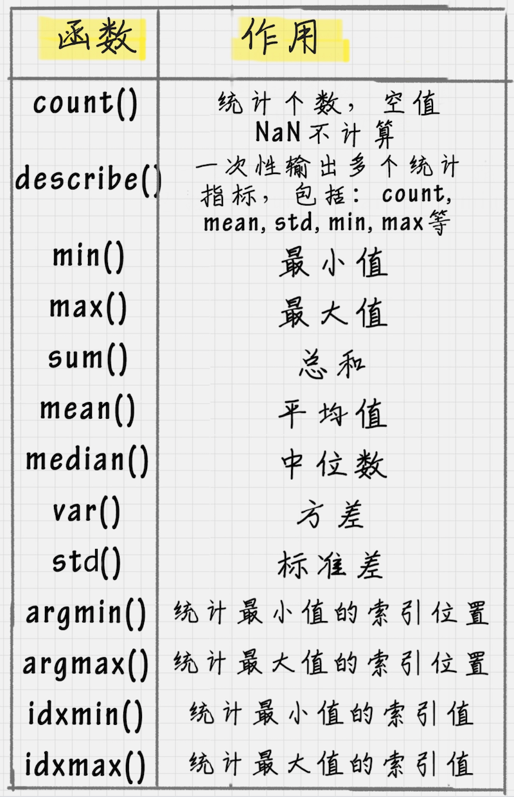
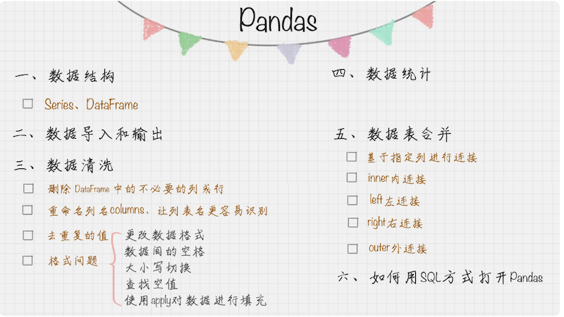

# 0105. Python 科学计算：Pandas
> 陈旸 2018-12-24

上一章中，我们讲了 Python 的一个重要的第三方库 NumPy，今天我来给你介绍 Python 的另一个工具 Pandas。

在数据分析工作中，Pandas 的使用频率是很高的，一方面是因为 Pandas 提供的基础数据结构 DataFrame 与 json 的契合度很高，转换起来就很方便。另一方面，如果我们日常的数据清理工作不是很复杂的话，你通常用几句 Pandas 代码就可以对数据进行规整。

Pandas 可以说是基于 NumPy 构建的含有更高级数据结构和分析能力的工具包。在 NumPy 中数据结构是围绕 ndarray 展开的，那么在 Pandas 中的核心数据结构是什么呢？

下面主要给你讲下 Series 和 DataFrame 这两个核心数据结构，他们分别代表着一维的序列和二维的表结构。基于这两种数据结构，Pandas 可以对数据进行导入、清洗、处理、统计和输出。

## 01. 数据结构：Series 和 DataFrame

Series 是个定长的字典序列。说是定长是因为在存储的时候，相当于两个 ndarray，这也是和字典结构最大的不同。因为在字典的结构里，元素的个数是不固定的。

Series 有两个基本属性：index 和 values。在 Series 结构中，index 默认是 0,1,2,…… 递增的整数序列，当然我们也可以自己来指定索引，比如 index=[‘a’, ‘b’, ‘c’, ‘d’]。

```
import pandas as pd
from pandas import Series, DataFrame
x1 = Series([1,2,3,4])
x2 = Series(data=[1,2,3,4], index=['a', 'b', 'c', 'd'])
print x1
print x2
```

这个例子中，x1 中的 index 采用的是默认值，x2 中 index 进行了指定。我们也可以采用字典的方式来创建 Series，比如：

```
d = {'a':1, 'b':2, 'c':3, 'd':4}
x3 = Series(d)
print x3 
```

DataFrame 类型数据结构类似数据库表。

它包括了行索引和列索引，我们可以将 DataFrame 看成是由相同索引的 Series 组成的字典类型。

我们虚构一个王者荣耀考试的场景，想要输出几位英雄的考试成绩：

```
import pandas as pd
from pandas import Series, DataFrame
data = {'Chinese': [66, 95, 93, 90,80],'English': [65, 85, 92, 88, 90],'Math': [30, 98, 96, 77, 90]}
df1= DataFrame(data)
df2 = DataFrame(data, index=['ZhangFei', 'GuanYu', 'ZhaoYun', 'HuangZhong', 'DianWei'], columns=['English', 'Math', 'Chinese'])
print df1
print df2
```

在后面的案例中，我一般会用 df, df1, df2 这些作为 DataFrame 数据类型的变量名，我们以例子中的 df2 为例，列索引是 [‘English’, ‘Math’, ‘Chinese’]，行索引是 [‘ZhangFei’, ‘GuanYu’, ‘ZhaoYun’, ‘HuangZhong’, ‘DianWei’]，所以 df2 的输出是：

在了解了 Series 和 DataFrame 这两个数据结构后，我们就从数据处理的流程角度，来看下他们的使用方法。

## 02. 数据导入和输出

Pandas 允许直接从 xlsx，csv 等文件中导入数据，也可以输出到 xlsx, csv 等文件，非常方便。

```
import pandas as pd
from pandas import Series, DataFrame
score = DataFrame(pd.read_excel('data.xlsx'))
score.to_excel('data1.xlsx')
print score
```

需要说明的是，在运行的过程可能会存在缺少 xlrd 和 openpyxl 包的情况，到时候如果缺少了，可以在命令行模式下使用「pip install」命令来进行安装。

## 03. 数据清洗

数据清洗是数据准备过程中必不可少的环节，Pandas 也为我们提供了数据清洗的工具，在后面数据清洗的章节中会给你做详细的介绍，这里简单介绍下 Pandas 在数据清洗中的使用方法。

我还是以上面这个王者荣耀的数据为例。

```
data = {'Chinese': [66, 95, 93, 90,80],'English': [65, 85, 92, 88, 90],'Math': [30, 98, 96, 77, 90]}
df2 = DataFrame(data, index=['ZhangFei', 'GuanYu', 'ZhaoYun', 'HuangZhong', 'DianWei'], columns=['English', 'Math', 'Chinese'])
```

在数据清洗过程中，一般都会遇到以下这几种情况，下面我来简单介绍一下。

### 1. 删除 DataFrame 中的不必要的列或行

Pandas 提供了一个便捷的方法 drop () 函数来删除我们不想要的列或行。比如我们想把「语文」这列删掉。

    df2 = df2.drop(columns=['Chinese'])

想把「张飞」这行删掉。

    df2 = df2.drop(index=['ZhangFei'])

### 2. 重命名列名 columns，让列表名更容易识别

如果你想对 DataFrame 中的 columns 进行重命名，可以直接使用 rename (columns=new_names, inplace=True) 函数，比如我把列名 Chinese 改成 YuWen，English 改成 YingYu。

    df2.rename(columns={'Chinese': 'YuWen', 'English': 'Yingyu'}, inplace = True)

### 3. 去重复的值

数据采集可能存在重复的行，这时只要使用 drop_duplicates () 就会自动把重复的行去掉。

    df = df.drop_duplicates () #去除重复行

### 4. 格式问题

#### 01. 更改数据格式

这是个比较常用的操作，因为很多时候数据格式不规范，我们可以使用 astype 函数来规范数据格式，比如我们把 Chinese 字段的值改成 str 类型，或者 int64 可以这么写：

```
df2['Chinese'].astype('str') 
df2['Chinese'].astype(np.int64) 
```

#### 02. 数据间的空格

有时候我们先把格式转成了 str 类型，是为了方便对数据进行操作，这时想要删除数据间的空格，我们就可以使用 strip 函数：

```
#删除左右两边空格
df2['Chinese']=df2['Chinese'].map(str.strip)
#删除左边空格
df2['Chinese']=df2['Chinese'].map(str.lstrip)
#删除右边空格
df2['Chinese']=df2['Chinese'].map(str.rstrip)
```

如果数据里有某个特殊的符号，我们想要删除怎么办？同样可以使用 strip 函数，比如 Chinese 字段里有美元符号，我们想把这个删掉，可以这么写：

    df2['Chinese']=df2['Chinese'].str.strip('$')

#### 03. 大小写转换

大小写是个比较常见的操作，比如人名、城市名等的统一都可能用到大小写的转换，在 Python 里直接使用 upper (), lower (), title () 函数，方法如下：

```
#全部大写
df2.columns = df2.columns.str.upper()
#全部小写
df2.columns = df2.columns.str.lower()
#首字母大写
df2.columns = df2.columns.str.title()
```

#### 04. 查找空值

数据量大的情况下，有些字段存在空值 NaN 的可能，这时就需要使用 Pandas 中的 isnull 函数进行查找。比如，我们输入一个数据表如下：

如果我们想看下哪个地方存在空值 NaN，可以针对数据表 df 进行 df.isnull ()，结果如下：

如果我想知道哪列存在空值，可以使用 df.isnull ().any ()，结果如下：

### 5. 使用 apply 函数对数据进行清洗

apply 函数是 Pandas 中自由度非常高的函数，使用频率也非常高。

比如我们想对 name 列的数值都进行大写转化可以用：

    df['name'] = df['name'].apply(str.upper)

我们也可以定义个函数，在 apply 中进行使用。比如定义 double_df 函数是将原来的数值 \*2 进行返回。然后对 df1 中的「语文」列的数值进行 *2 处理，可以写成：

```
def double_df(x):
           return 2*x

df1[u'语文'] = df1[u'语文'].apply(double_df)
```

我们也可以定义更复杂的函数，比如对于 DataFrame，我们新增两列，其中 ’new1’ 列是「语文」和「英语」成绩之和的 m 倍，'new2’ 列是「语文」和「英语」成绩之和的 n 倍，我们可以这样写：

```
def plus(df,n,m):
    df['new1'] = (df[u'语文']+df[u'英语']) * m
    df['new2'] = (df[u'语文']+df[u'英语']) * n
    return df

df1 = df1.apply(plus,axis=1,args=(2,3,))
```

其中 axis=1 代表按照列为轴进行操作，axis=0 代表按照行为轴进行操作，args 是传递的两个参数，即 n=2, m=3，在 plus 函数中使用到了 n 和 m，从而生成新的 df。

1『df1.apply(plus,axis=1,args=(2,3,))，这个表达式很有借鉴意义，如何传递函数，参数单独拎出来的；axis=1 代表按照列为轴进行操作，即对一行行数据处理，axis=0 代表按照行为轴进行操作，即对一列列数据进行处理。』

## 04. 数据统计

在数据清洗后，我们就要对数据进行统计了。

Pandas 和 NumPy 一样，都有常用的统计函数，如果遇到空值 NaN，会自动排除。

常用的统计函数包括：



表格中有一个 describe () 函数，统计函数千千万，describe () 函数最简便。它是个统计大礼包，可以快速让我们对数据有个全面的了解。下面我直接使用 df1.descirbe () 输出结果为：

```
df1 = DataFrame({'name':['ZhangFei', 'GuanYu', 'a', 'b', 'c'], 'data1':range(5)})
print df1.describe()
```

## 05. 数据表合并

有时候我们需要将多个渠道源的多个数据表进行合并，一个 DataFrame 相当于一个数据库的数据表，那么多个 DataFrame 数据表的合并就相当于多个数据库的表合并。

比如我要创建两个 DataFrame：

```
df1 = DataFrame({'name':['ZhangFei', 'GuanYu', 'a', 'b', 'c'], 'data1':range(5)})
df2 = DataFrame({'name':['ZhangFei', 'GuanYu', 'A', 'B', 'C'], 'data2':range(5)})
```

两个 DataFrame 数据表的合并使用的是 merge () 函数，有下面 5 种形式：

### 1. 基于指定列进行连接

比如我们可以基于 name 这列进行连接。

    df3 = pd.merge(df1, df2, on='name')

### 2. inner 内连接

inner 内链接是 merge 合并的默认情况，inner 内连接其实也就是键的交集，在这里 df1, df2 相同的键是 name，所以是基于 name 字段做的连接：

    df3 = pd.merge(df1, df2, how='inner')

### 3. left 左连接

左连接是以第一个 DataFrame 为主进行的连接，第二个 DataFrame 作为补充。

    df3 = pd.merge(df1, df2, how='left')

### 4. right 右连接

右连接是以第二个 DataFrame 为主进行的连接，第一个 DataFrame 作为补充。

    df3 = pd.merge(df1, df2, how='right')

### 5. outer 外连接

外连接相当于求两个 DataFrame 的并集。

    df3 = pd.merge(df1, df2, how='outer')

## 06. 如何用 SQL 方式打开 Pandas

Pandas 的 DataFrame 数据类型可以让我们像处理数据表一样进行操作，比如数据表的增删改查，都可以用 Pandas 工具来完成。不过也会有很多人记不住这些 Pandas 的命令，相比之下还是用 SQL 语句更熟练，用 SQL 对数据表进行操作是最方便的，它的语句描述形式更接近我们的自然语言。

事实上，在 Python 里可以直接使用 SQL 语句来操作 Pandas。

这里给你介绍个工具：pandasql。

pandasql 中的主要函数是 sqldf，它接收两个参数：一个 SQL 查询语句，还有一组环境变量 globals () 或 locals ()。这样我们就可以在 Python 里，直接用 SQL 语句中对 DataFrame 进行操作，举个例子：

```
import pandas as pd
from pandas import DataFrame
from pandasql import sqldf, load_meat, load_births
df1 = DataFrame({'name':['ZhangFei', 'GuanYu', 'a', 'b', 'c'], 'data1':range(5)})
pysqldf = lambda sql: sqldf(sql, globals())
sql = "select * from df1 where name ='ZhangFei'"
print pysqldf(sql)
```

上面这个例子中，我们是对「name='ZhangFei」的行进行了输出。当然你会看到我们用到了 lambda，lambda 在 python 中算是使用频率很高的，那 lambda 是用来做什么的呢？它实际上是用来定义一个匿名函数的，具体的使用形式为：

     lambda argument_list: expression

这里 argument_list 是参数列表，expression 是关于参数的表达式，会根据 expression 表达式计算结果进行输出返回。在上面的代码中，我们定义了：

    pysqldf = lambda sql: sqldf(sql, globals())

在这个例子里，输入的参数是 sql，返回的结果是 sqldf 对 sql 的运行结果，当然 sqldf 中也输入了 globals 全局参数，因为在 sql 中有对全局参数 df1 的使用。

## 总结



和 NumPy 一样，Pandas 有两个非常重要的数据结构：Series 和 DataFrame。使用 Pandas 可以直接从 csv 或 xlsx 等文件中导入数据，以及最终输出到 excel 表中。

我重点介绍了数据清洗中的操作，当然 Pandas 中同样提供了多种数据统计的函数。

最后我们介绍了如何将数据表进行合并，以及在 Pandas 中使用 SQL 对数据表更方便地进行操作。

Pandas 包与 NumPy 工具库配合使用可以发挥巨大的威力，正是有了 Pandas 工具，Python 做数据挖掘才具有优势。

我们来回顾一下今天的内容，在 Pandas 中，最主要的数据结构是什么？它都提供了哪些函数，可以帮我们做数据清洗？你可以自己描述一下吗？

练习题：对于下表的数据，请使用 Pandas 中的 DataFrame 进行创建，并对数据进行清洗。同时新增一列「总和」计算每个人的三科成绩之和。

