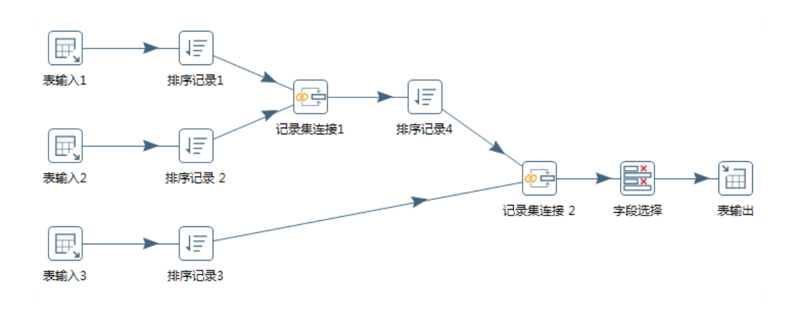
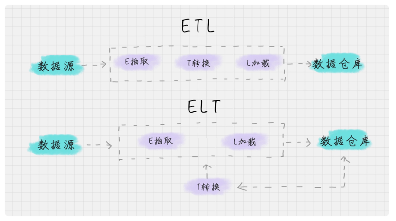
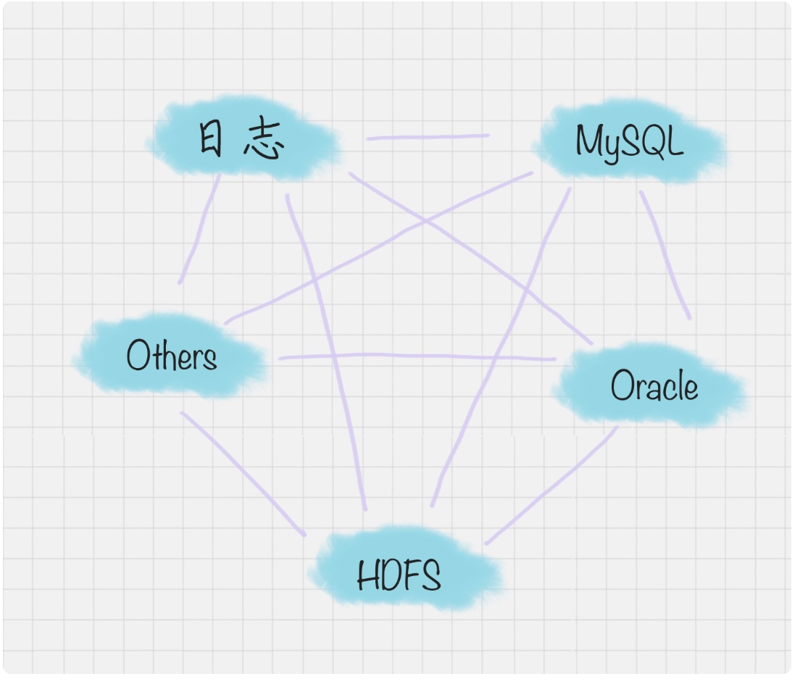
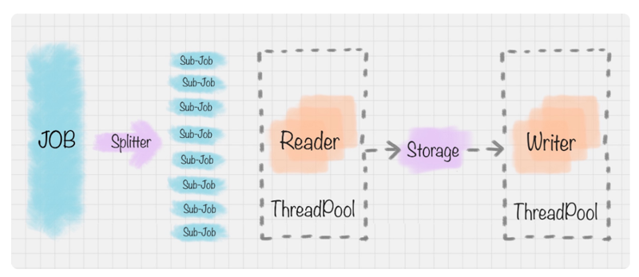

# 0112. 数据集成：这些大号一共 20 亿粉丝？
> 陈旸 2019-01-09

我们采集的数据经常会有冗余重复的情况。举个简单的例子，假设你是一个网络综艺节目的制片人，一共有 12 期节目，你一共打算邀请 30 位明星作为节目的嘉宾。你知道这些明星影响力都很大，具体在微博上的粉丝数都有标记。于是你想统计下，这些明星一共能直接影响到微博上的多少粉丝，能产生多大的影响力。

然后你突然发现，这些明星的粉丝数总和超过了 20 亿。那么他们一共会影响到中国 20 亿人口么？显然不是的，我们都知道中国人口一共是 14 亿，这 30 位明星的影响力总和不会覆盖中国所有人口。

那么如何统计这 30 位明星真实的影响力总和呢？这里就需要用到数据集成的概念了。

数据集成就是将多个数据源合并存放在一个数据存储中（如数据仓库），从而方便后续的数据挖掘工作。

据统计，大数据项目中 80% 的工作都和数据集成有关，这里的数据集成有更广泛的意义，包括了数据清洗、数据抽取、数据集成和数据变换等操作。这是因为数据挖掘前，我们需要的数据往往分布在不同的数据源中，需要考虑字段表达是否一样，以及属性是否冗余。

## 01. 数据集成的两种架构：ELT 和 ETL

数据集成是数据工程师要做的工作之一。一般来说，数据工程师的工作包括了数据的 ETL 和数据挖掘算法的实现。算法实现可以理解，就是通过数据挖掘算法，从数据仓库中找到「金子」。

什么是 ETL 呢？ETL 是英文 Extract、Transform 和 Load 的缩写，顾名思义它包括了数据抽取、转换、加载三个过程。ETL 可以说是进行数据挖掘这项工作前的「备菜」过程。

我来解释一下数据抽取、转换、加载这三个过程。

抽取是将数据从已有的数据源中提取出来。

转换是对原始数据进行处理，例如将表输入 1 和 表输入 2 进行连接形成一张新的表。


如果是三张表连接的话，可以怎么操作呢？先将表输入 1 和表输入 2 进行连接形成表输入 1-2，然后将表输入 1-2 和表输入 3 进行连接形成新的表。然后再将生成的新表写入目的地。



根据转换发生的顺序和位置，数据集成可以分为 ETL 和 ELT 两种架构。

ETL 的过程为提取 (Extract)—— 转换 (Transform)—— 加载 (Load)，在数据源抽取后首先进行转换，然后将转换的结果写入目的地。

ELT 的过程则是提取 (Extract)—— 加载 (Load）—— 变换 (Transform)，在抽取后将结果先写入目的地，然后利用数据库的聚合分析能力或者外部计算框架，如 Spark 来完成转换的步骤。



目前数据集成的主流架构是 ETL，但未来使用 ELT 作为数据集成架构的将越来越多。这样做会带来多种好处：

1. ELT 和 ETL 相比，最大的区别是「重抽取和加载，轻转换」，从而可以用更轻量的方案搭建起一个数据集成平台。使用 ELT 方法，在提取完成之后，数据加载会立即开始。一方面更省时，另一方面 ELT 允许 BI 分析人员无限制地访问整个原始数据，为分析师提供了更大的灵活性，使之能更好地支持业务。

2. 在 ELT 架构中，数据变换这个过程根据后续使用的情况，需要在 SQL 中进行，而不是在加载阶段进行。这样做的好处是你可以从数据源中提取数据，经过少量预处理后进行加载。这样的架构更简单，使分析人员更好地了解原始数据的变换过程。

介绍完了这两种架构，你肯定想要知道 ETL 工具都有哪些？

典型的 ETL 工具有：

1. 商业软件：Informatica PowerCenter、IBM InfoSphere DataStage、Oracle Data Integrator、Microsoft SQL Server Integration Services 等。

2. 开源软件：Kettle、Talend、Apatar、Scriptella、DataX、Sqoop 等。

相对于传统的商业软件，Kettle 是一个易于使用的，低成本的解决方案。国内很多公司都在使用 Kettle 用来做数据集成。所以我重点给你讲解下 Kettle 工具的使用。

## 02. Kettle 工具的使用

Kettle 是一款国外开源的 ETL 工具，纯 Java 编写，可以在 Window 和 Linux 上运行，不需要安装就可以使用。Kettle 中文名称叫水壶，该项目的目标是将各种数据放到一个壶里，然后以一种指定的格式流出。

Kettle 在 2006 年并入了开源的商业智能公司 Pentaho，正式命名为 Pentaho Data Integeration，简称「PDI」。因此 Kettle 现在是 Pentaho 的一个组件，下载地址：[Article Detail](https://community.hitachivantara.com/s/article/data-integration-kettle)。

在使用 Kettle 之前还需要安装数据库软件和 Java 运行环境（JRE）。

Kettle 采用可视化的方式进行操作，来对数据库间的数据进行迁移。它包括了两种脚本：Transformation 转换和 Job 作业。

Transformation（转换）：相当于一个容器，对数据操作进行了定义。数据操作就是数据从输入到输出的一个过程。你可以把转换理解成为是比作业粒度更小的容器。在通常的工作中，我们会把任务分解成为不同的作业，然后再把作业分解成多个转换。

Job（作业）：相比于转换是个更大的容器，它负责将转换组织起来完成某项作业。

接下来，我分别讲下这两个脚本的创建过程。

### 1. 如何创建 Transformation（转换）

Transformation 可以分成三个步骤，它包括了输入、中间转换以及输出。


在 Transformation 中包括两个主要概念：Step 和 Hop。Step 的意思就是步骤，Hop 就是跳跃线的意思。

1. Step（步骤）：Step 是转换的最小单元，每一个 Step 完成一个特定的功能。在上面这个转换中，就包括了表输入、值映射、去除重复记录、表输出这 4 个步骤；

2. Hop（跳跃线）：用来在转换中连接 Step。它代表了数据的流向。


### 2. 如何创建 Job（作业）

完整的任务，实际上是将创建好的转换和作业串联起来。在这里 Job 包括两个概念：Job Entry、Hop。

如何理解这两个概念呢？

1. Job Entry（工作实体）：Job Entry 是 Job 内部的执行单元，每一个 Job Entry 都是用来执行具体的任务，比如调用转换，发送邮件等。

2. Hop：指连接 Job Entry 的线。并且它可以指定是否有条件地执行。

在 Kettle 中，你可以使用 Spoon，它是一种一种图形化的方式，来让你设计 Job 和 Transformation，并且可以保存为文件或者保存在数据库中。下面我来带你做一个简单的例子。

### 案例 1：如何将文本文件的内容转化到 MySQL 数据库中

这里我给你准备了文本文件，这个文件我上传到了 GitHub 上，你可以自行下载：http://t.cn/E4SzvOf，数据描述如下：


下面我来教你，如何将文本文件的内容转化到 MySQL 数据库中。

Step1：创建转换，右键「转换→新建」；

Step2：在左侧「核心对象」栏目中选择「文本文件输入」控件，拖拽到右侧的工作区中；

Step3：从左侧选择「表输出」控件，拖拽到右侧工作区；

Step4：鼠标在「文本文件输入」控件上停留，在弹窗中选择图标，鼠标拖拽到「表输出」控件，将一条连线连接到两个控件上；

这时我们已经将转换的流程设计好了，现在是要对输入和输出两个控件进行设置。

Step5：双击「文本文件输入」控件，导入已经准备好的文本文件；

Step6：双击「表输出」控件，这里你需要配置下 MySQL 数据库的连接，同时数据库中需要有一个数据表，字段的设置与文本文件的字段设置一致（这里我设置了一个 wucai 数据库，以及 score 数据表。字段包括了 name、create_time、Chinese、English、Math，与文本文件的字段一致）。

具体操作可以看下面的演示：

Step7：创建数据库字段的对应关系，这个需要双击「表输出」，找到数据库字段，进行字段映射的编辑；

Step8：点击左上角的执行图标，如下图：

这样我们就完成了从文本文件到 MySQL 数据库的转换。

Kettle 的控件比较多，内容无法在一节课内容中完整呈现，我只给你做个入门了解。

另外给你推荐一个 Kettle 的开源社区：http://www.ukettle.org 。

在社区里，你可以和大家进行交流。因为 Kettle 相比其他工具上手简单，而且是开源工具，有问题可以在社群里咨询。因此我推荐你使用 Kettle 作为你的第一个 ETL 工具。

当然除了 Kettle 工具，实际工作中，你可能也会接触到其他的 ETL 工具，这里我给你简单介绍下阿里巴巴的开源工具 DataX 和 Apache 的 Sqoop。

### 阿里开源软件：DataX

在以往的数据库中，数据库都是两两之间进行的转换，没有统一的标准，转换形式是这样的：



但 DataX 可以实现跨平台、跨数据库、不同系统之间的数据同步及交互，它将自己作为标准，连接了不同的数据源，以完成它们之间的转换。


DataX 的模式是基于框架 + 插件完成的，DataX 的框架如下图：



在这个框架里，Job 作业被 Splitter 分割器分成了许多小作业 Sub-Job。在 DataX 里，通过两个线程缓冲池来完成读和写的操作，读和写都是通过 Storage 完成数据的交换。比如在「读」模块，切分后的小作业，将数据从源头装载到 DataXStorage，然后在「写」模块，数据从 DataXStorage 导入到目的地。

这样的好处就是，在整体的框架下，我们可以对 Reader 和 Writer 进行插件扩充，比如我想从 MySQL 导入到 Oracle，就可以使用 MySQLReader 和 OracleWriter 插件，装在框架上使用即可。

### Apache 开源软件：Sqoop

Sqoop 是一款开源的工具，是由 Apache 基金会所开发的分布式系统基础架构。Sqoop 在 Hadoop 生态系统中是占据一席之地的，它主要用来在 Hadoop 和关系型数据库中传递数据。通过 Sqoop，我们可以方便地将数据从关系型数据库导入到 HDFS 中，或者将数据从 HDFS 导出到关系型数据库中。

Hadoop 实现了一个分布式文件系统，即 HDFS。Hadoop 的框架最核心的设计就是 HDFS 和 MapReduce。HDFS 为海量的数据提供了存储，而 MapReduce 则为海量的数据提供了计算。

## 总结

今天我介绍了数据集成的两种架构方式，以及 Kettle 工具的基本操作。不要小看了 ETL，虽然它不直接交付数据挖掘的结果，但是却是数据挖掘前重要的工作，它包括了抽取各种数据、完成转化和加载这三个步骤。

因此除了数据科学家外，还有个工作职位叫 ETL 工程师，这份工作正是我们今天介绍的从事 ETL 这种架构工作的人。如果你以后有机会从事这份工作，你不仅要对今天介绍的数据集成概念有所了解，还要掌握至少一种 ETL 开发工具，如 Kettle、DataX、 Sqoop 等；此外还需要熟悉主流数据库技术，比如 SQL Server、PostgeSQL、Oracle 等。

这是我操作 kettle 的流程视频，你可以看一下。

今天我给你讲了数据集成的两种架构，以及帮助我们实现 ETL 的工具 Kettle。纸上得来终觉浅，绝知此事要躬行。你不妨尝试下如何使用 Kettle 将 MySQL 数据库内容转化到文本文件？

另我想让你来谈谈，你对数据集成的理解，如果你之前做过 ETL 的工具，也请你来谈一谈你对 ETL 的工具选择和使用经历。

## 精选留言

### 01

实际操作完成，说下操作过程中注意事项：

1、下载安装 jdk1.8+，注意配置系统 JAVA_HOME 环境变量。

2、下载 Kettle。

3、如果你用的是 MySQL，导入数据时会报 Driver class 'org.gjt.mm.mysql.Driver' could not be found, make sure the 'MySQL' driver (jar file) is installed. org.gjt.mm.mysql.Driver 错误。此时需要到 https://dev.mysql.com/downloads/file/?id=468318%20 下载后，解压出 mysql-connector-java-5.1.41-bin.jar 包，放到 pdi-ce-8.2.0.0-342\data-integration\lib 目录即可。

2019-01-09

### 02

大约三年大数据工程师工作，从最开始的数据集成（sqoop、代码、商用软件 ETL 工具等），将数据汇聚到数据仓库，理解业务，清洗应用需要的数据。数据集成是将多源（多系统）、多样（结构化、非结构化、半结构化）、多维度数据整合进数据仓库，形成数据海洋，更好的提供业务分析系统的数据服务，通过数仓的数据集成，达到数据共享的效果，降低对原始业务系统的影响，同时加快数据分析工作者的数据准备周期。数据集成最开始就是原始系统的数据，照样搬到数据仓库，这种类型工作长期实施，容易疲劳失去兴趣，理解业务需求，通过自己的数据集成、清洗、数据分析，提供有意思的数据，就是挖金子过程，应该也是一件有趣的事情。

2019-06-09

### 03

Kettle 数据集成

1、安装 jdk：官网 http://www.oracle.com/technetwork/java/javase/downloads/jdk8-downloads-2133151.html，下载 mac 版的 JDK，下载后，直接安装。终端验证 java-version。

2、安装 Kettle：https://sourceforge.net/projects/pentaho/files/Data%20Integration/

下载最新 pdi-ce-8.2.0.0-342.zip 压缩包，直接生成 data integration 文件夹。

3、下载数据库驱动：https://dev.mysql.com/downloads/connector/j/

mysql-connector-java-5.1.41.tar.gz 解压，但是出现了 query-cache-size 问题，重新下载最新 mysql-connector-java-8.0.13.tar.gz，又出现找不到 jar 文件。重启也不行，最后两个文件都放在了 data integration/lib 里面，貌似就可以了，这块还需再探索。

4、打开终端，启动 Kettle：sh spoon.sh 打开 Spoon，开始文本输入和表输出了。

5、安装 MySQL，同时安装了 MySQL WorkBench 建立数据库 wucai 和表 score，目前出现表输出 Unexpected batch update error committing the database connection 和 org.pentaho.di.core.exception.KettleDatabaseBatchException 问题，可能是对 SQL 设置问题，还需 debug。

2019-01-09

### 04

希望有如我一般的使用 Mac 的屌丝注意，安装完了 Kettle 之后，要去 mysql 官网下载驱动，这个驱动不能用最新版本的，要用老版本的才能连接数据库，我用的是 5.1.46。

2019-03-22

### 05

加载就是把转换后的数据从中间层 (stage 层，通常是一个数据库或数据库集群) 导入数据分析层，然后才能在模型中用这些干净的数据进行数据分析。

作者回复：对的

2019-01-10

### 06

1. 安装 openjdk。

2. 下载 kettle zip 包，解压即可。

2. 下载 mysql jdbc driver (https://dev.mysql.com/downloads/connector/j/), 解压將 mysql-connector-java-8.0.15 (我用的这个版本) 放入 ‘data-integration/lib/’ 目录下。

3. sudo apt-get install mysql ，安装完后如果使用 root 用户，注意是否能以 localhost 登录，创建一个数据库用来测试，并创建一个 table，表名随意，字段能对应到你的数据即可。

4. 运行脚本 spoon.sh 打开 kettle, 添加 text input ，双击 -- 添加数据文件 -- 切换到‘内容’ -- 修改分隔符为 tab -- 修改格式为 Unix（如不修改会找不到字段） -- 切换到‘字段’ -- 获取字段。

2019-03-13

### 07

搭环境 (open jdk , mysql 8.0 , mysql-connector for java, kettle)

2019-11-12

### 08

目前我们做的业务需求比较多，一个需求有时会关联五六张表，所以我们特别希望可以先做转换，做成大宽表，入仓，可以直接用。老师说的先加载再转换，是适用于做数据挖掘时吗？

作者回复：两种方式都适用于数据挖掘的情况。

2019-08-27

### 09

数据库 MySQL 操作

本地登录

mysql -u root -p

创建数据库 wucai

CREATE DATABASE wucai;

查询数据库

show databases;

切换 / 进入数据库 wucai

use wucai;

创建数据库表 score。包含 create_time、name、Chinese、English、Math 五个字段。

CREATE TABLE score (create_time VARCHAR(255) NULL, name VARCHAR(255) NULL, Chinese VARCHAR(255) NULL, English VARCHAR(255) NULL, Math VARCHAR(255) NULL);

查询数据库表

show tables;

2019-03-19

### 10

使用 postgresql 的朋友，记得再 spoon 中给表字段加引号。

2019-01-28

### 11

centos7 mysql 5.7

操作成功，分享开心下，步骤老师也讲挺细的，也需要在 kettke 的 lib / 中加入 mysql-connector-java-5.1.46-bin.jar，我就分享出 mysql 的操作吧，参考而已：

```
CREATE TABLE scores (
create_time char(20) NOT NULL,
name char(20) NOT NULL,
Chinese int NOT NULL,
English INT NOT NULL,
Math INT NOT NULL )
ENGINE= InnoDB;
```

总结：该集成工具。类似 flume 的作用，对接数据源的上下游，载入自己编写的 jar 文件，整个就更友好些。

2020-01-16

### 12

数据集成理解：数据集成是对各种业务数据进行清洗、按数据仓库模型转换后形成一套跨业务的集成数据，这套集成数据可以从各个维度、全方位地展示业务数据，为 BI 分析和数据挖掘提供可靠、丰富的数据来源。我曾经用过的 ETL 工具是 IBM 的 DataStage，DataStage 的数据抽取效率还是挺高的，它是在抽取过程中对数据进行分区，各个分区并行抽取和转换，最后再对各个分区进行收集和合并，这种机制极大提高了 ETL 的效率。DataStage 采用图形化界面进行流程设计，不需要编程，上手比较容易，但各个组件需要进行大量配置，配置比较繁琐，另外，调试起来也不是很直观方便，但总体来说还是一款不错的 ETL 工具。

2019-08-06