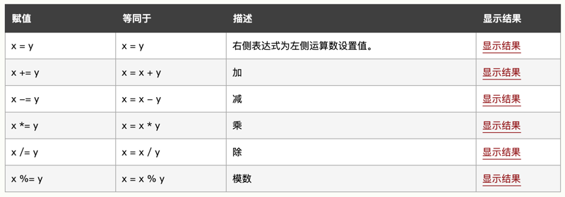
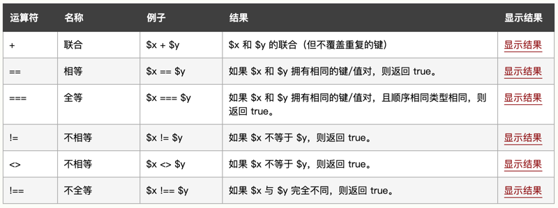
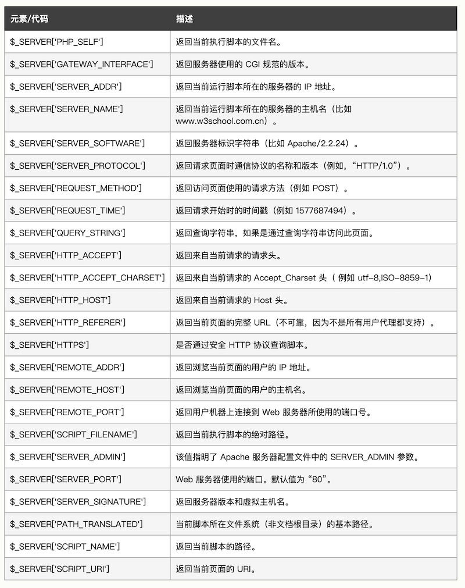

# 0101 基础教程

[PHP 简介](https://www.w3school.com.cn/php/php_intro.asp)

## 09. PHP 运算符

本节展示了可用于 PHP 脚本中的各种运算符。

PHP 算数运算符。下例展示了使用不同算数运算符的不同结果：


```
<?php 
$x=17; 
$y=8;
echo ($x + $y); // 输出 25
echo ($x - $y); // 输出 9
echo ($x * $y); // 输出 136
echo ($x / $y); // 输出 2.125
echo ($x % $y); // 输出 1
?>
```

PHP 赋值运算符。PHP 赋值运算符用于向变量写值。PHP 中基础的赋值运算符是 "="。这意味着右侧赋值表达式会为左侧运算数设置值。



下例展示了使用不同赋值运算符的不同结果：

```
<?php 
$x=17; 
echo $x; // 输出 17

$y=17; 
$y += 8;
echo $y; // 输出 25

$z=17;
$z -= 8;
echo $z; // 输出 9

$i=17;
$i *= 8;
echo $i; // 输出 136

$j=17;
$j /= 8;
echo $j; // 输出 2.125

$k=17;
$k %= 8;
echo $k; // 输出 1
?>
```

PHP 字符串运算符。


下例展示了使用字符串运算符的结果：

```
<?php
$a = "Hello";
$b = $a . " world!";
echo $b; // 输出 Hello world!

$x="Hello";
$x .= " world!";
echo $x; // 输出 Hello world!
?>
```

PHP 递增 / 递减运算符。


下例展示了使用不同递增 / 递减运算符的不同结果：

```
<?php
$x=17; 
echo ++$x; // 输出 18

$y=17; 
echo $y++; // 输出 17

$z=17;
echo --$z; // 输出 16

$i=17;
echo $i--; // 输出 17
?>
```

PHP 比较运算符。


PHP 比较运算符用于比较两个值（数字或字符串）：

下例展示了使用某些比较运算符的不同结果：

```
<?php
$x=17; 
$y="17";

var_dump($x == $y);
echo "<br>";
var_dump($x === $y);
echo "<br>";
var_dump($x != $y);
echo "<br>";
var_dump($x !== $y);
echo "<br>";

$a=17;
$b=8;

var_dump($a > $b);
echo "<br>";
var_dump($a < $b);
?>
```

PHP 逻辑运算符。


PHP 数组运算符。



PHP 数组运算符用于比较数组：

下例展示了使用不同数组运算符的不同结果：

```
<?php
$x = array("a" => "apple", "b" => "banana"); 
$y = array("c" => "orange", "d" => "peach"); 
$z = $x + $y; // $x 与 $y 的联合
var_dump($z);
var_dump($x == $y);
var_dump($x === $y);
var_dump($x != $y);
var_dump($x <> $y);
var_dump($x !== $y);
?>
```

## 10. PHP if...else...elseif 语句

条件语句用于基于不同条件执行不同的动作。

PHP 条件语句。在您编写代码时，经常会希望为不同的决定执行不同的动作。您可以在代码中使用条件语句来实现这一点。在 PHP 中，我们可以使用以下条件语句：1）if 语句 —— 如果指定条件为真，则执行代码；2）if...else 语句 —— 如果条件为 true，则执行代码；如果条件为 false，则执行另一端代码；3）if...elseif....else 语句 —— 根据两个以上的条件执行不同的代码块；4）switch 语句 —— 选择多个代码块之一来执行。

PHP —— if 语句。if 语句用于在指定条件为 true 时执行代码。

```
if (条件) {
  当条件为 true 时执行的代码;
}
```

下例将输出 "Have a good day!"，如果当前时间 (HOUR) 小于 20：

```
<?php
$t=date("H");

if ($t<"20") {
  echo "Have a good day!";
}
?>
```

PHP - if...else 语句。请使用 if....else 语句在条件为 true 时执行代码，在条件为 false 时执行另一段代码。

```
if (条件) {
  条件为 true 时执行的代码;
} else {
  条件为 false 时执行的代码;
}
```

如果当前时间 (HOUR) 小于 20，下例将输出 "Have a good day!"，否则输出 "Have a good night!"：

```
<?php
$t=date("H");

if ($t<"20") {
  echo "Have a good day!";
} else {
  echo "Have a good night!";
}
?>
```

PHP - if...elseif....else 语句。请使用 if....elseif...else 语句来根据两个以上的条件执行不同的代码。

```
if (条件) {
  条件为 true 时执行的代码;
} elseif (condition) {
  条件为 true 时执行的代码;
} else {
  条件为 false 时执行的代码;
}
```

如果当前时间 (HOUR) 小于 10，下例将输出 "Have a good morning!"，如果当前时间小于 20，则输出 "Have a good day!"。否则将输出 "Have a good night!"：

```
<?php
$t=date("H");

if ($t<"10") {
  echo "Have a good morning!";
} elseif ($t<"20") {
  echo "Have a good day!";
} else {
  echo "Have a good night!";
}
?>
```

## 11. PHP Switch 语句

switch 语句用于基于不同条件执行不同动作。

Switch 语句。如果您希望有选择地执行若干代码块之一，请使用 Switch 语句。使用 Switch 语句可以避免冗长的 if..elseif..else 代码块。

```
switch (expression)
{
case label1:
  expression = label1 时执行的代码 ;
  break;  
case label2:
  expression = label2 时执行的代码 ;
  break;
default:
  表达式的值不等于 label1 及 label2 时执行的代码;
}
```

工作原理：1）对表达式（通常是变量）进行一次计算；2）把表达式的值与结构中 case 的值进行比较；3）如果存在匹配，则执行与 case 关联的代码；4）代码执行后，break 语句阻止代码跳入下一个 case 中继续执行；5）如果没有 case 为真，则使用 default 语句。

```
<?php
$favfruit="orange";

switch ($favfruit) {
   case "apple":
     echo "Your favorite fruit is apple!";
     break;
   case "banana":
     echo "Your favorite fruit is banana!";
     break;
   case "orange":
     echo "Your favorite fruit is orange!";
     break;
   default:
     echo "Your favorite fruit is neither apple, banana, or orange!";
}
?>
```

## 12. PHP while 循环

PHP while 循环在指定条件为 true 时执行代码块。

PHP 循环。在您编写代码时，经常需要反复运行同一代码块。我们可以使用循环来执行这样的任务，而不是在脚本中添加若干几乎相等的代码行。

在 PHP 中，我们有以下循环语句：1）while —— 只要指定条件为真，则循环代码块；2）do...while —— 先执行一次代码块，然后只要指定条件为真则重复循环；3）for —— 循环代码块指定次数；4）foreach —— 遍历数组中的每个元素并循环代码块。

PHP while 循环。只要指定的条件为真，while 循环就会执行代码块。

```
while (条件为真) {
  要执行的代码;
}
```

下例首先把变量 \$x 设置为 1（\$x=1）。然后执行 while 循环，只要 \$x 小于或等于 5。循环每运行一次，\$x 将递增 1：

```
<?php 
$x=1; 

while($x<=5) {
  echo "这个数字是：$x <br>";
  $x++;
} 
?>
```

PHP do...while 循环。do...while 循环首先会执行一次代码块，然后检查条件，如果指定条件为真，则重复循环。

```
do {
  要执行的代码;
} while (条件为真);
```

下面的例子首先把变量 \$x 设置为 1（\$x=1）。然后，do while 循环输出一段字符串，然后对变量 \$x 递增 1。随后对条件进行检查（\$x 是否小于或等于 5）。只要 \$x 小于或等于 5，循环将会继续运行：

```
<?php 
$x=1; 

do {
  echo "这个数字是：$x <br>";
  $x++;
} while ($x<=5);
?>
```

请注意，do while 循环只在执行循环内的语句之后才对条件进行测试。这意味着 do while 循环至少会执行一次语句，即使条件测试在第一次就失败了。下面的例子把 \$x 设置为 6，然后运行循环，随后对条件进行检查：

```
<?php 
$x=6;

do {
  echo "这个数字是：$x <br>";
  $x++;
} while ($x<=5);
?>
```

运行实例下一节会讲解 for 循环和 foreach 循环。

## 13. PHP for 循环

PHP for 循环执行代码块指定的次数。如果您已经提前确定脚本运行的次数，可以使用 for 循环。

```
for (init counter; test counter; increment counter) {
  code to be executed;
}
```

参数：1）init counter：初始化循环计数器的值；2）test counter：: 评估每个循环迭代。如果值为 TRUE，继续循环。如果它的值为 FALSE，循环结束；3）increment counter：增加循环计数器的值。

下面的例子显示了从 0 到 10 的数字：

```
<?php 
for ($x=0; $x<=10; $x++) {
  echo "数字是：$x <br>";
} 
?>
```

PHP foreach 循环。foreach 循环只适用于数组，并用于遍历数组中的每个键 / 值对。

```
foreach ($array as $value) {
  code to be executed;
}
```

每进行一次循环迭代，当前数组元素的值就会被赋值给 \$value 变量，并且数组指针会逐一地移动，直到到达最后一个数组元素。

下面的例子演示的循环将输出给定数组（\$colors）的值：

```
<?php 
$colors = array("red","green","blue","yellow"); 

foreach ($colors as $value) {
  echo "$value <br>";
}
?>
```

在稍后的章节，您将学到更多有关数组的知识。

## 14. PHP 函数

PHP 的真正力量来自它的函数：它拥有超过 1000 个内建的函数。

PHP 用户定义函数：1）除了内建的 PHP 函数，我们可以创建我们自己的函数。2）函数是可以在程序中重复使用的语句块。3）页面加载时函数不会立即执行。4）函数只有在被调用时才会执行。

在 PHP 创建用户定义函数。用户定义的函数声明以单词 "function" 开头：

```
function functionName() {
  被执行的代码;
}
```

注释：函数名能够以字母或下划线开头（而非数字）。函数名对大小写不敏感。

提示：函数名应该能够反映函数所执行的任务。

在下面的例子中，我们创建名为 "writeMsg ()" 的函数。打开的花括号（{）指示函数代码的开始，而关闭的花括号（}）指示函数的结束。此函数输出 "Hello world!"。如需调用该函数，只要使用函数名即可：

```
<?php
function sayHi() {
  echo "Hello world!";
}

sayhi(); // 调用函数
?>
```

PHP 函数参数。可以通过参数向函数传递信息。参数类似变量。参数被定义在函数名之后，括号内部。您可以添加任意多参数，只要用逗号隔开即可。

下面的例子中的函数有一个参数（\$fname）。当调用 familyName () 函数时，我们同时要传递一个名字（例如 Bill），这样会输出不同的名字，但是姓氏相同：

```
<?php
function familyName($fname) {
  echo "$fname Zhang.<br>";
}

familyName("Li");
familyName("Hong");
familyName("Tao");
familyName("Xiao Mei");
familyName("Jian");
?>
```

下面的例子中的函数有两个参数（\$fname 和 \$year）：

```
<?php
function familyName($fname,$year) {
  echo "$fname Zhang. Born in $year <br>";
}

familyName("Li","1975");
familyName("Hong","1978");
familyName("Tao","1983");
?>
```

PHP 默认参数值。下面的例子展示了如何使用默认参数。如果我们调用没有参数的 setHeight () 函数，它的参数会取默认值：

```
<?php
function setHeight($minheight=50) {
  echo "The height is : $minheight <br>";
}

setHeight(350);
setHeight(); // 将使用默认值 50
setHeight(135);
setHeight(80);
?>
```

PHP 函数 —— 返回值。如需使函数返回值，请使用 return 语句：

```
<?php
function sum($x,$y) {
  $z=$x+$y;
  return $z;
}

echo "5 + 10 = " . sum(5,10) . "<br>";
echo "7 + 13 = " . sum(7,13) . "<br>";
echo "2 + 4 = " . sum(2,4);
?>
```

## 15. PHP 数组

数组能够在单独的变量名中存储一个或多个值。

数组在单个变量中存储多个值：

```
<?php
$cars=array("porsche","BMW","Volvo");
echo "I like " . $cars[0] . ", " . $cars[1] . " and " . $cars[2] . ".";
?>
```

什么是数组？数组是特殊的变量，它可以同时保存一个以上的值。如果您有一个项目列表（例如汽车品牌列表），在单个变量中存储这些品牌名称是这样的：

```
$cars1="porsche";
$cars2="BMW";
$cars3="Volvo";
```

不过，假如您希望对变量进行遍历并找出特定的那个值？或者如果您需要存储 300 个汽车品牌，而不是 3 个呢？解决方法是创建数组！

数组能够在单一变量名中存储许多值，并且您能够通过引用索引号来访问某个值。

在 PHP 中创建数组。在 PHP 中，array () 函数用于创建数组：

    array();

在 PHP 中，有三种数组类型：1）索引数组 —— 带有数字索引的数组；2）关联数组 —— 带有指定键的数组；3）多维数组 —— 包含一个或多个数组的数组。

PHP 索引数组。有两种创建索引数组的方法：1）索引是自动分配的（索引从 0 开始）：

    $cars=array("porsche","BMW","Volvo");

或者也可以手动分配索引：

```
$cars[0]="porsche";
$cars[1]="BMW";
$cars[2]="Volvo";
```

下面的例子创建名为 \$cars 的索引数组，为其分配三个元素，然后输出包含数组值的一段文本：

```
<?php
$cars=array("porsche","BMW","Volvo");
echo "I like " . $cars[0] . ", " . $cars[1] . " and " . $cars[2] . ".";
?>
```

获得数组的长度 —— count () 函数。count () 函数用于返回数组的长度（元素数）：

```
<?php
$cars=array("porsche","BMW","Volvo");
echo count($cars);
?>
```

遍历索引数组。如需遍历并输出索引数组的所有值，您可以使用 for 循环，就像这样：

```
<?php
$cars=array("porsche","BMW","Volvo");
$arrlength=count($cars);

for($x=0;$x<$arrlength;$x++) {
  echo $cars[$x];
  echo "<br>";
}
?>
```

PHP 关联数组。关联数组是使用您分配给数组的指定键的数组。有两种创建关联数组的方法：

    $age=array("Bill"=>"35","Steve"=>"37","Elon"=>"43");

或者：

```
$age['Bill']="63";
$age['Steve']="56";
$age['Elon']="47";
```

随后可以在脚本中使用指定键：

```
<?php
$age=array("Bill"=>"63","Steve"=>"56","Elon"=>"47");
echo "Elon is " . $age['Elon'] . " years old.";
?>
```

遍历关联数组。如需遍历并输出关联数组的所有值，您可以使用 foreach 循环，就像这样：

```
<?php
$age=array("Bill"=>"63","Steve"=>"56","Elon"=>"47");

foreach($age as $x=>$x_value) {
  echo "Key=" . $x . ", Value=" . $x_value;
  echo "<br>";
}
?>
```

多维数组。我们将在 PHP 高级教程中讲解多维数组。

如需完整的数组函数参考手册，请访问我们的 PHP 数组参考手册。该参考手册包含每个函数的简要描述、使用示例：[PHP Array 函数](https://www.w3school.com.cn/php/php_ref_array.asp)。

## 16. PHP 数组排序

数组中的元素能够以字母或数字顺序进行升序或降序排序。

PHP —— 数组的排序函数。在本节中，我们将学习如下 PHP 数组排序函数：1）sort () —— 以升序对数组排序。2）rsort () —— 以降序对数组排序。3）asort () —— 根据值，以升序对关联数组进行排序。4）ksort () —— 根据键，以升序对关联数组进行排序。5）arsort () —— 根据值，以降序对关联数组进行排序。6）krsort () —— 根据键，以降序对关联数组进行排序。7）对数组进行升序排序 —— sort ()。

下面的例子按照字母升序对数组 \$cars 中的元素进行排序：

```
<?php
$cars=array("porsche","BMW","Volvo");
sort($cars);
?>
```

下面的例子按照数字升序对数组 \$numbers 中的元素进行排序：

```
<?php
$numbers=array(3,5,1,22,11);
sort($numbers);
?>
```

对数组进行降序排序 —— rsort ()。下面的例子按照字母降序对数组 \$cars 中的元素进行排序：

```
<?php
$cars=array("porsche","BMW","Volvo");
rsort($cars);
?>
```

下面的例子按照数字降序对数组 \$numbers 中的元素进行排序：

```
<?php
$numbers=array(3,5,1,22,11);
rsort($numbers);
?>
```

根据值对数组进行升序排序—— asort ()。下面的例子根据值对关联数组进行升序排序：

```
<?php
$age=array("Bill"=>"63","Steve"=>"56","Elon"=>"47");
asort($age);
?>
```

根据键对数组进行升序排序 —— ksort ()。下面的例子根据键对关联数组进行升序排序：

```
<?php
$age=array("Bill"=>"63","Steve"=>"56","Elon"=>"47");
ksort($age);
?>
```

根据值对数组进行降序排序 —— arsort ()。下面的例子根据值对关联数组进行降序排序：

```
<?php
$age=array("Bill"=>"63","Steve"=>"56","Elon"=>"47");
arsort($age);
?>
```

根据键对数组进行降序排序 —— krsort ()。下面的例子根据键对关联数组进行降序排序：

```
<?php
$age=array("Bill"=>"63","Steve"=>"56","Elon"=>"47");
krsort($age);
?>
```

如需完整的数组函数参考手册，请访问我们的 PHP 数组参考手册。该参考手册包含每个函数的简要描述、使用示例：[PHP Array 函数](https://www.w3school.com.cn/php/php_ref_array.asp)

## 17. PHP 全局变量 —— 超全局变量

超全局变量在 PHP 4.1.0 中引入，是在全部作用域中始终可用的内置变量。

PHP 全局变量 —— 超全局变量。PHP 中的许多预定义变量都是「超全局的」，这意味着它们在一个脚本的全部作用域中都可用。在函数或方法中无需执行 global \$variable; 就可以访问它们。

这些超全局变量是：

```
$GLOBALS
$_SERVER
$_REQUEST
$_POST
$_GET
$_FILES
$_ENV
$_COOKIE
$_SESSION
```

本节会介绍一些超全局变量，并会在稍后的章节讲解其他的超全局变量。

\$GLOBALS —— 引用全局作用域中可用的全部变量。\$GLOBALS 这种全局变量用于在 PHP 脚本中的任意位置访问全局变量（从函数或方法中均可）。PHP 在名为 \$GLOBALS [index] 的数组中存储了所有全局变量。变量的名字就是数组的键。下面的例子展示了如何使用超级全局变量 \$GLOBALS：

```
<?php 
$x = 75; 
$y = 25;
 
function addition() { 
  $GLOBALS['z'] = $GLOBALS['x'] + $GLOBALS['y']; 
}
 
addition(); 
echo $z; 
?>
```

在上面的例子中，由于 z 是 \$GLOBALS 数组中的变量，因此在函数之外也可以访问它。

\$_SERVER 这种超全局变量保存关于报头、路径和脚本位置的信息。

下面的例子展示了如何使用 \$_SERVER 中的某些元素：

```
<?php 
echo $_SERVER['PHP_SELF'];
echo "<br>";
echo $_SERVER['SERVER_NAME'];
echo "<br>";
echo $_SERVER['HTTP_HOST'];
echo "<br>";
echo $_SERVER['HTTP_REFERER'];
echo "<br>";
echo $_SERVER['HTTP_USER_AGENT'];
echo "<br>";
echo $_SERVER['SCRIPT_NAME'];
?>
```

下表列出了您能够在 \$_SERVER 中访问的最重要的元素：



PHP \$_REQUEST 用于收集 HTML 表单提交的数据。

下面的例子展示了一个包含输入字段及提交按钮的表单。当用户通过点击提交按钮来提交表单数据时，表单数据将发送到 \<form> 标签的 action 属性中指定的脚本文件。在这个例子中，我们指定文件本身来处理表单数据。如果您需要使用其他的 PHP 文件来处理表单数据，请修改为您选择的文件名即可。然后，我们可以使用超级全局变量 \$_REQUEST 来收集 input 字段的值：

```
<html>
<body>

<form method="post" action="<?php echo $_SERVER['PHP_SELF'];?>">
Name: <input type="text" name="fname">
<input type="submit">
</form>

<?php 
$name = $_REQUEST['fname']; 
echo $name; 
?>

</body>
</html>
```

PHP \$_POST 广泛用于收集提交 method="post" 的 HTML 表单后的表单数据。

\$_POST 也常用于传递变量。

下面的例子展示了一个包含输入字段和提交按钮的表单。当用户点击提交按钮来提交数据后，表单数据会发送到 \<form> 标签的 action 属性中指定的文件。在本例中，我们指定文件本身来处理表单数据。如果您希望使用另一个 PHP 页面来处理表单数据，请用更改为您选择的文件名。然后，我们可以使用超全局变量 \$_POST 来收集输入字段的值：

```
<html>
<body>

<form method="post" action="<?php echo $_SERVER['PHP_SELF'];?>">
Name: <input type="text" name="fname">
<input type="submit">
</form>

<?php 
$name = $_POST['fname'];
echo $name; 
?>

</body>
</html>
```

PHP \$_GET 也可用于收集提交 HTML 表单 (method="get") 之后的表单数据。

\$_GET 也可以收集 URL 中的发送的数据。

假设我们有一张页面含有带参数的超链接：

```
<html>
<body>

<a href="test_get.php?subject=PHP&web=W3school.com.cn">测试 $GET</a>

</body>
</html>
```

当用户点击链接 "测试 \$GET"，参数 "subject" 和 "web" 被发送到 "test_get.php"，然后您就能够通过 \$_GET 在 "test_get.php" 中访问这些值了。

下面的例子是 "test_get.php" 中的代码：

```
<html>
<body>

<?php 
echo "在 " . $_GET['web'] . " 学习 " . $_GET['subject'];
?>

</body>
</html>
```

提示：您将在 PHP 表单 这一节中学到更多有关 \$_POST 和 \$GET 的知识。

