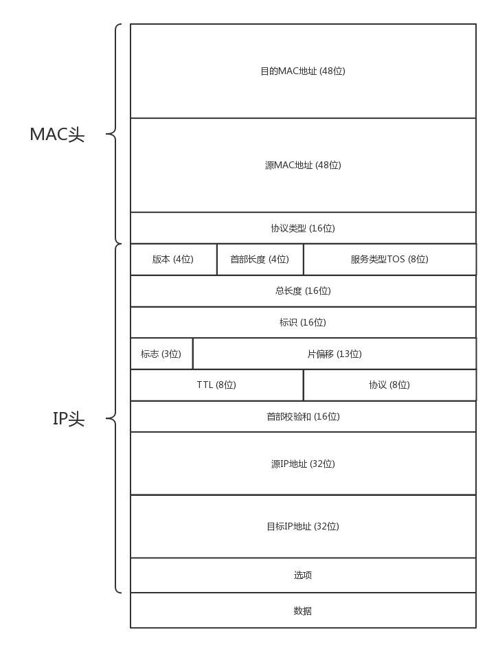
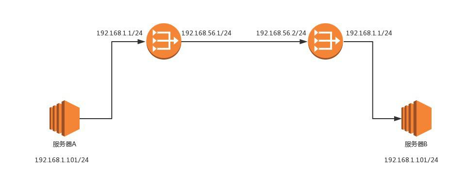

# 第 8 讲 | 世界这么大，我想出网关：欧洲十国游与玄奘西行
> 刘超 2018-06-04

前几节，我主要跟你讲了宿舍里和办公室里用到的网络协议。你已经有了一些基础，是时候去外网逛逛了！

## 01. 怎么在宿舍上网？

还记得咱们在宿舍的时候买了台交换机，几台机器组了一个局域网打游戏吗？可惜啊，只能打局域网的游戏，不能上网啊！盼啊盼啊，终于盼到大二，允许宿舍开通网络了。学校给每个宿舍的网口分配了一个 IP 地址。这个 IP 是校园网的 IP，完全由网管部门控制。宿舍网的 IP 地址多为 192.168.1.x。校园网的 IP 地址，假设是 10.10.x.x。

这个时候，你要在宿舍上网，有两个办法：

第一个办法，让你们宿舍长再买一个网卡。这个时候，你们宿舍长的电脑里就有两张网卡。一张网卡的线插到你们宿舍的交换机上，另一张网卡的线插到校园网的网口。而且，这张新的网卡的 IP 地址要按照学校网管部门分配的配置，不然上不了网。这种情况下，如果你们宿舍的人要上网，就需要一直开着宿舍长的电脑。

第二个办法，你们共同出钱买个家庭路由器（反正当时我们买不起）。家庭路由器会有内网网口和外网网口。把外网网口的线插到校园网的网口上，将这个外网网口配置成和网管部的一样。内网网口连上你们宿舍的所有的电脑。这种情况下，如果你们宿舍的人要上网，就需要一直开着路由器。

这两种方法其实是一样的。只不过第一种方式，让你的宿舍长的电脑，变成一个有多个口的路由器而已。而你买的家庭路由器，里面也跑着程序，和你宿舍长电脑里的功能一样，只不过是一个嵌入式的系统。

当你的宿舍长能够上网之后，接下来，就是其他人的电脑怎么上网的问题。这就需要配置你们的网卡。当然 DHCP 是可以默认配置的。在进行网卡配置的时候，除了 IP 地址，还需要配置一个 Gateway 的东西，这个就是网关。

## 02. 你了解 MAC 头和 IP 头的细节吗？

一旦配置了 IP 地址和网关，往往就能够指定目标地址进行访问了。由于在跨网关访问的时候，牵扯到 MAC 地址和 IP 地址的变化，这里有必要详细描述一下 MAC 头和 IP 头的细节。

在 MAC 头里面，先是目标 MAC 地址，然后是源 MAC 地址，然后有一个协议类型，用来说明里面是 IP 协议。IP 头里面的版本号，目前主流的还是 IPv4，服务类型 TOS 在第三节讲 ip addr 命令的时候讲过，TTL 在第 7 节讲 ICMP 协议的时候讲过。另外，还有 8 位标识协议。这里到了下一层的协议，也就是，是 TCP 还是 UDP。最重要的就是源 IP 和目标 IP。先是源 IP 地址，然后是目标 IP 地址。

在任何一台机器上，当要访问另一个 IP 地址的时候，都会先判断，这个目标 IP 地址，和当前机器的 IP 地址，是否在同一个网段。怎么判断同一个网段呢？需要 CIDR 和子网掩码，这个在第三节的时候也讲过了。

如果是同一个网段，例如，你访问你旁边的兄弟的电脑，那就没网关什么事情，直接将源地址和目标地址放入 IP 头中，然后通过 ARP 获得 MAC 地址，将源 MAC 和目的 MAC 放入 MAC 头中，发出去就可以了。

如果不是同一网段，例如，你要访问你们校园网里面的 BBS，该怎么办？这就需要发往默认网关 Gateway。Gateway 的地址一定是和源 IP 地址是一个网段的。往往不是第一个，就是第二个。例如 192.168.1.0/24 这个网段，Gateway 往往会是 192.168.1.1/24 或者 192.168.1.2/24。

如何发往默认网关呢？网关不是和源 IP 地址是一个网段的么？这个过程就和发往同一个网段的其他机器是一样的：将源地址和目标 IP 地址放入 IP 头中，通过 ARP 获得网关的 MAC 地址，将源 MAC 和网关的 MAC 放入 MAC 头中，发送出去。网关所在的端口，例如 192.168.1.1/24 将网络包收进来，然后接下来怎么做，就完全看网关的了。

网关往往是一个路由器，是一个三层转发的设备。啥叫三层设备？前面也说过了，就是把 MAC 头和 IP 头都取下来，然后根据里面的内容，看看接下来把包往哪里转发的设备。

在你的宿舍里面，网关就是你宿舍长的电脑。一个路由器往往有多个网口，如果是一台服务器做这个事情，则就有多个网卡，其中一个网卡是和源 IP 同网段的。

很多情况下，人们把网关就叫作路由器。其实不完全准确，而另一种比喻更加恰当：路由器是一台设备，它有五个网口或者网卡，相当于有五只手，分别连着五个局域网。每只手的 IP 地址都和局域网的 IP 地址相同的网段，每只手都是它握住的那个局域网的网关。

任何一个想发往其他局域网的包，都会到达其中一只手，被拿进来，拿下 MAC 头和 IP 头，看看，根据自己的路由算法，选择另一只手，加上 IP 头和 MAC 头，然后扔出去。

## 03. 静态路由是什么？

这个时候，问题来了，该选择哪一只手？IP 头和 MAC 头加什么内容，哪些变、哪些不变呢？这个问题比较复杂，大致可以分为两类，一个是静态路由，一个是动态路由。动态路由下一节我们详细地讲。这一节我们先说静态路由。

静态路由，其实就是在路由器上，配置一条一条规则。这些规则包括：想访问 BBS 站（它肯定有个网段），从 2 号口出去，下一跳是 IP2；想访问教学视频站（它也有个自己的网段），从 3 号口出去，下一跳是 IP3，然后保存在路由器里。

每当要选择从哪只手抛出去的时候，就一条一条的匹配规则，找到符合的规则，就按规则中设置的那样，从某个口抛出去，找下一跳 IPX。

## 04. IP 头和 MAC 头哪些变、哪些不变？

对于 IP 头和 MAC 头哪些变、哪些不变的问题，可以分两种类型。我把它们称为「欧洲十国游」型和「玄奘西行」型。

之前我说过，MAC 地址是一个局域网内才有效的地址。因而，MAC 地址只要过网关，就必定会改变，因为已经换了局域网。两者主要的区别在于 IP 地址是否改变。不改变 IP 地址的网关，我们称为转发网关；改变 IP 地址的网关，我们称为 NAT 网关。

### 「欧洲十国游」型

结合这个图，我们先来看「欧洲十国游」型。

服务器 A 要访问服务器 B。首先，服务器 A 会思考，192.168.4.101 和我不是一个网段的，因而需要先发给网关。那网关是谁呢？已经静态配置好了，网关是 192.168.1.1。网关的 MAC 地址是多少呢？发送 ARP 获取网关的 MAC 地址，然后发送包。包的内容是这样的：

源 MAC：服务器 A 的 MAC

目标 MAC：192.168.1.1 这个网口的 MAC

源 IP：192.168.1.101

目标 IP：192.168.4.101

包到达 192.168.1.1 这个网口，发现 MAC 一致，将包收进来，开始思考往哪里转发。

在路由器 A 中配置了静态路由之后，要想访问 192.168.4.0/24，要从 192.168.56.1 这个口出去，下一跳为 192.168.56.2。

于是，路由器 A 思考的时候，匹配上了这条路由，要从 192.168.56.1 这个口发出去，发给 192.168.56.2，那 192.168.56.2 的 MAC 地址是多少呢？路由器 A 发送 ARP 获取 192.168.56.2 的 MAC 地址，然后发送包。包的内容是这样的：

源 MAC：192.168.56.1 的 MAC 地址

目标 MAC：192.168.56.2 的 MAC 地址

源 IP：192.168.1.101

目标 IP：192.168.4.101

包到达 192.168.56.2 这个网口，发现 MAC 一致，将包收进来，开始思考往哪里转发。

在路由器 B 中配置了静态路由，要想访问 192.168.4.0/24，要从 192.168.4.1 这个口出去，没有下一跳了。因为我右手这个网卡，就是这个网段的，我是最后一跳了。

于是，路由器 B 思考的时候，匹配上了这条路由，要从 192.168.4.1 这个口发出去，发给 192.168.4.101。那 192.168.4.101 的 MAC 地址是多少呢？路由器 B 发送 ARP 获取 192.168.4.101 的 MAC 地址，然后发送包。包的内容是这样的：

源 MAC：192.168.4.1 的 MAC 地址

目标 MAC：192.168.4.101 的 MAC 地址

源 IP：192.168.1.101

目标 IP：192.168.4.101

包到达服务器 B，MAC 地址匹配，将包收进来。

通过这个过程可以看出，每到一个新的局域网，MAC 都是要变的，但是 IP 地址都不变。在 IP 头里面，不会保存任何网关的 IP 地址。所谓的下一跳是，某个 IP 要将这个 IP 地址转换为 MAC 放入 MAC 头。

之所以将这种模式比喻称为欧洲十国游，是因为在整个过程中，IP 头里面的地址都是不变的。IP 地址在三个局域网都可见，在三个局域网之间的网段都不会冲突。在三个网段之间传输包，IP 头不改变。这就像在欧洲各国之间旅游，一个签证就能搞定。

### 「玄奘西行」型

我们再来看「玄奘西行」型。

这里遇见的第一个问题是，局域网之间没有商量过，各定各的网段，因而 IP 段冲突了。最左面大唐的地址是 192.168.1.101，最右面印度的地址也是 192.168.1.101，如果单从 IP 地址上看，简直是自己访问自己，其实是大唐的 192.168.1.101 要访问印度的 192.168.1.101。

怎么解决这个问题呢？既然局域网之间没有商量过，你们各管各的，那到国际上，也即中间的局域网里面，就需要使用另外的地址。就像出国，不能用咱们自己的身份证，而要改用护照一样，玄奘西游也要拿着专门取经的通关文牒，而不能用自己国家的身份证。

首先，目标服务器 B 在国际上要有一个国际的身份，我们给它一个 192.168.56.2。在网关 B 上，我们记下来，国际身份 192.168.56.2 对应国内身份 192.168.1.101。凡是要访问 192.168.56.2，都转成 192.168.1.101。

于是，源服务器 A 要访问目标服务器 B，要指定的目标地址为 192.168.56.2。这是它的国际身份。服务器 A 想，192.168.56.2 和我不是一个网段的，因而需要发给网关，网关是谁？已经静态配置好了，网关是 192.168.1.1，网关的 MAC 地址是多少？发送 ARP 获取网关的 MAC 地址，然后发送包。包的内容是这样的：

源 MAC：服务器 A 的 MAC

目标 MAC：192.168.1.1 这个网口的 MAC

源 IP：192.168.1.101

目标 IP：192.168.56.2

包到达 192.168.1.1 这个网口，发现 MAC 一致，将包收进来，开始思考往哪里转发。

在路由器 A 中配置了静态路由：要想访问 192.168.56.2/24，要从 192.168.56.1 这个口出去，没有下一跳了，因为我右手这个网卡，就是这个网段的，我是最后一跳了。

于是，路由器 A 思考的时候，匹配上了这条路由，要从 192.168.56.1 这个口发出去，发给 192.168.56.2。那 192.168.56.2 的 MAC 地址是多少呢？路由器 A 发送 ARP 获取 192.168.56.2 的 MAC 地址。

当网络包发送到中间的局域网的时候，服务器 A 也需要有个国际身份，因而在国际上，源 IP 地址也不能用 192.168.1.101，需要改成 192.168.56.1。发送包的内容是这样的：

源 MAC：192.168.56.1 的 MAC 地址

目标 MAC：192.168.56.2 的 MAC 地址

源 IP：192.168.56.1

目标 IP：192.168.56.2

包到达 192.168.56.2 这个网口，发现 MAC 一致，将包收进来，开始思考往哪里转发。

路由器 B 是一个 NAT 网关，它上面配置了，要访问国际身份 192.168.56.2 对应国内身份 192.168.1.101，于是改为访问 192.168.1.101。

在路由器 B 中配置了静态路由：要想访问 192.168.1.0/24，要从 192.168.1.1 这个口出去，没有下一跳了，因为我右手这个网卡，就是这个网段的，我是最后一跳了。

于是，路由器 B 思考的时候，匹配上了这条路由，要从 192.168.1.1 这个口发出去，发给 192.168.1.101。

那 192.168.1.101 的 MAC 地址是多少呢？路由器 B 发送 ARP 获取 192.168.1.101 的 MAC 地址，然后发送包。内容是这样的：

源 MAC：192.168.1.1 的 MAC 地址

目标 MAC：192.168.1.101 的 MAC 地址

源 IP：192.168.56.1

目标 IP：192.168.1.101

包到达服务器 B，MAC 地址匹配，将包收进来。

从服务器 B 接收的包可以看出，源 IP 为服务器 A 的国际身份，因而发送返回包的时候，也发给这个国际身份，由路由器 A 做 NAT，转换为国内身份。

从这个过程可以看出，IP 地址也会变。这个过程用英文说就是 Network Address Translation，简称 NAT。

其实这第二种方式我们经常见，现在大家每家都有家用路由器，家里的网段都是 192.168.1.x，所以你肯定访问不了你邻居家的这个私网的 IP 地址的。所以，当我们家里的包发出去的时候，都被家用路由器 NAT 成为了运营商的地址了。

很多办公室访问外网的时候，也是被 NAT 过的，因为不可能办公室里面的 IP 也是公网可见的，公网地址实在是太贵了，所以一般就是整个办公室共用一个到两个出口 IP 地址。你可以通过 https://www.whatismyip.com/ 查看自己的出口 IP 地址。

## 小结

好了，这一节内容差不多了，我来总结一下：

如果离开本局域网，就需要经过网关，网关是路由器的一个网口；

路由器是一个三层设备，里面有如何寻找下一跳的规则；

经过路由器之后 MAC 头要变，如果 IP 不变，相当于不换护照的欧洲旅游，如果 IP 变，相当于换护照的玄奘西行。

最后，给你留两个思考题吧。

当在你家里要访问 163 网站的时候，你的包需要 NAT 成为公网 IP，返回的包又要 NAT 成你的私有 IP，返回包怎么知道这是你的请求呢？它怎么就这么智能的 NAT 成了你的 IP 而非别人的 IP 呢？

对于路由规则，这一节讲述了静态路由，需要手动配置，如果要自动配置，你觉得应该怎么办呢？

## 黑板墙

lh

老师，你在第二种情况说，网关 B 上记下来，国际身份 192.168.56.2 对应国内身份 192.168.1.101。那么如果该局域网内还有很多其他机器，比如 192.168.1.102，103 等等，它们对应的国际身份呢？如果也是 192.168.56.2，那么从 192.168.56.1 发来请求时，网关 B 要将该消息转发到哪个国内身份呢？

2018-06-04

Malcolm

这一节讲的特别不清楚，对于懂的人来说当然懂，对于初学者来说，这节有点故弄玄虚了。

1. 访问的外网的某个地址，怎么可能会访问某个私有 ip（主机 B）？

2.NAT 的 TCP 用一主机 + 端口映射，你不讲初学者怎么知道如何响应给哪台主机？

作者回复：比如访问学校里面的选课网站？可以先理解一对一映射的场景

2018-09-10

Leon📷

这里面留言的都是人才。知识面又广，声音又好听，我超喜欢在这个地方看评论的感觉，不看评论是不可能的，这辈子都不可能不看评论的。

2018-10-27

jacy

回答一下第一题，nat 支持一对一转换，即一个内网 ip 与一个外网 ip，题一需要协议支持一个外网 ip 对应多个内网 ip，则需要 napt 协议支持，。协议会维护一张映射表，结构如下:

内网 ip:port--> 外网 ip: 空闲 port

只要路由器空闲 ip 足够即可。但有个问题想请教老师，像微信这种有海量用户保持长连接的场景，路由 port 不够，是怎么处理的，不可能是加路由设备来处理吧？

2018-07-05

张爽

NAT Gateway 会以源 IP + 源端口的方式记录连接的 NAT 记录，Ping 是直接调用的 ICMP，不经过第四层的协议，并没有端口号，请问老师，同一内网的两台机器同时 Ping 百度，再收到两个应答之后，在没有端口号做区分的情况下，如何进行转发，谢谢

作者回复：连接维护用哈希匹配，tcp 有端口的一种算法，icmp 也有相应的算法

2018-06-04

流沙咖啡

有个地方有错误，在例子中，路由器 B 右边的 192.168.1.0/24 并不是静态路由，而是「直连网段」

作者回复：赞，是直连，直连也有条路由的

2018-06-04

yunfei_lei

对于情况二，服务器 A 怎么知道服务器 B 的国际地址的？

2018-06-05

顾骨

局域网中两台机器同时访问百度，但是出现了一个极端情况：两台机器的源端口都是一样的，回来时，网关怎么区分该发给谁呢。

2018-06-04

monkay

有下一跳和没有下一条运作上有什么区别？为什么每次都强调有没有下一跳？

2018-06-04

蔺波

Nat 有 session, 这一块需要讲的

作者回复：是的，会讲

2018-07-02

林三杠

一直有个疑问，IPv4 的公网地址是有限的，现在那么多云厂商卖虚拟主机，每台主机都有一个公网 IP，会有用完的时候吗？分给每个云厂商的公网 IP 有多少啊？

2018-06-05

Geek_9807b5

老师您好，我有一个关于 NAPT 的疑问。

将端口号和 ip 地址都 translate 成为公网 ip 和运算后的端口号，端口号最多 65535 个，如果内网机器特别多，都走 tcp 请求，导致接口超过 65535 个，怎么办？

2018-06-05

起风了 001

作为教程我觉得问题可以简单带过，但是一定要点出来，这样读者可以继续深入学习。比如在讲西行型时，要说明实际上网络请求是有端口号的，服务器 A 请求服务器 B, 虽然是用的服务器 B 的 192.168.56.2/24 这个 ip 左右目标 ip, 但是他本身是有带上端口号，比如端口号 123, 这个端口号在路由器 B 上有一个 NAT 映射，路由器知道 123 端口代表着内网主机 192.188.1.101:321, 这样可以解决很多人的疑问：内网有多台机器的时候怎么知道目标是哪一台？

作者回复：赞，是的

2019-05-17

indeyo

回答第一个问题。老师在讲「玄奘西行游」的过程，只讲了服务器 A 给服务器 B 发包的情况，没有讲服务器 B 给服务器 A 回复包的情况，其实是类似的。根据私有 ip（国家身份证）不能在公网上面出现的原则，我列一下回去的包的内容是怎样的：

假设和服务器 A 直连的路由器为路由器 a，和服务器 B 直连的路由器为路由器 b。

服务器 B-> 路由器 b

源 MAC：192.168.1.101 的 MAC

目标 MAC：192.168.1.1 的 MAC

源 IP：192.168.1.101

目标 IP：192.168.56.1

路由器 b-> 路由器 a

源 MAC：192.168.56.2 的 MAC

目标 MAC：192.168.56.1 的 MAC

源 IP：192.168.56.2

目标 IP：192.168.56.1

路由器 a-> 服务器 A

源 MAC：192.168.1.1 的 MAC

目标 MAC：192.168.1.101 的 MAC

源 IP：192.168.56.2

目标 IP：192.168.1.101

最关键的地方在于，当第二个包到达路由器 a 时，它是怎么知道服务器 A 的私有 ip（国家身份证）的呢？路由器 a 有个引射表，可以通过公有 ip（护照）查找出私有 ip（国家身份证）。

2018-12-09

Alery

老师，你在第二种情况说，网关 B 上记下来，国际身份 192.168.56.2 对应国内身份 192.168.1.101。那么如果该局域网内还有很多其他机器，比如 192.168.1.102，103 等等，它们对应的国际身份呢？如果也是 192.168.56.2，那么从 192.168.56.1 发来请求时，网关 B 要将该消息转发到哪个国内身份呢？就好比公司局域网往往是几十个几百个绑定到一个公网 ip 上的，这个时候怎么对应到具体的某个局域网 ip 呢？

2018-07-05

master

1.wan 口地址怎么来的？

2. 是否在到达公网前的这一段链路上每一跳都需要 NAT？

作者回复: wan 口地址是运营商分配的，只有最后一跳使用 nat

2018-10-28

zj 坚果

老师，为啥我们在宿舍里用交换机而不是用路由器啊，我们能够上外网呀

作者回复：有的交换机叫交换机，其实是有路由功能的

2018-06-07

化雨

查了下第一题，nat 时不光会替换 ip 地址，也会替换端口号；每个网关应该都维护了一张端口主机映射表，这样便能准确寻址私网主机。仔细看了下您画的报文结构，猜测端口号占用的应该是 ip 报文中的选项字段

2018-06-05

caohuan

本篇所得：1. 玄奘西游，需要转换 IP 地址，把外网 与内网相互转换，欧洲十日游 不需要转换 IP 地址；

2. 静态配置路由 为规定 哪个口 访问对应的外网；

3. 离开 局域网 需要经过网关，网关是路由器的一个网口；

4. 路由为三层设备，里面包括 下一跳的信息；

老师的问题 1. 公网 IP 转 私有 IP，以及私有 IP 转化为公网 IP，可以用一套算法，正向、反向类推。

2. 自动匹配 可以用 数据结构 + 算法，自动匹配路由的 IP，既方便又效率。

2018-12-31

Yangjing

什么场景下网络是「欧洲十国游」类型的，能提供个例子不？

2018-08-05

如果是我主动发起请求，我怎么知道目标服务器在目标网关上的端口号是多少

作者回复：网关不会改变监听端口，服务器的监听端口是知名端口，比如 80

2018-11-24

潇洒

问题一：因为到达目的服务器接收的源 IP 就是公网 IP，返回时到达最后一个和源 IP 网段相同的网关，在这里转换为私有 IP 并发送。

不知道这样理解正确吗

作者回复：是的

2018-11-19

我是大神郑

老师，您好。我有个小疑问。就是三层交换机和路由器可以不可以理解为同一功能的设备，还是有包络关系？期待老师答复

2018-06-10

u

对于第一个问题，答案叫做 napt！

2018-06-09

Ziggy_aa

老师，有个不理解的地方。

如果外网和内网的 IP 是一一绑定的话，内网 IP 的意义不就没有了么？

还是说，一个内网中有十台机器，但只有一个公网 IP 的情况，这个网络中就只有一台可以连接外网，其他都连接不了。

作者回复：当然不能一一绑定，所以有多台机器共享一个外网 ip 的情况。

